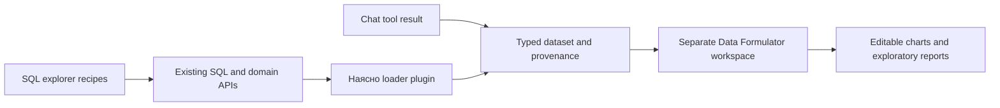

# Data Formulator integration feasibility

Reviewed 2026-09-28. Our checkout: `3ac58f7eec`, including the working tree as read.
Upstream: `microsoft/data-formulator`, main commit
`5477f0e236426dc8f74a498ec400414fba7fbc0f` (2026-08-15), Python package version
`0.8.0b1`. These findings apply to that revision. The upstream README describes
0.7 as stable; the extension and API details below were checked against main.

## Recommendation

**Feasible. Start with a separate, internal Data Formulator workspace that consumes
our existing SQL recipes and computed chat results.** Keep our query definitions,
identity resolution, time scopes and provenance as the source of the imported data.

The useful addition is an editable visual analysis workspace: users can change
chart encodings, branch an investigation and assemble reports. Our current chat
already answers domain questions and renders charts; replacing its orchestration
would give up substantial existing work for a different product experience.

For an immediate trial, use the CSV exports already available in both our SQL
browser and chat. For a durable connection, implement a Data Formulator
`ExternalDataLoader` plugin over our HTTP interfaces. A plugin can be installed
without forking the upstream app. A one-click handoff from our UI needs additional
work; the loader extension alone does not supply that handoff.

## What was verified

- Read upstream connector, PostgreSQL loader, workspace import, agent, sandbox,
  model client, API client, session and deployment sources.
- Read our SQL execution and HTTP boundary, query catalogs, tool registry,
  result envelope, data fetchers, chart renderer and model-proxy documentation.
- Imported our registries under Node: **235 tools**, **74 SQL recipes**
  (15 chat recipes + 37 legacy recipes + 22 expanded recipes). The broader SQL
  question catalog contains 426 questions; that is not 426 executable SQL recipes.
- Made three small, read-only requests to the public `https://naiasno.bg/api/sql`.
  All returned HTTP 200:

| Probe | Observed result |
| --- | --- |
| `GET /schema` | 280 relations: 198 tables, 50 materialized views, 32 views |
| Literal values query | Cyrillic `София`, text EIK `000695089` and null preserved; PostgreSQL numeric `12.50` returned as a string; date returned as an ISO timestamp |
| Three generated rows with limit 2 | Two rows and `truncated: true` |

The live schema included `contractor_rank`, `company_public_money`,
`person_wealth_year` and `tr_owner_share`. It did **not** include the
`questionCapabilities` field implemented in our local `sql_lib.js`. This establishes
a difference between the inspected source and the deployed response, not its cause.
Check each pilot recipe against production before advertising it as available.

No Data Formulator runtime, model call, direct database connection or end-to-end
chart rendering was tested. No dependencies were installed or services deployed.
The effort estimates below are engineering estimates, not measured delivery times.

## Relevant upstream architecture

| Area | Observed implementation | Integration consequence |
| --- | --- | --- |
| Frontend | React 18, Redux, Material UI, Vite; Flint plus Vega-related chart dependencies | Full UI adoption is an application integration, rather than importing one React component |
| Backend | Python 3.11+, Flask, LiteLLM, pandas, PyArrow, DuckDB | Requires a separate runtime from our Node functions and Firebase-hosted frontend |
| Data ingestion | `ExternalDataLoader.fetch_data_as_arrow()` → workspace Parquet | Source data becomes a workspace snapshot; refresh re-fetches it |
| Extension | Python `*_data_loader.py` files via `DF_PLUGIN_DIR` | A custom Наясно connector is a supported extension path |
| Analysis | Agent tools include generated Python execution and data inspection | Our deterministic calculations and narration checks do not transfer automatically |
| Persistence | Workspace files and sessions; local, ephemeral and Azure Blob options | A hosted service needs an explicit persistence choice; our GCS deployment is not a built-in workspace backend |
| Identity | Local, anonymous browser identity, or configured authentication | For a shared analyst service, use verified identity and per-user workspace isolation |
| Localization | English and Chinese registered | Bulgarian UI localization is extra work; Bulgarian model-answer quality remains untested |

The upstream project is MIT-licensed. Its package identifies itself as a research
prototype and beta. Pin the revision for a pilot and retain applicable notices when
redistributing code. No production support commitment was evaluated.

Sources: [package and dependencies](https://github.com/microsoft/data-formulator/blob/5477f0e236426dc8f74a498ec400414fba7fbc0f/pyproject.toml),
[frontend dependencies](https://github.com/microsoft/data-formulator/blob/5477f0e236426dc8f74a498ec400414fba7fbc0f/package.json),
[loader extension](https://github.com/microsoft/data-formulator/blob/5477f0e236426dc8f74a498ec400414fba7fbc0f/examples/plugins/README.md),
[workspace ingestion](https://github.com/microsoft/data-formulator/blob/5477f0e236426dc8f74a498ec400414fba7fbc0f/py-src/data_formulator/data_loader/external_data_loader.py),
[deployment guide](https://github.com/microsoft/data-formulator/blob/5477f0e236426dc8f74a498ec400414fba7fbc0f/DEVELOPMENT.md),
[license](https://github.com/microsoft/data-formulator/blob/5477f0e236426dc8f74a498ec400414fba7fbc0f/LICENSE).

## Connection options

These estimates assume one engineer familiar with our repository, a small curated
dataset set and an internal audience. They are separate scopes, not additive promises.

| Option | Feasibility | Rough effort | Assessment |
| --- | --- | --- | --- |
| Export CSV from SQL/chat and upload | High | Hours for a trial | Best first evaluation; manual refresh and limited metadata |
| Native PostgreSQL connector | High for base tables | About a day for a local trial; more for curated access | Useful for developer exploration, but bypasses our API controls and misses curated views in discovery |
| Custom loader over SQL recipes/API | High | 2–4 days for an internal pilot | Best durable first connection; reuse existing limits and semantics |
| Bridge selected chat tools | High | 4–8 days for an initial subset | Preserves our domain calculations and reaches JSON-backed datasets too |
| Add richer chart editing inside our app | Medium–high | 1–3 weeks for a narrow editor | Consider Flint or a chart-spec layer; does not require adopting the whole application |
| Embed/adopt the whole Data Formulator UX publicly | Medium | Several weeks; budget 3–6+ initially | Authentication, compute isolation, quotas, storage, localization and UI maintenance dominate |

### 1. Our SQL explorer → Data Formulator

We already expose:

```text
GET  /api/sql/schema
POST /api/sql/query   { sql, limit }
                     → { columns, rows, rowCount, truncated, elapsedMs }
```

The source configures `app_readonly`, a READ ONLY transaction, an 8-second SQL
timeout and a 2,000-row maximum. Single read statements use a server cursor.
The HTTP layer has a 40-request/IP/minute limit **per function instance** and
`maxInstances: 3`; it is not a shared global rate counter.

A Python loader can call these endpoints and convert rows to Arrow without any
PostgreSQL credentials. Implement `list_params`, `list_tables`,
`fetch_data_as_arrow`, and useful metadata/connection methods. Prefer a catalog of
named, parameterized recipes to automatically exposing every relation. Generate
that catalog from `src/lib/questions/sql/` so query definitions are not copied
into Python. Publish query results through a small adapter around the existing
recipe renderer if refreshable, parameterized access is needed.

**Row limits must be part of the result meaning.** A 2,000-row sample of contracts
cannot answer a whole-corpus total in DuckDB. Aggregate in PostgreSQL through a
recipe first, then import the small result. Reject `truncated: true` as an ordinary
complete dataset, or explicitly label and persist it as a sample. A `LIMIT 25`
ranking can be intentionally incomplete even when `truncated` is false: its catalog
metadata must identify the top-N population too. Do not loop over pages merely to
evade the API's cap.

Normalize wire types explicitly: numeric strings become appropriate numeric
columns, EIK/EKATTE stay strings, dates retain their intended grain, and null stays
unknown. The schema endpoint describes relation types, but a query response lists
column names without result type metadata; expressions and aliases need recipe
types or an additive result-type API field.

Browser-to-browser handoff requires a defined session/import protocol. Data
Formulator has a multipart `/create-table` route accepting a JSON array in
`raw_data`, but it is an internal API tied to workspace identity, not a verified
stable embedding SDK. A loader-backed import also supplies refresh provenance that
a bare upload does not. Start with a separate tab and explicit import.

Local references: `functions/index.js` (`makeSql`), `functions/sql_execution.js`,
`functions/sql_statement.js`, `functions/sql_lib.js`,
`src/screens/dev/SqlBrowserScreen.tsx`, `src/lib/questions/sql/recipes.ts`.
Upstream: [table import API](https://github.com/microsoft/data-formulator/blob/5477f0e236426dc8f74a498ec400414fba7fbc0f/py-src/data_formulator/routes/tables.py).

### 2. Our AI tools → Data Formulator

Our 235 tools are TypeScript functions registered in `ai/tools/registry.ts`.
They are not currently a generic HTTP or MCP tool service. Some call `/api/db/*`;
others calculate from bundled or bucket-hosted JSON. Direct PostgreSQL access
therefore does not replace the whole tools layer.

The existing `Envelope` is a strong handoff point:

- `columns` + `rows`: import as a typed table.
- `series`: reshape to long-form rows such as `(x, series_key, value)`.
- `facts`/scalar: import only appropriate numeric facts with explicit units;
  keep explanatory facts as metadata.
- `provenance`, `subtitle`, query and revision data: retain beside the dataset
  and visibly with exported charts.
- `clarify`: complete entity/place disambiguation before importing anything.
- Domain results marked partial, unavailable or unsupported: retain the status;
  never convert them into an empty, apparently successful table.
- Domain bundles: import separate datasets with their individual scopes instead
  of silently concatenating different populations.

The smallest integration exports the already-computed envelope from the browser.
CSV support already exists in `ai/app/export.ts`; a typed JSON plus metadata export
would retain more meaning. A later connector can call a Node tool bridge using
allowlisted names and validated arguments, returning the same envelopes.

Use the existing `fetchData`/`fetchDb` seams with explicit server configuration.
Do not reuse `dbFetcherNode.ts` as a production server: it is a test harness that
deliberately pins the local database. Do not mutate global fetchers per request.
Whether every tool can run in the proposed server bundle still needs validation.

Registering our tools directly inside Data Formulator's agent loop is a broader
change than adding a data loader. I found no documented general MCP registration
or stable React embedding contract in the inspected paths. Treat those approaches
as additional adapter work, rather than a configuration option.

### 3. Direct PostgreSQL connection

The built-in loader uses psycopg2 and supports host, port, database, user and
password. A local trial can reach our Docker database on port 5433; an authorized
operator can reach Cloud SQL through its proxy. Use a dedicated reader with
restricted grants and database-level resource limits.

Two concrete limitations make this a weaker default:

1. Its list/search/lazy catalog queries filter `table_type = 'BASE TABLE'`.
   Our live catalog includes **82 views/materialized views**. Important sources
   such as `tr_owner_share` and `contractor_rank` will not be discoverable through
   those stock catalog paths. This is a discovery limitation, not proof that a
   manually supplied view name could never be queried.
2. The loader opens autocommit connections, uses `fetchall()`, and caps ordinary
   imports at up to **2,000,000 rows**. Connection setup sets a connect timeout
   and encoding, but does not install our 8-second query timeout or READ ONLY
   transaction policy. Its metadata inspection can also run exact `COUNT(*)`.
   Existing API limits do not apply to these direct connections.

The direct loader can push filters and structured probes to PostgreSQL; it is
not purely a full-table downloader. However, imported workspace transformations
operate on their snapshots, and do not automatically reuse our PostgreSQL serving
functions or guarantee whole-corpus computation.

Source: [PostgreSQL loader](https://github.com/microsoft/data-formulator/blob/5477f0e236426dc8f74a498ec400414fba7fbc0f/py-src/data_formulator/data_loader/postgresql_data_loader.py).

## The main correctness constraint: preserve our data definitions

Schema descriptions and Data Formulator's data memory can help the model, but
cannot substitute for executable definitions. Our repository has explicit rules
whose loss would produce plausible, incorrect charts:

- Contract records, amendment events and consortium member/carrier rows have
  different counting and money rules. Use our procurement query contract.
- Awarded procurement, EU grants and disbursements are different measures.
  A beneficiary's procurement does not prove project financing.
- Company ownership comes from `tr_owner_share`; raw historical owner rows
  cannot be summed as a current ownership table.
- Roll-call aggregates exclude superseded votes and use party at cast time.
- Declared assets distinguish ownership, use, share weighting, filing period
  and imputed currency values.
- Missing coverage is not zero, and a risk indicator is not a finding of misconduct.

The connector should carry grain, units, time window, filters, source/revision,
coverage and completion status. Keep these visible in the surrounding workspace
or report; placing them only in a model prompt or CSV sidecar is insufficient.
Additional calculations made inside Data Formulator should be identified as
exploratory derivations. Importing a verified result does not automatically verify
every later join, ratio, chart aggregation or narrative.

## Deployment and model integration

Our `/api/llm` is an application-specific protocol with Turnstile sessions,
question reservations and a three-call budget. It is not an OpenAI-compatible
endpoint that can be pasted into Data Formulator's `api_base` setting. Data
Formulator has its own multi-step agent loop, token requirements and model calls.
A shared model gateway would need an adapter and revised cost accounting.

For an internal pilot, use a separately budgeted server-side model configuration.
Record latency and cost per completed analysis; no defensible per-analysis price
estimate is possible from the source inspection alone.

Firebase Hosting can serve frontend assets, but cannot by itself run Flask,
workspace files and generated-code workers. A separate compute service is needed.
Cloud Run is a possible web-service host, but the supplied Docker sandbox launches
`docker run` subprocesses; that is not a turnkey match for a normal Cloud Run
container. Choose the execution isolation and persistent storage design first.

The default local sandbox uses a Python subprocess with audit hooks and secret
environment scrubbing. The Docker implementation adds memory/CPU/process limits
and a read-only workspace mount; its inspected launch command does not specify
`--network none`. Neither was penetration-tested here. Public exposure requires
an independently validated execution boundary, controlled network access,
per-user quotas and verified workspace identity. The upstream deployment guide
itself separates anonymous demos from authenticated deployments.

Plugins execute trusted Python in the main server process. Hosted plugin loading
requires attention to `DF_ALLOW_PLUGINS` and directory ownership; user-provided
data must not become installable server code.

Sources: [agent tools](https://github.com/microsoft/data-formulator/blob/5477f0e236426dc8f74a498ec400414fba7fbc0f/py-src/data_formulator/analyst/tools.py),
[agent loop](https://github.com/microsoft/data-formulator/blob/5477f0e236426dc8f74a498ec400414fba7fbc0f/py-src/data_formulator/analyst/agent.py),
[sandbox implementations](https://github.com/microsoft/data-formulator/tree/5477f0e236426dc8f74a498ec400414fba7fbc0f/py-src/data_formulator/sandbox).
Our model boundary: `functions/README.md`, `functions/llm_http.js` and
`functions/llm_security.js`.

## Proposed pilot and decision criteria



1. **Evaluate with existing exports.** Use a scoped contractor ranking, a municipal
   fiscal series and a roll-call or election result. Check whether the editing and
   report workflow adds enough value beyond our current charts.
2. **Build a narrow SQL recipe connector.** Expose 5–10 known queries; preserve
   metadata, explicit types, source scope, refresh information and truncation.
3. **Add selected chat-result imports.** Reuse computed envelopes first. Introduce
   a server tool bridge only if invoking tools from within Data Formulator is useful.
4. **Decide between an internal sidecar and native chart features.** If the desired
   feature is simply better chart editing in our existing chat, evaluate a smaller
   Flint/chart-spec integration before taking on a second public application.

Pilot acceptance checks:

- Imported values match the original SQL/tool result, including nulls and IDs.
- Intentional top-N, server truncation and unavailable results remain distinguishable.
- Chart aggregation preserves the stated population and denominator.
- Refresh replays the same parameters and visibly updates source/revision metadata.
- Bulgarian labels, diacritics, dates and exports render correctly.
- Source links and caveats survive report export.
- Timeouts and 429s produce explicit failures rather than empty successful data.
- Measured model cost and latency fit the intended analyst workflow.

**Decision:** proceed with an internal visualization pilot. The HTTP/recipe and
chat-envelope paths are well matched to our existing architecture. A full public
replacement of our chat would be a separate product and infrastructure project.
