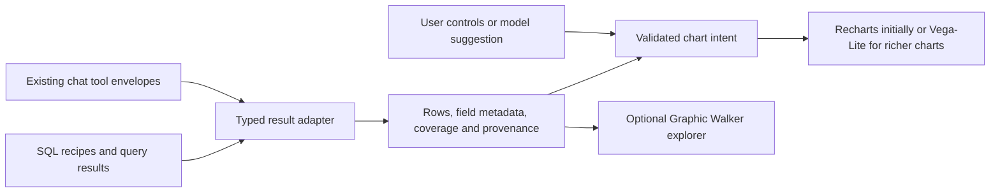

# Visualization libraries for Наясно

Research date: 2026-09-28. Companion to the [Data Formulator feasibility review](./data-formulator-feasibility-2026-09-28.md).

## Recommendation

**Keep Recharts for existing screens. Shortlist Vega-Lite for richer AI-generated charts and Graphic Walker for an embedded visual explorer.** Choose between those two according to the intended user experience before adding dependencies.

- **A “Chart this result” button with bar/line/scatter and field selectors:** extend our existing Recharts renderer. This is the smallest useful increment.
- **Chat produces varied, editable charts, including facets and linked selections:** use a restricted chart contract compiled to Vega-Lite.
- **Users drag fields, change dimensions and explore SQL results themselves:** pilot Graphic Walker on a separate lazy-loaded route.
- **Rich dashboard interactions or specialist chart types become the main requirement:** evaluate Apache ECharts instead of Vega-Lite.
- **A standalone analyst agent that transforms data and organizes investigations:** Data Formulator remains relevant. That is a larger application integration.

These are judgments about our application, based on source and documentation review. No comparative runtime benchmark, dependency installation, paid model call or accessibility audit was performed. Upstream main-branch manifests can differ from published packages; pin and verify the actual release during a pilot.

## What our application actually needs

Our frontend uses React 19, TypeScript, Vite 6 and Recharts 2.15, with Leaflet and selected D3 packages for specialist views. `ai/render/AnswerView.tsx` already maps tool results to charts and tables. `src/components/ui/chart.tsx` provides the existing chart styling layer. CI and Cloud Functions use Node 22.

The preceding review verified 235 chat tools and 74 executable SQL recipes. The SQL browser already exports CSV/JSON; chat exports data and rendered answers. Consequently, a library's ability to accept rows is easy to satisfy. The harder work is retaining field meaning, data coverage, units, provenance and saved exploration state.

| Existing boundary | Consequence for every candidate |
| --- | --- |
| `/api/sql/query` returns columns, rows and truncation state; maximum 2,000 rows | Aggregate in PostgreSQL before charting; a renderer cannot recover omitted rows |
| SQL result columns are names without result-level type descriptors | Add explicit metadata or user overrides for computed query columns |
| Live probe returned numeric amounts as strings | Convert measures deliberately; preserve EIK/EKATTE identifiers as strings |
| Chat `Envelope` carries series, tables, facts, provenance and status | Adapt these results directly; keep domain calculations in existing tools |
| Chat also supports bundles, maps, markers and specialist views | Begin with table/series results; retain the current renderer for other cases |
| Existing performance tests enforce lazy chart/map dependencies | Load a new renderer/editor only when its route or chart is opened |

Local evidence: [package.json](../../package.json), [SQL browser](../../src/screens/dev/SqlBrowserScreen.tsx), [tool types](../../ai/tools/types.ts), [answer renderer](../../ai/render/AnswerView.tsx), [performance checks](../../tests/perf.spec.ts). API observations and exact limits are documented in the companion review.

## Comparison

“AI fit” below means suitability for a validated, serializable chart description. It does not mean the library supplies our domain reasoning or understands our tools. Integration effort is relative to this repository, not a benchmark.

### Renderers and chart languages

| Candidate | Main strength | AI/chart contract fit | User editing supplied | Fit and main cost for us |
| --- | --- | --- | --- | --- |
| **Recharts — existing baseline** | React components and current site integration | Good through an app-owned JSON contract mapped to components | Build field/type controls ourselves | Lowest incremental cost; retain for conventional dashboard and chat charts |
| **Vega-Lite + Vega** | Declarative grammar, facets, layers and linked selections | Excellent: JSON schema and explicit field encodings | Interaction bindings; full editor UI is separate | Best general chart language for chat; compiler/runtime and custom controls add work |
| **Apache ECharts** | Broad chart catalog, dashboard interaction, Canvas/SVG | Good: restrict its option objects and supply trusted formatters | Built-in interaction components; field editor is separate | Strong dashboard alternative; larger configuration surface to govern |
| **Flint** | Semantic chart language that compiles to other backends | Excellent in concept: compact specs and semantic types | Chart widgets are available; not a complete data explorer | Worth a bounded experiment; young 0.x API plus renderer dependency |
| **Plotly.js** | Statistical/scientific charts, 3D and WebGL trace options | Good: structured traces/layout | Pan, zoom and selection; full field editor is separate | Best for a concrete scientific requirement; bundle cost difficult to justify for routine charts |
| **Observable Plot** | Concise analytical/editorial chart authoring | Moderate: JavaScript API needs our JSON-to-code adapter | Pointer/tip interaction; general editing is custom | Good for authored research graphics; less direct fit for persisted AI specs |
| **Nivo** | Ready-made React charts with themes and selected SVG/Canvas variants | Moderate: map our contract to component props | Custom editor required | Consider a specific missing chart type; broad migration offers little over Recharts |
| **visx** | Low-level React/D3 building blocks | Low as a direct AI target; good behind custom templates | Custom editor required | Best for bespoke visual forms; we own layout, interaction and accessibility behavior |
| **Chart.js** | Familiar Canvas charts and selective component imports | Good through restricted configuration | Custom editor required | Reasonable in a new app; little immediate advantage over our installed renderer |
| **Highcharts** | Extensive chart interaction and documented accessibility modules | Good through restricted options | Chart interaction; broader authoring is separate | Worth considering when supported accessibility features justify a commercial dependency |

Primary sources for the rows: [Recharts](https://github.com/recharts/recharts), [Vega-Lite](https://vega.github.io/vega-lite/docs/), [ECharts rendering](https://echarts.apache.org/handbook/en/best-practices/canvas-vs-svg/), [Flint](https://github.com/microsoft/flint-chart), [Plotly React](https://plotly.com/javascript/react/), [Observable Plot](https://github.com/observablehq/plot), [Nivo](https://github.com/plouc/nivo), [visx](https://github.com/airbnb/visx), [Chart.js integration](https://www.chartjs.org/docs/latest/getting-started/integration.html), [Highcharts accessibility](https://www.highcharts.com/docs/accessibility/accessibility-module).

### Explorers and query frameworks

These supply more of an application than a chart renderer, so their additional runtime and UI costs buy different functionality.

| Candidate | What it adds | SQL explorer fit | Existing chat fit | Decision |
| --- | --- | --- | --- | --- |
| **Graphic Walker** | Embeddable React field editor, saved chart state, frontend computation or custom computation interface | Strong for bounded result exploration; full-data aggregation requires backend integration | Hand off a result and initial chart; keep our current chat orchestration | First editor to pilot |
| **Perspective** | Grid, pivot table, charts and configurable queries; browser/server query execution | Strong when pivoting and table exploration dominate | Useful as an “Explore result” destination | Second editor candidate if analysts need pivots more than chart composition |
| **Mosaic / vgplot** | Coordinated views whose selections drive database queries | Strong architectural fit for large linked explorations, but not a drop-in adapter to our API | More infrastructure than current result rendering needs | Revisit if interactive filtering across large corpora becomes a requirement |
| **Data Formulator** | Agent-driven transformation, chart authoring and analysis workspace | Can ingest SQL results through a connector | Bridge selected tool results; separate agent/runtime | Keep as an internal workspace option |

Sources: [Graphic Walker](https://github.com/Kanaries/graphic-walker), [Perspective](https://github.com/perspective-dev/perspective), [Mosaic getting started](https://idl.uw.edu/mosaic/get-started/), [vgplot](https://idl.uw.edu/mosaic/vgplot/), [Data Formulator source review](./data-formulator-feasibility-2026-09-28.md).

## Shortlist in detail

### 1. Vega-Lite: preferred language for richer chat charts

Its JSON grammar describes fields and encodings rather than React component trees. Parameters support selection, filtering, widget bindings and linked views. This fits a saved chart that the model proposes and the user then edits. [Interaction grammar](https://vega.github.io/vega-lite/docs/parameter.html).

Use `vega-embed` through a small React lifecycle adapter, including cleanup with `finalize()`. Embed supports SVG/Canvas and PNG/SVG export. Our UI must still supply field selectors, save/share behavior and source captions. Disable external-editor actions when a result should stay inside our application. [Embed API](https://vega.github.io/vega-embed/).

**Tradeoff:** a grammar is more flexible than our current chart components, but that flexibility needs constraints. A chart can be valid JSON and still misleading. Restrict permitted fields, aggregation, axes and transformations using our result metadata. This is application design, not a guarantee supplied by Vega-Lite.

### 2. Graphic Walker: preferred ready-made visual editor

The React component accepts data and field definitions, provides chart construction controls and offers renderer-only components. Its compact TerseSpec expands into canonical saved chart state. A computation interface allows backend execution. [Component and specification documentation](https://github.com/Kanaries/graphic-walker).

The inspected main manifest declares React/ReactDOM `>=19`, matching our major version. It also includes Vega 5 / Vega-Lite 5, Observable Plot, Leaflet and substantial editor dependencies. A separate Vega-Lite 6 integration could therefore ship duplicate major versions. Do not assume dependency deduplication or drop-in spec interchange. [Current package manifest](https://github.com/Kanaries/graphic-walker/blob/main/packages/graphic-walker/package.json).

For the pilot, pass a complete, bounded result snapshot. If the intended experience is “change grouping and requery the full corpus,” implement a computation adapter with our SQL limits, allowed fields and semantic rules. Merely passing the first 2,000 rows would produce incomplete totals. Also protect precomputed percentages and distinct counts from invalid reaggregation.

### 3. ECharts: preferred alternative for interactive dashboards

Canvas/SVG renderers and modular imports make it possible to choose capabilities explicitly. This is attractive for heatmaps, networks or dashboard interactions that would otherwise require several custom components. [Renderer guidance](https://echarts.apache.org/handbook/en/best-practices/canvas-vs-svg/), [modular imports](https://echarts.apache.org/handbook/en/basics/import/).

Use the core API in a React adapter with resize and disposal handling; a third-party wrapper is optional. Keep trusted functions outside the model's JSON output. ECharts documents HTML-capable features and other untrusted-option risks, so accepting arbitrary option objects is not our integration contract. [Security guidance](https://echarts.apache.org/handbook/en/best-practices/security/).

It supplies chart behavior rather than a complete visual field editor. Choose it when our chart catalog and interaction needs justify it; generic AI chart authoring alone favors Vega-Lite.

### 4. Flint: separate experiment without adopting Data Formulator

Flint compiles a common semantic input to Vega-Lite, ECharts, Chart.js, Plotly or native Excel output. The README documents chart widgets and a separate MCP server. Its semantic types and automatic layout could reduce the chart configuration we maintain. [Flint source and API examples](https://github.com/microsoft/flint-chart).

Evaluate the library with one backend and a small chart set. The documented 0.5.x development stage and multiple compilation targets create extra compatibility work. Its MCP server does not automatically connect our TypeScript tools, and we do not need MCP to use the compiler inside our app.

### 5. Perspective and Mosaic: different answers to data exploration

Perspective merits evaluation for pivot-heavy SQL exploration. Current documentation includes React bindings, a WebAssembly engine and virtual servers that translate view configurations to external database queries. Those are extension paths, not compatibility with our existing HTTP endpoint. [Current project](https://github.com/perspective-dev/perspective).

Use current `@perspective-dev` packages. The project moved to OpenJS; older tutorials using `@finos` describe the previous package family. [Maintainer migration announcement](https://github.com/perspective-dev/perspective/discussions/3077).

Mosaic uses a coordinator and commonly DuckDB-WASM or a DuckDB server. vgplot supports JSON/YAML specifications and renders through Observable Plot. Directly supplying rows bypasses the query machinery and does not support its interactive filtering. Its strongest benefit therefore involves a query-engine integration. [Runtime setup](https://idl.uw.edu/mosaic/get-started/), [vgplot data and interaction behavior](https://idl.uw.edu/mosaic/vgplot/).

For our current chat results, both add responsibilities that a renderer alone avoids: query state, aggregation policy, engine loading and possibly new server infrastructure. They become more attractive with a concrete pivot/cross-filtering workflow.

## Delivery constraints that change the decision

### Performance and export

- Measure **incremental compressed route bytes, first render, update latency and memory** in our Vite build. Package download sizes and publisher demos are not comparable benchmarks.
- Keep all new editor/renderer imports behind lazy boundaries, as required by `tests/perf.spec.ts`.
- Plotly publishes partial bundles; even its basic bundle carries a substantial runtime. Use a selected bundle if a scientific feature warrants adoption. [Official bundle definitions and sizes](https://github.com/plotly/plotly.js/blob/main/dist/README.md).
- Observable Plot creates DOM/SVG output and documents replacing a chart to rerender it; incremental updates and animated transitions are not currently supported. That suits authored analytical figures more naturally than frequently changing dashboard state. [Plot interactions](https://observablehq.github.io/plot/features/interactions).
- Existing CSV exports should remain based on the source result. Image exports should include date, units, coverage and source attribution; a renderer's image button alone does not preserve our provenance contract.

### Accessibility and Bulgarian presentation

No library choice establishes application accessibility by itself. Retain the table alternative and grounded text summary, provide keyboard-operable controls, and test long Bulgarian names, number formatting, dates, contrast and small screens.

Recharts 3 turns `accessibilityLayer` on by default; our installed 2.x line does not. Do not credit our current charts with that newer default. ECharts provides descriptions and decal patterns that require configuration. Chart.js puts responsibility for Canvas accessibility alternatives on the application. Highcharts offers a dedicated module covering keyboard navigation, descriptions and ARIA support. [Recharts migration](https://github.com/recharts/recharts/wiki/3.0-migration-guide), [ECharts accessibility](https://apache.github.io/echarts-handbook/en/best-practices/aria/), [Chart.js accessibility](https://www.chartjs.org/docs/latest/general/accessibility.html), [Highcharts module](https://www.highcharts.com/docs/accessibility/accessibility-module).

### Licensing and version compatibility

| Candidate | Observed upstream terms / adoption issue |
| --- | --- |
| Vega-Lite | BSD-3-Clause; main currently requires Vega 6.4+ and Node 22+ ([manifest](https://github.com/vega/vega-lite/blob/main/package.json)) |
| ECharts | Apache-2.0 ([manifest](https://github.com/apache/echarts/blob/master/package.json)) |
| Flint | MIT; pin its compiler and chosen renderer together ([repository](https://github.com/microsoft/flint-chart)) |
| Plotly.js | MIT for the JS library; no Dash service is needed to embed it ([manifest](https://github.com/plotly/plotly.js/blob/main/package.json)) |
| Observable Plot | ISC; usable independently of Observable's hosted products ([repository](https://github.com/observablehq/plot)) |
| Perspective | Apache-2.0; use the new package namespace ([repository](https://github.com/perspective-dev/perspective)) |
| Mosaic | BSD-3-Clause ([manifest](https://github.com/uwdata/mosaic/blob/main/package.json)) |
| Graphic Walker | Package declares Apache-2.0, but the repo also includes separate branding/white-label terms. Resolve their scope for the selected package and UI before planning a rebranded public editor ([manifest](https://github.com/Kanaries/graphic-walker/blob/main/packages/graphic-walker/package.json), [LICENSE2](https://github.com/Kanaries/graphic-walker/blob/main/LICENSE2)) |
| Highcharts | Commercial licensing is an adoption consideration; current terms do not make every nonprofit or internal use free ([vendor licensing update](https://www.highcharts.com/blog/news/our-new-eula-makes-free-usage-clearer/)) |

The Graphic Walker README describes the second license in relation to logos, while LICENSE2 contains broader wording. This report identifies that ambiguity rather than treating the package's Apache label as a complete white-label determination. No license purchase or permission request was made.

## Recommended integration shape

The adapter is the reusable investment:

1. Normalize table/series results and preserve identifiers, missing values, units, grain and provenance. Make field types explicit rather than guessing from the first row.
2. Describe chart intent using a versioned application schema: chart type, allowed fields, series/color, sort, axis formatting and approved interaction choices. Generate renderer configuration in trusted code.
3. Keep SQL and tool execution under our existing controls. The model can suggest a chart without receiving database credentials or generating executable JavaScript.
4. Track completeness separately from intentional top-N results. Requery for broader aggregation; prevent claims about whole datasets from truncated snapshots. Ratios require their denominators; averages and distinct counts cannot generally be summed.
5. Save the chart together with source recipe/tool, parameters, dataset/schema version, time scope and refresh policy. Decide explicitly whether reopening restores a snapshot or refreshes the result.

For a Vega integration, initially disallow model-provided external data URLs, expression strings, HTML and embed options; supply approved interactions through templates. For a Graphic Walker integration, validate its canonical state separately. Conversion between its state and our chart intent should cover an explicit subset rather than promise lossless interchange.

## Proposed pilot and effort

Estimates assume one engineer familiar with the repository, a narrow internal feature and a few representative datasets. They are independent options, not measured delivery commitments.

| Scope | Estimated effort | What it establishes |
| --- | --- | --- |
| Recharts field/type controls over existing results | 2–4 working days | Whether basic user editing solves most requests |
| Vega-Lite adapter with 4–6 chart templates, validation and export | 4–7 working days | Whether facets and richer chart intent justify another renderer |
| Graphic Walker result-snapshot explorer | 3–5 working days | Whether the full visual editor is useful and fits our UI/build |
| Graphic Walker full-data computation integration | 1–2 additional weeks | Correct server aggregation, filtering and query limits |
| Flint compiler experiment using the same fixtures | 1–2 working days | Layout quality and spec simplicity; not production readiness |

Use the same fixtures for whichever two paths are compared:

- A contractor ranking with long Bulgarian names, EIK text and euro amounts.
- A municipal annual series containing nulls, years and changing population denominators.
- A multi-party voting result with stable party colors and explicit historical scope.
- A deliberately truncated result and a complete top-N result.
- A 2,000-row scatter result, plus a pre-aggregated larger-source example.

Success means totals match existing tools, identifiers stay intact, nulls remain unknown, misleading reaggregation is blocked, saved charts reopen correctly, exports retain captions, keyboard/table access works, and lazy-loading budgets hold. Record actual bytes and timings on desktop and a throttled mobile profile.

**Suggested next decision:** for a public chat improvement, begin with the result adapter and Recharts controls, adding Vega-Lite when the chosen chart set requires it. For a new analyst-facing exploration screen, pilot Graphic Walker directly. ECharts is the alternative if dashboard interactions become the priority; a full Data Formulator service remains a separate product decision.
