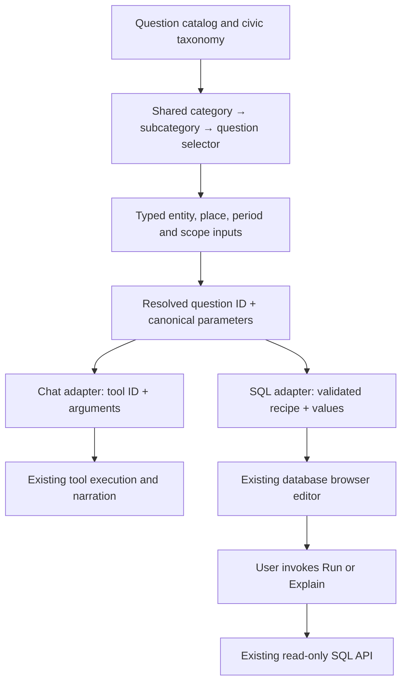

# AI chat coverage and shared question selector for chat and SQL

Status: implementation plan; not implemented. Created 9 September 2026.

## Outcome

One question library and one category selector power both the AI chat and the public database browser:

- **AI chat:** category → subcategory → question → optional parameters → execute the declared tool and narrate its result.
- **Database browser (`/db`):** the same category → subcategory → question → optional parameters → generate an editable SQL statement in the existing editor. The existing **Run** and **Explain** buttons execute it.

For example, **Бюджет и данъци → Общински финанси → „Колко просрочени задължения има общината?“** asks for a municipality and reporting period. Chat returns the corresponding fiscal facts. `/db` generates a query over the same canonical fiscal data with those filters, period, units and missing-value semantics.

The implementation also closes the routing, data-coverage and semantic drift recorded in the [AI chat audit](../audits/ai-chat-audit-2026-09-09.md). Adding a selectable question is the last step of integrating a capability, after its data, arguments and returned meaning are verified.

## Verified starting point

| Surface | Current implementation | Implication |
|---|---|---|
| Chat | 217 tools; audit records 200 intended-tool mismatches across 776 language-specific registry examples | Fix free-text routing as well as direct starter dispatch. |
| Chat starters | 150 bilingual entries with IDs, category paths, tool IDs and BG/EN argument fixtures | Migrate the existing data, preserving its IDs; do not rebuild a second catalog. |
| Taxonomy | 18 categories and 64 subcategories in `ai/app/starterCategories.json` | Reuse these civic topics across both surfaces. |
| Editorial backlog | 257 Bulgarian questions, all marked for review | This is a demand backlog, not 257 production-ready capabilities. |
| SQL browser | Public `/db`, CodeMirror, schema explorer, Run/Explain, history, saved queries, CSV/JSON exports | Integrate with the existing screen and execution API. |
| SQL library | **37 queries in 13 purpose groups**, in `src/screens/dev/sqlLibrary.ts` | Preserve all 37 existing `/db?q=<id>` links, `cost` and `walks` metadata. Older comments referring to 31 queries/12 groups are stale. |
| SQL API | `/api/sql/schema` and `/api/sql/query`; request body currently `{sql, limit}` | Editable SQL can continue using the existing endpoint; a new LLM SQL-generation service is unnecessary. |
| SQL execution | Production uses the read-only role, read-only transaction, 8-second timeout, 2,000-row maximum and rate limiting. Dev currently uses 20 seconds / 5,000 rows. | Validate generated recipes against production limits, not only the more permissive development defaults. |
| SQL tests | `scripts/db/tests/sql_library.data.test.ts` executes the library and verifies several business-definition traps | Extend this gate; preserve the map-link assertions and improve semantic parity checks. |

Reference implementation files:

- [Chat dispatch](../../ai/app/Chat.tsx), [starter metadata](../../ai/app/starters.ts), [router](../../ai/orchestrator/router.ts), [registry](../../ai/tools/registry.ts).
- [SQL browser](../../src/screens/dev/SqlBrowserScreen.tsx), [SQL library](../../src/screens/dev/sqlLibrary.ts), [SQL execution](../../functions/sql_lib.js), [dev SQL adapter](../../vite/sql-browser.ts).
- [Existing data-browser plan](data-hub-lateral-edges-v1.md). This plan builds on the purpose library already shipped; historical “10 samples” descriptions are not the current baseline.

## Design decisions

### 1. Share the question, parameters and selector; specialize the output

Use a surface-neutral module under `src/lib/questions/` and a shared React selector under `src/components/questions/`. Both Vite apps already consume shared `src/` modules.



The selector does not import the tool registry, providers, PostgreSQL clients, SQL execution services or CodeMirror. It emits a typed selection. Chat owns narration; `/db` owns SQL editing and execution. Load SQL recipes only in `/db`; do not add SQL strings to the chat bundle or chat/model dependencies to the main site's selector.

Use the existing design-system menu/popover primitives and the repository's nonmodal dropdown convention. Both hosts render the **same selector component**, with host-specific labels and callbacks, rather than maintaining two visually similar copies.

### 2. Model support separately for chat and SQL

Proposed files:

| File/directory | Responsibility |
|---|---|
| `src/lib/questions/types.ts` | Question, parameter, availability, coverage and resolved-selection contracts. |
| `src/lib/questions/categories.json` | The existing 18/64 taxonomy, moved without changing IDs. |
| `src/lib/questions/catalog.ts` and topic data modules | Shared bilingual titles/questions, parameter specifications, capability references and legacy aliases. |
| `src/lib/questions/resolve.ts` | Pure defaults, parameter validation and conversion to canonical selection. Entity lookup adapters stay outside this pure module. |
| `src/components/questions/QuestionSelector.tsx` | Category navigation, search, breadcrumbs, leaf lists and accessibility. |
| `src/components/questions/QuestionParameters.tsx` | Shared parameter form, with host-provided entity/place/period lookups. |
| `ai/app/questionAdapter.ts` | Map canonical selections to declared tools and arguments; reuse the existing `runChoice` behavior. |
| `src/lib/questions/sql/recipes.ts` and topic modules | Versioned, reviewed SQL recipes, dependency declarations and output-column contracts. |
| `src/lib/questions/sql/render.ts` | Deterministically render validated parameters into editable SQL. |
| `src/screens/dev/sqlLibrary.ts` | Temporary compatibility projection preserving existing exports, IDs and map links. |
| `scripts/ai/audit_question_coverage.ts` | Generate coverage, parity and unresolved-question reports across both surfaces. |

A question record needs:

- Stable `id`, `categoryId`, `subcategoryId`, bilingual `question` and short `description`, optional search aliases and editorial source references.
- Typed parameters: entity IDs, geographic level + code, election ID + election type + round, assembly ID, year/quarter or date range, enumerated measure/basis, and bounded result limit. Use only the parameters relevant to that question.
- Explicit defaults distinguished from user choices. “Latest” is resolved from available data with its actual date/period, not a hardcoded year or the browser calendar alone.
- `chat` capability: ready/review/unavailable, tool reference, adapter reference and reason when unavailable.
- `sql` capability: ready/review/unavailable, recipe reference + version, and reason when unavailable.
- Coverage constraints: source IDs, supported entity/geographic grain, period, currency/unit, money basis, freshness policy, known exclusions, and whether an empty result is meaningful.
- Test references and the most recent validation record. A validation date is evidence of a past check, not proof that the current source is fresh.

Keep implementation functions in adapter modules, not JSON. The catalog can refer to their IDs. Validate every reference at build/test time.

One civic question may have both outputs, only chat, or only SQL. Do not merge similar-looking questions unless their measures, source coverage and filters agree. In particular, “contracted”, “paid”, “forecast”, “declared”, “registered population” and “census population” remain different meanings.

Preserve the 18 civic categories. SQL-only technical entries such as corpus sizes and freshness remain available through a shared-catalog **„Данни и покритие“ / “Data and coverage”** utility group, rendered by the same selector. This is an additive utility group, not a reason to force technical questions into an unrelated civic subcategory. Availability controls whether the group appears in either host.

The present starter IDs happen to be tool names; preserve them through migration. Future question IDs must not be forced to equal tool names: several parameterized questions can use one tool, and one question can later migrate between tools without breaking its identity.

### 3. SQL generation uses reviewed recipes

Generate SQL deterministically from a selected question and typed parameters. Do not translate the Bulgarian sentence into arbitrary SQL at runtime. Reuse existing SQL functions/views and the existing 37 library recipes wherever their business meaning matches the question.

SQL output must be directly editable and runnable in the existing browser. The first version retains `/api/sql/query {sql, limit}`; it must not display unresolved `$1` placeholders while that endpoint has no parameter-binding contract.

The renderer uses explicit typed value tokens or a small SQL construction API, not string replacement over arbitrary query text:

- Strings have a single PostgreSQL-aware literal encoder, covering apostrophes, backslashes, Unicode and NUL rejection. IDs such as ЕИК and ЕКАТТЕ stay strings so leading zeroes survive.
- Numbers, dates, periods and limits are parsed and bounded before rendering. Reject non-finite numbers and invalid dates.
- Table/function/column/order identifiers come from recipe code or enumerated mappings; they are never taken from free text.
- A recipe produces one bounded read query, normally `SELECT` or `WITH … SELECT`. It declares the functions/relations and result columns it uses.
- Explanatory SQL comments carry source, period, units, coverage and important traps. The same metadata also appears in a short UI description.
- JSON-returning functions are projected into useful scalar columns or expanded rows where appropriate. Do not present a whole result as `[object Object]` and call the question answered.

For outputs needing more than one corpus, prefer an existing canonical PG function or a reviewed CTE with explicit deduplication and money bases. Do not reconstruct a second set of business formulas in a SQL template when a canonical function can serve both chat and SQL.

The renderer is not a replacement for the SQL API's existing protections: users can edit the SQL. Preserve the read-only role/transaction, timeout, row cap and rate limiting.

Example generated statement for **Бюджет и данъци → Общински финанси → „Кои общини имат най-много просрочени задължения?“**, with year 2025, quarter 4 and limit 25:

```sql
-- Просрочени задължения към края на IV тримесечие на 2025 г.; евро.
-- NULL means not published, not zero. These are arrears, not all commitments.
SELECT obshtina, fiscal_year, quarter, arrears_eur
FROM municipal_fiscal
WHERE fiscal_year = 2025
  AND quarter = 4
  AND arrears_eur IS NOT NULL
ORDER BY arrears_eur DESC, obshtina
LIMIT 25;
```

These column names were checked against migration `149_municipal_fiscal.sql`; the example is a planned recipe, not a query executed in this planning turn. The corresponding chat adapter must use that same reporting period and measure, and disclose the population of municipalities with missing values when presenting the ranking.

### 4. Static-only data needs an explicit SQL strategy

Do not assume every chat tool has a PostgreSQL equivalent. Candidate/person election tables exist, but they do not automatically represent national/section election results, presidential rounds or every local-election corpus. The audit also identifies static water, education and other artifacts.

At inventory time, classify each question's SQL path as:

1. Existing canonical PG relation/function: write the recipe now.
2. Data present in PG payloads: query it only when the payload has a stable documented shape and acceptable execution cost; otherwise expose a normalized serving view/function.
3. Static-only source: add an idempotent loader plus typed PG serving representation where SQL support is required. Otherwise record a specific unavailable reason and ingestion dependency.
4. Source not ingested or not sufficient for the question: keep the question in review, with the missing source/measure stated.

The **Избори → Парламентарни** journey must work in both hosts at completion. Therefore the plan includes a bounded election SQL ingestion/serving step if the inventory confirms national result queries are still static-only. Do not substitute candidate preferences or parliamentary roll calls for election results. Presidential/local SQL coverage follows the same rule and must not point to parliamentary tables as a fallback.

### 5. Preserve browser editing, history and links

- Replace the current purpose menu with the shared selector; keep the schema sidebar, history, saved queries, export controls, result links and Run/Explain shortcuts.
- Navigating categories or editing parameter fields does not erase the SQL editor. A completed question selection / **Generate SQL** action replaces its contents atomically and can be undone.
- Generation never submits `/api/sql/query`. Clear the previous CodeMirror text selection so a subsequent Run cannot execute an old selected fragment.
- Preserve all 37 existing `/db?q=<id>` values through an explicit alias map. Keep `walks` links used by the data map valid, including SQL-only questions.
- Add versioned, validated serialization of recipe parameters for new shareable selections. Resolve `q` first, accept only that recipe's allowlisted parameters, and never accept raw SQL from a URL.
- On unknown ID, invalid parameter or unsupported recipe version, show a clear error and leave the editor intact. On browser Back/Forward, apply a valid new selection without auto-running.
- A hand edit, saved-query load, or history load clears the catalog identity/URL parameters unless the editor still exactly matches that generated selection. Handle CodeMirror's programmatic change callback so generating SQL does not immediately clear its own ID.
- Keep old localStorage history and saved-query records readable. Optional new question/parameter metadata is additive; do not discard users' SQL.
- Mark a previous result as belonging to the last executed SQL when the editor changes; never label it as the result of the newly selected question before Run.

## Implementation sequence

Each step ends with its focused tests and a review of changed behavior. Integration steps must include data evidence; a non-null envelope or a SQL query returning any rows is insufficient.

### Tier 1 — Baseline, shared contracts and correctness

#### Step 1. Freeze and reconcile the capability inventory

**Work**

- Re-run the chat wiring audit; capture the current 150 starters, all registry examples, 257 editorial questions, 217 tool-topic mappings, and 37 SQL recipes.
- Produce `docs/audits/question-capability-matrix.json` with one record per distinct question and separate chat/SQL status, source, measure, grain, parameters, gap and implementation-step reference.
- Crosswalk existing SQL IDs to civic topics and matching chat questions. Retain SQL-only questions rather than discarding them to fit the current AI library.
- Compare main-app API functions with chat readers to distinguish missing access from missing fields/routing. Verify PG function signatures from migrations/live schema; do not guess columns from labels.
- Review existing SQL copy as well as SQL mechanics. Current examples call contract value “paid”, and procedure base-rate wording mentions applicants although rejected applications are not in ISUN. Correct those meanings before merging catalogs.
- Identify all static-only questions and the minimum new PG representation needed for elections in both hosts.

**Acceptance**

- Every current starter, SQL ID and editorial question has an explicit disposition; all 47 source groups have coverage notes.
- No invented “supported” status based solely on topic adjacency, route existence, a PG relation name or an estimated row count.
- Exact duplicates are linked, semantic differences retained, and every unresolved item points to a later step or explicit source prerequisite.

#### Step 2. Introduce the shared catalog and typed parameters

**Work**

- Add the shared contracts/modules described above; migrate the 18/64 taxonomy and 150 starters without changing their IDs.
- Normalize execution parameters to language-independent identities. Keep bilingual display text and bilingual free-text routing fixtures separate from canonical args.
- Add adapters/projections so the current flat chat chips and SQL menu still work during migration.
- Add surface-specific availability filtering, stable ordering and search over Bulgarian/English questions and aliases. Ranking is curated; do not claim popularity without usage evidence.

**Acceptance**

- Both apps compile against the same taxonomy and catalog schema.
- Invalid category paths, duplicate/unknown IDs, missing adapters, invalid defaults and unbounded limits fail a hermetic catalog test.
- The main site does not import AI providers/tools through the shared selector; chat does not import the SQL recipe bundle.

#### Step 3. Repair the confirmed answer and routing defects

**Work**

- Presidential intent before generic elections; explicit type/year/round/place retention. Ambiguous 2024 comparisons request/select both dates or a specific election.
- Canonical entity lookup for people, companies and ministries; preserve ambiguity instead of accepting a national fallback. Fix English vote-topic extraction/search.
- Separate MIR and administrative oblast calculations; reconcile 28-oblast denominators and exclude abroad where appropriate.
- Carry assembly identity explicitly through historical parliament tools. Migrate parallel JSON/PG summaries only after parity checks.
- Fix air missingness, station fallback labels, date/averaging periods and compatible thresholds.
- Reconcile budget revenue, expenditure, EU contribution and balance; keep state/CFP/COFOG bases distinct.
- Correct overbroad spending, affordability, wealth, school-quality, risk and vote-flow wording; move withheld examples into active use only after a targeted repair.
- Validate required tool arguments and enums. Add source-aware cache policies and revalidation for deadline-sensitive data. Hash vector inputs so semantic changes invalidate old vectors.

**Acceptance**

- Every original mismatch gets an explicit resolution: repaired route/args, corrected example, deliberate clarification or withdrawn misleading wording. No silent deletion from the audit denominator.
- All promoted free-text examples select the intended tool and scope in BG/EN; direct starter dispatch cannot bypass parameter validation.
- Targeted fixtures verify entity, period, geography, money reconciliation, nulls and output meaning; source-backed tools are also probed locally.

### Tier 2 — One selector, two working outputs

#### Step 4. Implement SQL recipes, rendering and compatibility

**Work**

- Migrate all 37 SQL library entries to the shared catalog/SQL adapter, preserving legacy aliases, costs and `walks` metadata.
- Parameterize existing hardcoded person/company/place/period values. Verify the exact SQL for every allowed recipe variant.
- Add recipes for currently supported DB-backed chat questions, reusing canonical serving functions and business definitions.
- Retain the `{sql, limit}` execution API. Implement typed literal rendering and output-column contracts.
- Fix the current SQL execution classification for generated queries with leading comments: both executors anchor SELECT detection at the start and inspect semicolons as raw text. Leading recipe comments can bypass cursor-based limiting. Use shared statement classification that understands comments/quoted literals, and verify the generated single-read path remains capped. Do not add a separate execution path that weakens the existing console.
- Share the relevant executor behavior between dev and production, or enforce a parity test with production limits. Keep Explain usable and distinguish it from execution.

**Acceptance**

- All 37 legacy IDs still seed an equivalent, correctly described SQL query.
- SQL generation is deterministic for a resolved selection/version and never executes a query.
- Apostrophes, Cyrillic, leading-zero codes, backslashes, semicolons inside values, invalid periods and malicious-looking input are covered by renderer tests. Inputs cannot change an identifier or add a statement.
- Every ready recipe is executed under read-only production limits against seeded fixtures and representative local data; assertions check output columns, filters, values and defined empty cases.
- Leading comments and quoted semicolons do not bypass the generated-query row cap. Backend errors/timeouts remain visible in the existing UI.

#### Step 5. Build the shared category and parameter selector

**Work**

- Implement category → subcategory → question navigation, breadcrumbs/back, search and a compact parameter form using shared components.
- Show 4–6 varied initial questions per leaf with “more”; avoid a 64-chip toolbar. Keep category navigation accessible on narrow screens.
- Resolve place and person ambiguity through shared lookup adapters. Show the chosen geographic level and reporting period.
- Filter readiness by host. A SQL-only question can appear in `/db` even before a chat tool exists; a static-only chat question must not masquerade as executable SQL. Expose an optional unavailable-items view with concise reasons.
- Add Bulgarian and English labels for the SQL library rather than keeping its current English-only metadata.

**Acceptance**

- Both hosts import the same selector and parameter components, and the same category IDs.
- Keyboard navigation, Escape/back, focus return, search, empty leaves, mobile layout and dark/light themes work.
- Category navigation alone triggers no chat tool and no SQL execution. Missing required parameters prevent generation/dispatch and are explained at the relevant field.

#### Step 6. Connect chat and `/db`; remove duplicate discovery lists

**Work**

- Chat: use the selector in the empty hero and post-answer discovery area. Dispatch the chosen tool via the existing `runChoice` behavior, preserving user messages, narration streaming, busy state and follow-up clarification. Free typing continues through the repaired router.
- Replace duplicated hero/base starter metadata with projections of the shared catalog; derive current election dates and party labels from canonical data. Preserve entity autocomplete where it serves a separate purpose.
- `/db`: wire SQL selection into `setSql`, CodeMirror and the URL/history behavior defined above. Preserve Run/Explain, current-selection execution, saved queries, exports and entity links.
- Add cross-surface links for questions with both adapters, carrying the same validated parameters. A link to `/db` prepares SQL and never executes it on arrival.

**Acceptance**

- The same municipal fiscal or procurement question and parameters reach the correct tool in chat and generate equivalent SQL in `/db`.
- Existing `/db?q=` links, direct navigation, Back/Forward, editor edits and saved/history loads behave correctly.
- Selector components contain no direct query submission or chat execution logic; each host's adapter owns that action.
- No unrelated question strings remain duplicated across the hero, chat starter bank and SQL purpose menu without an explicit reason.

### Tier 3 — High-value missing data, with chat and SQL together

#### Step 7. Fiscal, declarations and procurement accountability

Implement each row as a complete vertical slice: canonical source/function → chat tool/envelope → SQL recipe → parameterized question → tests → readiness promotion.

| Slice | Existing source/API family | Required questions and semantics |
|---|---|---|
| Municipal finances | `municipal_fiscal`, `municipal-fiscal-*` | Municipality profile/ranking/history; debt, commitments, obligations and arrears remain distinct; quarter and evaluable criteria explicit. |
| Budget detail | `budget-variance`, `budget-personnel`, ministry/municipal/capital/law routes and serving functions | Plan versus execution, personnel series, programme and municipality detail; same money basis in both adapters. |
| Declarations and mayor income | `declaration-detail`, `person-declarations`, breakdowns/events/abroad/cohort/accumulation/stakes; `mayor-pay*` | Year and filing type, declared assets/liabilities, ownership versus use, income versus salary, attributed versus missing relationships. |
| Inspections and contract execution | АДФИ, contract annexes, subcontractors, consortium and tender dossier/document data | Findings with source/outcome, base contract versus amendments, participant roles, value changes and actual execution evidence. |

**Acceptance:** same resolved parameters produce semantically equivalent chat facts and SQL results from the same source snapshot; differences in display rounding are normalized, not treated as different facts. Missing source/period/identity remains explicit.

#### Step 8. Complete election SQL and the geography-sensitive civic slices

**Work**

- If required by Step 1, add normalized national election results and dimensions to PG using existing local source artifacts. Allocate migration numbers at implementation time, add an idempotent loader to the normal refresh chain, document source versions and preserve type/date/round/party/grain keys. Start with national parliamentary results; add presidential rounds and local results by their actual source grains.
- Provide canonical election serving queries and use them for SQL recipes. Compare against existing chat computations before migrating those tools to the new serving path.
- Add water rationing/operator coverage, administrative service discovery and education context/history/textbook detail. Reuse current `schoolMatura` cohort/percentile/SES support rather than rebuilding it.
- For static-only water/service/education data, apply the PG strategy above and explicitly record any fields still unavailable.

**Acceptance**

- **Избори → Парламентарни → latest national results** works in both chat and `/db` with the same election and totals.
- Presidential and local questions use their own election types/rounds and never silently fall back to parliamentary results.
- National totals reconcile with the corresponding granular source; geography joins preserve MIR/oblast/municipality/settlement distinctions and abroad handling.
- Water questions state the observed period; service questions retain official links; school comparisons retain cohorts and compatible periods.

### Tier 4 — Remaining audited integration families

#### Step 9. Add the remaining existing-data capabilities

Work in the following independent topic slices; each follows the same dual-output promotion gate as Step 7:

| Slice | Remaining integration |
|---|---|
| Procurement registers and comparisons | TED notice/lineage coverage, ЦПРС registration, АОП experts, competition/award criteria/concentration and per-contract benchmarks. |
| EU funding | ISUN procedure rates/fit/completion, open-call deadlines and current official conditions, Interreg operation/programme/partner detail. Preserve Interreg's existing inclusion and avoid counting it twice. No applicant approval-rate claim without rejected-application data. |
| Health | Hospital histories/financial coverage/activity, drug pack/unit/quarter comparisons and molecule detail. Align date ranges, units and comparability. |
| Local accountability and courts | Individual council resolutions/named votes, magistrate filings/relationships, court detail and coverage. |
| Transport/security geography | Project/facility/directorate maps; distinguish registered seat, project location and beneficiary geography. |
| Existing broader tools | Reconcile remaining energy, culture, social, prices, macro, demography and poll tools against canonical main-app sources; supply SQL adapters where a valid PG source exists. |

**Acceptance:** every existing-data gap in the audit is implemented or has a precise data prerequisite with a tracked unresolved status. Do not mark an entire family complete because one top-level totals tool works.

#### Step 10. Resolve the editorial questions requiring new evidence

Triage the rest of the 257-question collection, including waiting times, individual eligibility, childcare capacity, live water tariffs/outages, train punctuality, building permits, public attitudes and news-based claims.

For each question, record one outcome: promote using an existing validated capability; implement a specific new official-source ingestion; provide an explicitly scoped statistical alternative; or leave unavailable with the missing evidence named. Similar wording does not justify substituting a different metric.

News integration is a dedicated retrieval/citation capability against `news/` and authoritative statistical sources. It requires article dates, source attribution and a distinction between an article's claim and verified data. Do not convert it into unrestricted SQL over a table presumed to exist.

**Acceptance:** all 257 editorial records have an individual disposition and both surface statuses. Unsupported questions remain inspectable in the coverage report and do not appear as ready starter actions.

### Tier 5 — Regression gates, packaging and release readiness

#### Step 11. Make coverage drift fail visibly

**Work**

- Add a hermetic catalog gate plus focused selector/host tests. Preserve and extend the 303 starter tests and existing SQL-library/map-link tests.
- Add seeded DB integration tests with production execution limits and independent expected facts for important recipes. Avoid deriving every expected answer from the same function under test.
- Compare chat versus SQL on the same resolved entity, period, geography, source basis and source version. Include empty/partial data, nulls, zero values, duplicate joins and boundary periods.
- Make new tool/source/schema changes require an explicit question/SQL coverage decision. Unsupported is valid when documented; silently unmapped is not.
- Keep free-text route evaluation distinct from direct starter execution. Test repair of all original mismatches and preserve provider-specific limitations; an LLM benchmark is separate from the deterministic router score.
- Use a required DB-enabled CI/release job. Ordinary local suites may follow the repository's DB-unreachable skip convention, but a skipped data suite is not a passed release gate.
- Revalidate query function signatures and schema dependencies after migrations; update source availability without using estimated table row counts as emptiness evidence.

**Acceptance**

- Both app builds/typechecks pass; selector/host tests and every ready recipe's data checks pass.
- Each dual-ready question has a parity fixture; all migrated legacy SQL links retain their map contracts.
- New sources cannot arrive without appearing as supported, partial or explicitly unavailable in the generated coverage report.

#### Step 12. Repair packaging and prepare the rollout

**Work**

- Fix `vite.config.ai.ts` to copy only required public assets instead of following the main app's data symlinks and pruning gigabytes afterward. Make prune/SEO plugins respect the resolved output directory.
- Run full AI and main-site builds, including fonts/SEO/static assets; the previous bundle-only check is not sufficient for release packaging.
- Verify local desktop/mobile flows in both hosts and execute a small read-only production parity/freshness sample when preparing release. Keep local and production data versions visible in evidence.
- Deploy schema/functions/loaders before UI recipes that depend on them; use explicit schema/capability versions so staggered deploys show unavailable status instead of broken SQL. Do not infer function availability from `/api/sql/schema`, which currently lists relations/columns rather than complete function signatures.
- Retain compatibility projections/aliases through rollout. Roll back an affected adapter's ready status without deleting the question, breaking old links or reverting user-saved SQL. Remove the compatibility modules only after all consumers migrate.

**Acceptance:** ordinary production packaging passes, both surfaces use the shared selector, ready capabilities meet the contract below, and the coverage report distinguishes shipped, partial and source-blocked work.

## Dependencies and suggested delivery boundaries

| Delivery | Steps | Depends on | Reviewable result |
|---|---|---|---|
| A | 1–2 | Existing audit | Shared catalog, complete disposition matrix, current UIs still functional. |
| B | 3 | 1; consumes 2 | Correct routing/data semantics and reclaimed withheld prompts. |
| C | 4–6 | 2; each promoted chat adapter requires relevant Step 3 fixes | Shared selector live in both apps, all 37 SQL links preserved, SQL generation into the editor. |
| D | 7–8 | 2, 4; host integration from 6 | High-value dual-output slices, including parliamentary election results in SQL. |
| E | 9–10 | 2, 4; source-specific prerequisites | Remaining existing-data coverage and fully triaged editorial bank. |
| F | 11–12 | Tests evolve with all prior steps; release requires their gates | Drift prevention, valid packaging and release evidence. |

Do not wait for every new source before delivering the shared selector. Conversely, do not call the overall coverage work complete when only the selector has shipped. Steps 11's tests accompany each slice; they are not postponed to the end.

## Final acceptance contract

1. Chat and `/db` use the same category/subcategory/question selector and canonical parameter model.
2. A ready chat selection executes the declared tool, bypassing text reclassification while retaining validation and ambiguity handling.
3. A ready SQL selection generates editable, correctly scoped SQL and requires the existing Run/Explain action to execute.
4. Every dual-ready question returns equivalent facts for the same parameters/source snapshot; no paid/awarded, MIR/oblast, current/historical or missing/zero substitutions.
5. All 150 original starter IDs and 37 SQL link IDs are accounted for. Editorial questions and audit gaps have explicit dispositions; unsupported capability is never silently advertised as ready.
6. The parliamentary-election example works end to end in both hosts. Broader static-only SQL coverage is implemented by actual serving data, not invented relation names.
7. No duplicated discovery catalog remains authoritative in a single host. Source/schema/tool changes trigger coverage validation, and full production packaging passes.

## Validation commands to use during implementation

Existing commands (run only the relevant scope as each step changes):

```sh
node --import tsx scripts/ai/audit_chat.ts
node --import tsx scripts/ai/probe_starters.ts
npx vitest run ai/app/starters.test.ts
npx vitest run scripts/db/tests/sql_library.data.test.ts
npm run typecheck:ai
npm run build:ai
npm run build
node --test functions/db_catalog.test.js
```

Add focused tests under the shared catalog/selector, SQL renderer, chat adapter and browser adapter paths; add DB parity fixtures under `scripts/db/tests/`. The plan-writing turn does not run those future tests, execute new SQL, perform migrations or change application behavior.
