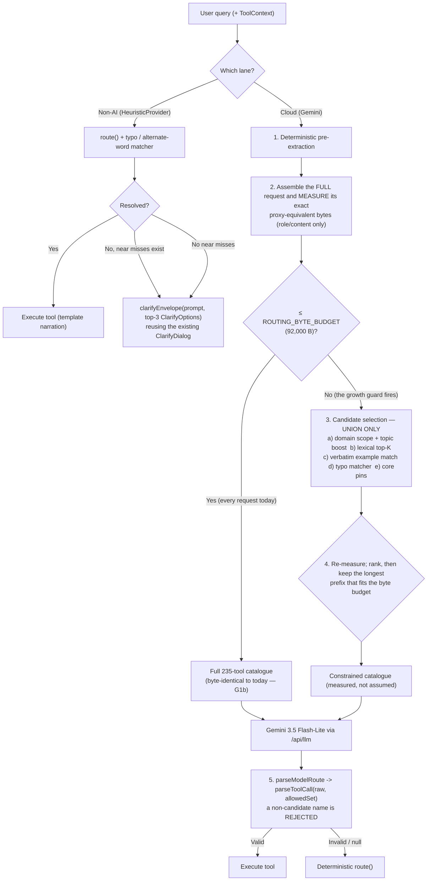

# AI Chat: Byte-Budgeted Tool Catalogue, Deterministic-First Routing & Candidate Pre-Selection

**Status**: Proposed; not implemented. **Rev 4**, 2026-09-16.
**Revision note**:
- **Rev 1** (September 2026): Stated the problem qualitatively and set a token-reduction target.
- **Rev 2** (2026-09-16): Replaced figures with live measurements, changed the objective to closing a hard byte ceiling without losing routing accuracy, made the constraint enforceable in code, and replaced the benchmark with a held-out one.
- **Rev 3** (2026-09-16): Added the domain-scope trigger mechanism, fiscal subtopic partitioning, the BG multi-turn narrowing note, and a narration size bound.
- **Rev 4** (2026-09-16): Audit of Rev 3 against the code, plus three review considerations. Seven changes:
  1. **Deleted the fiscal subtopic partition** — it fails completeness (55 of 90 fiscal tools uncovered under the plan's own topic names, 4 double-assigned) and its exclusivity rule contradicts the union semantics. Replaced by a ranking *boost*, cap unchanged.
  2. **Added the missing `indicators` trigger** — 40 tools, including all 12 prices/basket/chain tools, had no anchor at all.
  3. **Specified Unicode-aware keyword boundaries** — `\b` is ASCII-only and never matches after a Cyrillic letter; `съд`/`град`/`съвет` traps are now named and tested.
  4. **Cut the byte margin from 8,000 B to 4,000 B** and derived it from `POLICY.inputBytes`. Measured long BG threads sit 7,450 B under the real ceiling, so the old margin narrowed ~7,400 B before it was needed — paying the accuracy cost for nothing.
  5. **Corrected the narrowing trigger (§1.3)** — it depends on question *length*, not turn count, and the growth deadline is now stated in tools and days.
  6. **Added the free deterministic lane as Phase 0 / G0** — `npm run ai:test:non-ai` already scores the same 471-case suite with zero API calls; it now blocks the billed Gemini gate.
  7. **Added the typo / alternate-word component and near-miss clarification**, and extended the argument gate from 53 to ~241 annotated cases per language using the existing starter bank.

**Target areas**: `ai/orchestrator/`, `ai/llm/`, `ai/tools/`, `ai/tests/`, `functions/`.

---

## 1. Verified starting point

Every figure below was measured on 2026-09-16 at `3f27f683e5` unless the row names its own artifact and date.

### 1.1 The cloud (Gemini) lane

| Surface | Measured | Implication |
|---|---|---|
| Tools in the registry | **235** (`TOOLS.length`) | Domain groups: **fiscal 90, elections 57, indicators 40, people 23, local 15, place 10** |
| Routing system prompt, BG / EN | **85,121 B / 56,632 B** | The BG catalogue is the binding case |
| Routing request, one-line question | **86,192 B / 57,681 B** | The proxy counts these bytes, not tokens |
| Proxy ceiling | **96,000 B** (`POLICY.inputBytes`), enforced on `JSON.stringify(messages)` | Exact and reproducible client-side |
| Largest tool entries | `procurementQuery` **3,229 B** (51 params), `fundingQuery` **3,081 B** (47 params) | A single new large tool costs ~3 KB of slack |
| Average tool entry, BG / fixed non-catalogue part | **345 B / 4,080 B** | Sizing arithmetic for any candidate set |
| Registry growth | **228 tools on 2026-09-10** (`current_baseline.json`) → **235 today** | **+7 in 6 days** — see §1.3, this is the deadline |
| Production model routing accuracy, full catalogue | **96.8% EN / 97.2% BG** tool accuracy; `realistic` group **91.7% EN**; arguments **98.1%** on 53 annotated cases/lang (`data/ai/evals/current_baseline.json`, 471 pairs, commit `6d503a3`) | **The number the narrowing path must not lower** |
| Cloud call budget | `calls: 3`, `callReserve` 31,000 µUSD, daily **$5** / monthly **$50**, model pinned to `google/gemini-3.5-flash-lite`, `body.tools` rejected (`functions/llm_security.js`) | No spare call for an extra routing hop; no second model without a policy change |
| Cost of one billed eval | **952 API requests** for the last full suite (`ai-evals-v2-2026-09-10.md`) | Billed gates must be earned by the free ones (§1.2) |

### 1.2 The Non-AI (deterministic) lane — measured, and the reason this plan resequences

| Surface | Measured | Implication |
|---|---|---|
| Non-AI tool accuracy | **75.8% EN / 83.2% BG** (`data/ai/evals/non_ai.json`, same 471-case suite) | 20 points below the model, and it costs nothing to measure |
| Non-AI call / argument accuracy | **73.7% / 30.2% EN**, **81.1% / 39.6% BG** (53 annotated cases) | Arguments are the weakest measured surface in the product |
| Non-AI known failures | **207**, split **147 wrong-tool (71.0%)** vs **60 abstentions (29.0%)** (`ai/tests/nonAiEval.knownFailures.json`) | The dominant failure is *confidently off-target*, not "no answer" |
| Free gate that already exists | `npm run ai:test:non-ai` → `ai/tests/nonAiEval.test.ts`; scores the same suite through `selectHeuristicRoute`; **no API calls, no Postgres, and it asserts `fetch` is never invoked**; 207 explicit `it.fails` ratchet entries | The deterministic lane can be gated to completion for **zero tokens** |
| Deterministic router on registry examples | **200 of 776 language-specific examples wrong-or-null** (`docs/audits/ai-chat-audit-2026-09-09.md`) | The fallback is not a peer of the model |
| On a miss | `clarify()` returns one static sentence with two hardcoded examples (`ai/llm/lang.ts:16-19`); no use of the near-miss | A typo dead-ends, or worse, answers the wrong tool |

### 1.3 The Bulgarian narrowing reality

The BG routing request is **86,192 B** before any context, so the trigger is set by how long the thread's questions are — **not** by turn count. Measured over full 6-turn BG windows:

| thread profile | total request | vs `88,000` (Rev 3 budget) | vs `92,000` (Rev 4 budget) | vs `96,000` ceiling |
|---|---|---|---|---|
| very short (`а ГЕРБ?`) | 86,996 | +1,004 | +5,004 | +9,004 |
| short | 87,394 | +606 | +4,606 | +8,606 |
| medium | 87,952 | **+48** | +4,048 | +8,048 |
| long | 88,550 | **−550 already over** | +3,450 | +7,450 |
| packed | 88,585 | **−585 already over** | +3,415 | +7,415 |

**Implications, all three load-bearing:**

1. **Rev 3's 8,000 B margin narrowed ~7,400 B before it was needed.** Long BG threads were already over the Rev 3 budget while sitting 7,450 B under the real ceiling. The byte count is exact, not estimated — the client's `JSON.stringify(messages)` *is* the proxy's computation (`functions/llm_security.js:99-104` maps to `{role, content}` and stringifies exactly that array). Rev 4 therefore uses `MARGIN = 4,000` (§4 C1).
2. **Narrowing is LIVE today, for the largest BG contexts — this corrected an earlier claim of this plan.** A typical 6-turn BG window measures ~88.9 KB, inside the 92,000 budget, but the LARGEST context the system itself admits (`CLOUD_BUDGET` = 1,200 estimated tokens, reachable by a single long turn) serializes to **~92.2 KB — over budget**, while still inside the proxy's 96,000 ceiling. Measured 2026-09-16 in `ai/llm/promptBudget.test.ts`, which pins both sides: the typical window fits with > 2,000 B of slack, and the saturated one does not.

   So the narrowing path is a current operating mode for long BG threads, not only a growth guard, and Phase 1's accuracy gates are live rather than precautionary. It remains true that EN never narrows (> 30 KB of slack). G1b is still a free byte-identical snapshot — the full-catalogue path must stay byte-identical whenever the budget is not exceeded — and G1a is still the accuracy gate, now for a path that already runs.
3. **The guard starts firing in roughly 1–2 weeks.** At 345 B per average entry, 3,415 B of slack is **~10 more tools** for a long BG thread, ~12 for a medium one, ~17 for a one-line question — and a single new large tool (3 KB) consumes nearly all of it. The registry grew **+7 tools in the 6 days** before this revision.

### 1.4 Secondary motivation: attention over 235 tools

Rev 1 argued that 235 tools at once cause routing collisions between overlapping neighbours (`procurementTotals` vs `procurementQuery`, `turnout` vs `turnoutSeries`, `budgetOverview` vs `budgetByFunction`). That is plausible and `K_MAX` exists because of it.

**It is not measured, and it is not what makes this plan urgent.** No artifact here isolates catalogue size from routing error — the 96.8/97.2% baseline is a full-catalogue result. Treat the byte ceiling (§1.3 item 3) as the blocking constraint and the attention argument as a hypothesis that G1a and G1b test between them; do not fund a design on it.

### 1.5 What actually happens today when the ceiling is hit

Rev 1 described an "unavoidable `413 input_too_large` failure". That is not what a visitor sees, and the real behaviour is worse:

1. `openrouter.ts:143` writes `setAiNotice("input_too_large")` and throws.
2. `selectRoute`'s catch (`:280`) returns the **deterministic** route.
3. Narration still succeeds, and the answer is labelled `usedModel = routedByModel || fromModel` (`:499-502`) — so the reply is presented as model-generated.
4. The only reader of the notice is the `ModelPicker` popover (`ai/app/ModelPicker.tsx:36-37`).

So the ceiling degrades routing silently from a 97%-accurate model to a 76–83% keyword router while the answer keeps its "AI помощник" label. That is the motivation — not the token bill, which is ~$0.005 per question against a $5/day budget.

---

## 2. Objective and non-objectives

**Objectives**

1. Guarantee that no routed request can reach `POLICY.inputBytes`.
2. Keep cloud routing accuracy under narrowing at or above the measured 96.8% EN / 97.2% BG baseline.
3. **Raise the deterministic lane**, which is what Non-AI mode serves: it costs no tokens, it is currently the weakest surface (30.2%/39.6% argument accuracy), and 71% of its failures are confidently wrong rather than absent.

**Explicit non-objectives**

- Banking a token/cost saving. Narrowing is a *growth guard*, not a default: today it fires for no request at all.
- Replacing retrieval quality. The typo/alternate-word component (C5) fixes **surface variation on a query that already shares tokens with the index**; it does not raise the 49.1% lexical recall on novel phrasing.

---

## 3. Target architecture

Two lanes. The deterministic lane is gated first because it is free; the cloud lane's narrowing path is exercised only after it is green.



Design constraints:

- **The binding constraint is bytes, and there is NO tool-count cap.** An earlier revision specified `K_MAX = 24` as an attention bound; measurement removed it. It was the ONLY binding constraint in the live path — the pre-selected set for a saturated BG thread (203 tools) already fits at 83,343 B — and it cost the gold tool for 9.9% of the eval corpus (35.5% of non-verbatim calls) against 0.5% with the byte bound alone. G2 (§6) then measured candidate-set recall directly: 0.56 @16 against 0.86–0.91 at the depth the byte bound actually keeps. A count cap cannot come back without a ranker that clears those numbers.
- **Every candidate arm only adds.** Arms are unioned; a later stage may *rank and prune* against the byte budget, but no arm may intersect away another arm's contribution. This is what Rev 3's fiscal subtopic rule violated (§7).
- **The full-catalogue path is untouched.** When the budget is not exceeded the emitted prompt must be byte-identical to today's, asserted for free (G1b).
- **The rules-first bypass box stays gone.** Rev 1 drew "Heuristic `route()` confident? (Score = 1.0) → bypass the cloud LLM". There is no score: `route()` returns `{tool,args} | null` (`router.ts:5207`, `Route` at `:54`), and the cloud path is deliberately model-first (`openrouter.ts:216-236` bypasses the model for exactly 7 pinned tools). Promoting a router measured at 200/776 above one measured at 97% is a large, unmeasured accuracy change and is out of scope.

---

## 4. Components

### C1 — `ai/llm/promptBudget.ts` (new): the invariant in one place

- `routingRequestBytes(lang, candidates, userContent): number` — exact UTF-8 length of the proxy-equivalent serialization. Exact rather than estimated because the proxy re-serializes only `{role, content}` (`functions/llm_security.js:99-104`).
- `ROUTING_BYTE_BUDGET = POLICY.inputBytes - MARGIN`, with `MARGIN = 4_000` and the margin's purpose stated in a comment (headroom for a future proxy framing addition; the count itself is exact, so this is not an estimation error budget). Rev 3's 8,000 B cost ~7,400 B of unnecessary narrowing — see §1.3.
- **NO tool-count cap.** See §3: `K_MAX` was measured to be the only binding constraint and to cost reachability, so the byte bound is the sole pruner. Any future cap must be justified by a G2 measurement at that depth.

### C2 — `ai/orchestrator/toolPreselector.ts` (new): union-only candidate selection

Ordered by cost. No new committed artifact and no model download.

1. **Verbatim registry-example match.** If the question equals a registry `examples[].bg|en`, include that tool. This is the honest home for the 204/284 starter prompts that appear verbatim in the registry, and it keeps the recall benchmark (G2) meaningful by handling them explicitly instead of by indexing the user's own query. Include the tool — do **not** bypass the model, or argument extraction is lost.
2. **Domain scope, with a topic ranking boost.** All **six** domains must have at least one trigger; a domain with no trigger is unreachable except through the 49.1% lexical arm.
   - **The `indicators` hole (Rev 3) must be closed.** Measured: all 12 prices/basket/chain/macro tools live in `indicators` — `electricityPrices`, `gasPrices`, `priceIndex`, `settlementPrices`, `productPrice`, `cheapestChains`, `priceRanking`, `basketAffordability`, `basketVsInflation`, `euFoodPriceLevels`, `fuelPrices`, `chainProfile`. Rev 3 labelled prices "a sub-domain of fiscal/indicators" and gave `indicators` no anchor, leaving 40 tools (17% of the registry) to the lexical arm alone.
   - Triggers: EKATTE place/settlement → `local` + `place`; party token → `elections`; person/magistrate name → `people`; retail/chain/product/basket/macro/land token → `indicators`; ministry/budget/contract/tender/fund/subsidy token → `fiscal`.
   - **Unicode-aware boundaries are mandatory.** Write `(?![\p{L}\p{N}])` with the `u` flag, never `\b` — `\b` is ASCII-only and never matches after a Cyrillic letter, a rule this repo already documents in `CLAUDE.md` (the `tender_subcontracting` note). Named traps to test: `съд` also matches *съдържа / съдба / съдействие / съдружник*; `град` also matches *гражданин / виноградарство*; `съвет` matches **Министерски съвет** (national government, not `local`).
   - **Within a domain, topic matches boost rank; they never exclude.** This replaces Rev 3's subtopic partition (§7) and is what orders `fiscal` (90 tools): boost bucket, then lexical score. Union semantics are preserved because nothing is removed from the arm — only the byte bound prunes, and it does so from the ranking's tail.
3. **Lexical top-K** via the existing `retrieveTools()` (`ai/llm/retrieve.ts`, fuse.js). Already a dependency of the main bundle (`src/layout/search/*`), so reuse is free. Measured 49.1% @8 on the real input, so it rides as an *extra* arm and never as the sole one. **G2 measured this arm as the binding ceiling**: candidate-set recall on the held-out residual is 0.439 @8 and 0.561 @16, against 0.864 @150. The union ranks tool-level evidence ABOVE domain membership because the reverse order measured 0.462 @16 — a domain block of 40–90 tools otherwise fills the top of the ranking.
4. **Typo / alternate-word matches** from C5.
5. **Core pins**: `governanceProfile`, `macroIndicator`, `budgetOverview`.

Then keep the longest prefix of that ranking whose re-measured request fits the budget. The kept set is a PREFIX of the ranking (the drop order is the ranking reversed), which is what lets the binary-search pruner return the same answer without rebuilding an 85 KB prompt ~200 times.

### C3 — `buildToolSystemPrompt(lang, candidates?)` (`ai/orchestrator/prompts.ts`)

- **The no-argument call must return the full catalogue, byte-identical to today**, so `prompts.test.ts:12-15` (which asserts a specific tool's `values=[...]` string) stays green and the EN path is untouched. G1b asserts this by snapshot.
- **Few-shot format anchors**: strict filtering leaves zero examples for many candidate sets (prices, health, local), risking format deviation. Always keep **two format anchors** (one scalar, one series/table), then append tool-matched examples. `response_format: json_object` guarantees valid JSON; the anchors guide argument shape.
- Report measured sizes, never hoped-for ones: fixed part 4,080 B (BG), 345 B per average entry.

### C4 — Enforcement: `parseToolCall` (`ai/orchestrator/toolSchema.ts:157`)

`parseToolCall` validates against the full `TOOLS_BY_NAME`, and `parseModelRoute` / `validateToolArgs` take no candidate parameter — so an unconstrained model could return any of the 235 names and have it execute, making narrowing advisory rather than enforced.

- `parseToolCall(raw, allowed?: ReadonlySet<string>)`, rejecting a non-candidate name so the deterministic fallback runs instead.
- Wire the same `allowed` set through `parseModelRoute`.
- Update `toolSelectionSchema()` (`:75-105`) with the same optional parameter for any grammar-constrained caller.

Not affected: `followOn` (`openrouter.ts:456`) and `runChoiceAuthorized` (`:520-570`) bypass `selectRoute`.

### C5 — `ai/orchestrator/typoMatch.ts` (new): typo and alternate-word tolerance, shared by BOTH lanes

This is the component that answers "does this plan help a misspelling?" — Rev 3 did not, because its arms were wired only into `selectRoute()`, which Non-AI mode never reaches.

- **Deterministic and offline**: NFC + case folding + punctuation/hyphen normalization, then Cyrillic-aware token matching with bounded edit distance (Damerau–Levenshtein ≤1 for tokens under 8 characters, ≤2 for longer) plus a small curated synonym map, over (registry examples ∪ topic keywords ∪ starter bank).
- **Shared by both lanes**: called from `selectHeuristicRoute` (so Non-AI mode benefits) as well as from C2 arm 4.
- **Scope is surface variation only.** It does not raise lexical recall on novel phrasing; that is §2's explicit non-objective.
- **It must not win over an exact match.** Exact/stem matches keep precedence so the fix cannot regress the cases that already work.

Measured behaviour to preserve and to fix (deterministic router today):

```
partyResult        Колко гласа взе ГЕРББ?              ✓ already tolerated
localMunicipality  Кой е кмета на Пловдив?             ✓ already tolerated
budgetOverview     Какъв е държавния бюджет?           ✓ already tolerated
nzokBudget         Колко похарчи НЗОК за лекрства?     ✗ WRONG TOOL (correct: nzokDrugs)
(none)             Каква е инфлацята?                 ✗ abstains
(none)             Къде е най-скъпата кошничка?       ✗ abstains (diminutive of кошница)
(none)             Министерският съвет колко похарчи? ✗ abstains
```

Note the first failure is the *harmful* class: a confident wrong answer, which is 147 of the 207 known non-AI failures (71%).

### C6 — Near-miss clarification (`ai/llm/provider.ts`, `ai/tools/clarify.ts`)

An unrouted query must not dead-end into `clarify()`'s static sentence (`ai/llm/lang.ts:16-19`). When C5 produces near misses, `HeuristicProvider.respond` (`:145`) returns a `clarifyEnvelope(prompt, options, provenance, domain?)` instead of `{env: null}`.

- The mechanism already exists and is renderer-wired: `Envelope.clarify?: ClarifyRequest` (`ai/tools/types.ts:150`), `ClarifyOption = {label, sublabel?, tool, args}` (`:108-117`), popped by `ai/app/Chat.tsx:601`, rendered by `ClarifyDialog` (`:925`). A clarify turn carries no data (`Chat.tsx:291`), which is correct here.
- **Constraint discovered from the code**: picking an option re-runs `option.tool` with `option.args`. An option whose args are incomplete would immediately clarify again, so **only emit options whose required args the pre-extraction can fill**; otherwise fall back to the plain `clarify()` sentence. Cap at 3 options.

### C7 — Eval corpus: use the starter bank and its parameters (new)

The richest argument ground truth in the repo is invisible to every published metric.

| | count |
|---|---|
| `ai/app/starterPrompts.json` raw entries | 284 |
| **`STARTERS` projected (chat-ready)** | **367** (`src/lib/questions/catalog.ts` merges the raw prompts with `contracts/{rollcall,funding,procurement,budget}` plus `toolParameters`/`toolSources`) |
| starters declaring expected args | **241 BG / 242 EN**, across **38 distinct arg keys** |
| argument-annotated cases in the eval suite today | **53 per language** |
| where the bank lives now | `ai/app/starters.test.ts` (tool + args, deterministic) and `regression.ts:3619-3632` (non-null only) — **neither eval suite** |

- Add the bank as a named group in **both** `NON_AI_CASES` (`ai/tests/nonAiEval.ts`) and `currentEval`, scoring tool **and** arguments. This expands the argument gate from 53 to ~241 cases per language with no authoring.
- Keep the recall/argument distinction honest: for **recall**, the bank stays excluded from G2 because 204 of 284 are verbatim in the registry that the retriever indexes. For **argument accuracy** the expected args are ground truth rather than retrievable text, so contamination does not apply and the cases are kept.

### C8 — Entity pre-extraction into the user prompt (Phase 2)

Keep, but make it measurable: injecting a *wrong* pre-extracted entity biases the model toward valid-syntax but incorrect arguments. Requires both a precision floor and a recall floor, evaluated on the C7 corpus rather than the old 53-case set.

### C9 — Modular routers (`ai/orchestrator/routers/`) (Phase 3)

- A file split relocates shadowing; it does not remove it. Add a precedence contract: each sub-router declares its order, and an automated conflict test asserts no two sub-routers match the same prompt with different tools.
- The export surface is load-bearing: `router.ts` has **50 import sites** (including `routeScope.ts` and `ai/tests/regression.ts`). A pure move must keep exporting `route`.
- Incorporate the existing domain parsers rather than replacing them: `fundingUnderstanding.ts` (1,098 lines), `procurementUnderstanding.ts` (923), `rollcallUnderstanding.ts` (477).
- Sequence: last, and alone. Never concurrently with Phase 1 — one gate, two variables.

---

## 5. Phased plan

Phase 0 is free and blocks everything. A phase ships only when its gates are green on a recorded run.

### Phase 0 — Deterministic lane and eval corpus (FREE, blocking)

1. Add the starter bank as a named group scoring tool + args in `ai/tests/nonAiEval.ts` (C7) and publish it in `data/ai/evals/non_ai.json`.
2. Stand up the deterministic preselector harness: the C2 arms, the six domain triggers, and the Unicode-boundary traps, all scored with zero API calls.
3. `ai/orchestrator/typoMatch.ts` (C5) + its trap and regression tests.
4. Near-miss clarification in `HeuristicProvider.respond` (C6).
**Gates**: G0, G2, G7. **No tokens are spent in this phase.**

### Phase 1 — Byte budget, growth guard, enforcement

1. `ai/llm/promptBudget.ts` + tests (C1).
2. `ai/orchestrator/toolPreselector.ts` (C2).
3. `buildToolSystemPrompt(lang, candidates?)` (C3) + the byte-identical snapshot test; the `ROUTING_BYTE_BUDGET` branch in `OpenRouterProvider.selectRoute()` (`ai/llm/openrouter.ts:243-250`).
4. `parseToolCall(raw, allowed)` / `parseModelRoute` threading (C4).
5. Extend `ai/orchestrator/prompts.test.ts`: keep the full-catalogue assertions, add the candidates-path assertion, and replace the 8,000-char filler at `:22` with the **real maximum context request**.
6. Narration request bound (G3b) — extend the existing all-tools harness rather than adding one.
**Gates**: G0 again, G1b, G3, G3b, G4, G5 — all free. Then, and only then, **G1a**, the single billed run.

### Phase 2 — Entity pre-extraction

`ai/orchestrator/entityExtraction.ts`; entities into the user prompt; coercion in `parseModelRoute`. **Gates**: G0, then G1a, plus entity precision/recall floors on the C7 corpus.

### Phase 3 — Router modularization

C9, on its own. **Gate**: G5 only, plus the no-two-routers-disagree conflict test.

---

## 6. Verification standards

Gates marked **free** require no API call; `npm run ai:test:non-ai` is self-contained vitest (no Postgres, and it asserts `fetch` is never invoked). Billed gates run only after every free gate is green.

| # | Cost | Gate | Definition |
|---|---|---|---|
| **G0** | free | **Deterministic lane** | `npm run ai:test:non-ai` with the C7 starter group added. Pre-registered floors: non-AI tool accuracy **≥ 75.8% EN / 83.2% BG**, call accuracy ≥ 73.7/81.1, argument accuracy **≥ 30.2% / 39.6%** on the expanded ~241-case corpus. Floors are raised, never lowered, by C5. The 207-entry `knownFailures` ratchet stays: a repaired entry becomes an unexpected pass and must be removed. |
| **G1a** | **billed** | **Accuracy under narrowing** | `npm run ai:eval:current` over all 471 pairs with the budget lowered so narrowing fires on **every** case — the only way to get a sample large enough to test the narrowed path and §1.4's attention hypothesis. Threshold: neither language more than **1.0 point** below the replayed full-catalogue baseline (96.8% EN / 97.2% BG), and no regression in the `realistic` group. Report a **gold-in-candidates** rate so a retrieval miss is separable from a model miss. |
| **G1b** | free | **The guard is inert when it should be** | Snapshot test: with the real budget and a real max-context request, the emitted prompt and the serialized request are **byte-identical** to the full-catalogue output. This replaces Rev 3's second billed run and is a stronger assertion than a re-run. |
| **G2** | free | **Honest recall** | Recall@K on the **163-query rules-declined residual** behind `data/ai/evals/retriever_recall.json`, plus `currentEval`'s `realistic` (24), `challenge` (20), `holdout` (6), `conversation`, `clarification` groups. The starter bank is **excluded** here (204 of 284 are verbatim in the indexed registry, so Rev 1's "≥98% recall@12 against the starter prompts" was guaranteed by construction) and the C2.1 verbatim arm is disabled while measuring. |
| **G3** | free | **Byte invariant and margin** | Asserts `ROUTING_BYTE_BUDGET` is derived from `POLICY.inputBytes`, that the margin is ≥ 2,000 B, and that the **maximum** realistic request fits. Fails if `functions/llm_security.js` lowers `inputBytes`. |
| **G3b** | free | **Narration request bound** | For every one of the 235 tools, the **full narration request** (`buildNarrationPrompt`'s system + user, where facts are inlined at `prompts.ts:150`) is under `POLICY.inputBytes`. Bounding `env.facts` alone does not bound the request that can 413. Note `facts: Record<string, string \| number>` (`ai/tools/types.ts:179`) is scalar-only by type, with table payloads in `rows`/`series` — the test pins the invariant; the number is reported, not assumed. |
| **G4** | free | **Enforcement** | A model response naming a real tool that is **not** in the candidate set returns `null` from `parseModelRoute` and falls back to `route()`. Without this the constraint is advisory (C4). |
| **G5** | free | **Deterministic suite** | `npm run ai:test` (414 `CASES` + `ARG_CASES` + 568 starter/suggestion route checks) unchanged, plus `npx vitest run ai/`. |
| **G6** | free | **Artifact coverage** *(only if a committed index is ever added)* | One entry per registry tool, no orphans, plus an `inputsHash`, mirroring `ai/llm/toolVectors.test.ts` — whose header documents the exact silent failure (the artifact drifted to 191 entries against a 216-tool registry and `openCalls` became unretrievable). |
| **G7** | free | **Typo matcher precision and reach** | C5 must (a) resolve the named trap set — misspellings, diminutives, inflections — without capturing the boundary traps (`Министерски съвет` must not become `local`; `съдържа` must not become `people`), and (b) not regress any case that routes correctly today. |

---

## 7. Rejected alternatives, with the numbers

- **Fiscal subtopic partitioning (Rev 3's C2.2), deleted.** Measured against the plan's own four topic names in `ai/app/toolTopics.json`: `procurement` covers **15** fiscal tools (not ~25), `budget` **7** + `ministries` **2** = **9** (not ~30), `funds` **11** (not ~18), and **`subsidies` is not a topic string at all — 0** (not ~10). That is 35 of 90 covered and **55 uncovered**; even generous topic-broadening reaches only 56 with **38 uncovered** and **4 tools double-assigned** (`roadsSpending`, `projectLifecycle`, `subsidiesOverview`, `subsidiesByScheme`), so it is not a partition.
  Worse, the rule "only that subtopic enters the candidate pool" **intersects** away up to 55 of 90 fiscal tools and contradicts the union semantics C2 depends on: "Разходите на НЗОК за лекарства" matches `разход` → budget (9 tools) → the 11 НЗОК tools are excluded and the model cannot pick them.
  And it is unnecessary: the real fiscal topic histogram is long-tailed (`public-money` 23, `procurement` 15, `funds` 11, `health` 11, `projects` 7, `budget` 7, `pensions-support` 7, `contracts` 6, `business` 6, `culture-tourism` 6, …) — a correct partition needs ~15–20 groups, while Rev 3's own optimistic counts exceeded the (since-removed) count cap by 2. Rev 4+ keeps **boost-then-rank**, which is deterministic without a taxonomy. Note also that Rev 3 cited the wrong file: `toolTopics.json` is a *tool→topics* map, while the codified taxonomy is `starterCategories.json` (18 categories / 64 subcategories).
- **A fixed-K hand-rolled BM25 + char-3-gram + Bulgarian stem list** (Rev 1's C1). The repo's own ranker table puts the lexical family at 49.1% @8 on the real input against **100.0% @8** for an already-measured fine-tuned `e5-small` (~45 MB q8), and it needs a committed artifact plus a G6 gate. Escalation order if G2 is insufficient: the committed `tool_vectors.json` (e5-base, 235×768) → the 45 MB fine-tuned `e5-small` → `gemini-embedding-001` (95.1%). The first two carry a real product cost (a model download on a path that needs none today), which is why they are not the default. C5's bounded edit distance is **not** this: it fixes surface variation, not recall.
- **A second cloud call: domain hop, or a cloud embedding call.** Blocked by `POLICY.calls = 3` with route + narration already consuming two, and both need `functions/llm_security.js` changed (the model is pinned at `:6`/`:77`, `body.tools` rejected at `:93-98`). A separate workstream.
- **Compressing the existing catalogue in place.** Parameter descriptions total only **11,899 B** of the 81,041 B BG catalogue; the bulk is tool descriptions **56,516 B** plus argument scaffolding. Trimming metadata buys ~15% and spends the disambiguation quality that makes the 97% possible.
- **An 8,000 B byte margin (Rev 3).** Measured long BG threads sat 7,450 B under the real ceiling while already over an 88,000 B budget, so the margin narrowed ~7,400 B too early — spending accuracy margin for no benefit. Rev 4 uses 4,000 B (§1.3).
- **Rules-first routing on the cloud path** (Rev 1's diagram box). See §3.

---

## 8. Non-goals

- **Raising lexical/semantic recall on novel phrasing.** C5 addresses typos and alternate word forms only (§2).
- **Changing the narration path.** G3b pins the size invariant; the narration prompt itself is not restructured.
- Lowering the tool count, retiring tools, or curating the registry.
- WebLLM / in-browser routing (`webllm.ts:159-260`, the K=8 constrained path whose args are left empty by design).
- Any change to `functions/llm_security.js` policy values.
- Making the *silent-fallback* notice prominent in the answer UI. The notice is written and read only inside `ModelPicker`; surfacing it is a separate, smaller change. (C6 is different and in scope: it stops an unrouted query dead-ending.)

---

## 9. Risks and rollback

| Risk | Mitigation |
|---|---|
| Narrowing lowers BG accuracy | It already fires for the longest BG contexts (§1.3), so G1a is a live gate rather than a precautionary one; the typical window stays under budget with > 2,000 B of slack, and G1b keeps the full-catalogue path byte-identical whenever the budget is not exceeded |
| Candidate selection misses the right tool | Union of five arms, of which domain scope has no ceiling once `indicators` is anchored; G2 on the declined residual; G1a's gold-in-candidates rate isolates the cause |
| C5 captures a boundary trap (`съвет` → local) | Unicode-aware boundaries specified in C2.2; G7 asserts the named traps and no regression on currently-correct cases |
| C6 options re-clarify in a loop | Options are emitted only when required args are filled; otherwise the static sentence |
| The byte bound diverges from the proxy's computation | C1 mirrors `functions/llm_security.js:99-104` exactly; G3 asserts the derived relationship and a ≥ 2,000 B margin |
| Registry growth re-opens the cliff | The guard is measured per request and the growth deadline is quantified (§1.3: ~10 tools at the recent rate); G3's max-context test is the alarm |
| The starter bank's verbatim overlap inflates a metric | Excluded from G2 recall; retained for G0/G1a argument scoring, where expected args are ground truth |
| Phase 3 destabilises routing | Phases never run concurrently; G5 unchanged |

**Rollback**: the narrowing branch is a single condition in `selectRoute`; reverting it restores the full catalogue for every request. `parseToolCall`'s `allowed` parameter is optional and its absence preserves today's behaviour. C5 and C6 are additive: C6 only changes the no-route branch of `HeuristicProvider.respond`, and C5 sits behind exact-match precedence. No migrations, no schema changes, and no deploy ordering constraint beyond the standard client bundle release.

---

## 10. Reference implementation files

- Router / prompt: [`router.ts`](../../ai/orchestrator/router.ts), [`prompts.ts`](../../ai/orchestrator/prompts.ts), [`memory.ts`](../../ai/orchestrator/memory.ts), [`tokens.ts`](../../ai/orchestrator/tokens.ts), [`routeScope.ts`](../../ai/orchestrator/routeScope.ts), [`toolSchema.ts`](../../ai/orchestrator/toolSchema.ts).
- Provider: [`openrouter.ts`](../../ai/llm/openrouter.ts), [`provider.ts`](../../ai/llm/provider.ts), [`heuristicRoute.ts`](../../ai/llm/heuristicRoute.ts), [`lang.ts`](../../ai/llm/lang.ts), [`session.ts`](../../ai/llm/session.ts), [`webllm.ts`](../../ai/llm/webllm.ts).
- Clarification: [`clarify.ts`](../../ai/tools/clarify.ts), [`types.ts`](../../ai/tools/types.ts).
- Retrieval (existing, measured): [`retrieve.ts`](../../ai/llm/retrieve.ts), [`semanticRetrieve.ts`](../../ai/llm/semanticRetrieve.ts), [`tool_vectors.json`](../../ai/llm/tool_vectors.json), [`buildToolVectors.ts`](../../ai/llm/buildToolVectors.ts), [`toolVectors.test.ts`](../../ai/llm/toolVectors.test.ts).
- Eval harnesses: [`nonAiEval.ts`](../../ai/tests/nonAiEval.ts), [`nonAiEval.test.ts`](../../ai/tests/nonAiEval.test.ts), [`nonAiEval.knownFailures.json`](../../ai/tests/nonAiEval.knownFailures.json), [`currentEval.ts`](../../ai/llm/currentEval.ts), [`regression.ts`](../../ai/tests/regression.ts).
- Data: [`registry.ts`](../../ai/tools/registry.ts), [`toolTopics.json`](../../ai/app/toolTopics.json), [`starterCategories.json`](../../ai/app/starterCategories.json), [`starterPrompts.json`](../../ai/app/starterPrompts.json), [`starters.ts`](../../ai/app/starters.ts), [`starters.test.ts`](../../ai/app/starters.test.ts), [`catalog.ts`](../../src/lib/questions/catalog.ts).
- Proxy policy: [`llm_security.js`](../../functions/llm_security.js), [`prompts.test.ts`](../../ai/orchestrator/prompts.test.ts).
- Evidence: [`current_baseline.json`](../../data/ai/evals/current_baseline.json), [`non_ai.json`](../../data/ai/evals/non_ai.json), [`retriever_recall.json`](../../data/ai/evals/retriever_recall.json), [AI chat audit 2026-09-09](../audits/ai-chat-audit-2026-09-09.md), [routing fixes and realistic evaluation 2026-09-10](ai-evals-v2-2026-09-10.md).
