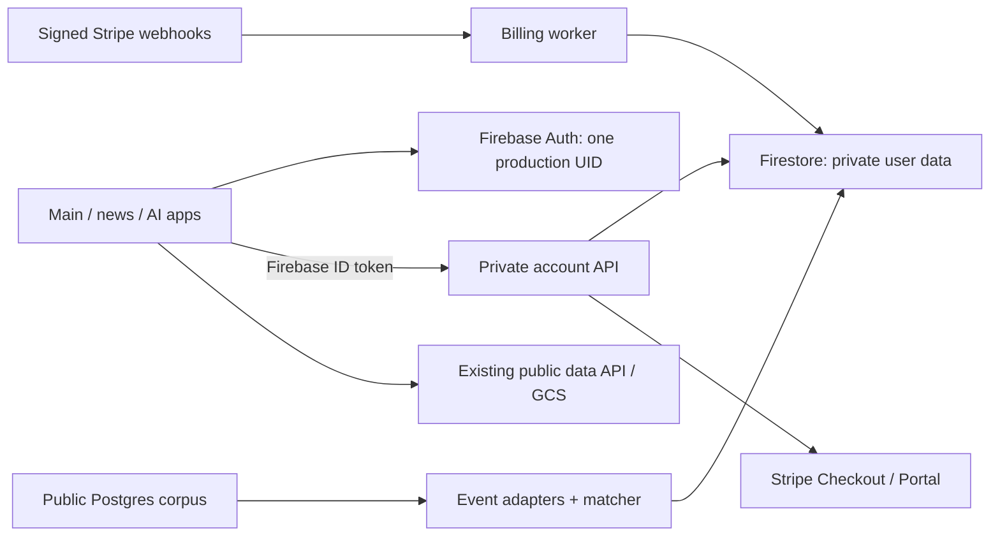

# Accounts, memberships and the personal dashboard — v1

Date: 2026-09-09. Status: implementation proposal, grounded in a source audit. No application changes or cloud configuration have been made.

Execution checklist and mandatory shared-theme/component requirements: [auth-membership-implementation-v1.md](auth-membership-implementation-v1.md). Use that plan for milestone tracking; this document retains the detailed product and architecture contracts.

## 1. Recommended direction

Use **Firebase Authentication** for Google and email/password accounts, **Firestore** for private account data, and **Stripe Checkout + Billing Portal** for subscriptions. Put Firestore behind a dedicated authenticated account API. Keep the public analytical corpus in its existing Postgres/GCS serving system.

Give every registered user a **“Моето табло” / “My dashboard”** home containing their alert inbox, selected lists, basket and dossiers. Keep ordinary public browsing available without login. Saving, following, managing lists and retaining personal history require registration. Basic cloud persistence belongs in the free account; charge for additional monitoring capacity and delivered digests.

The user has chosen Firebase, Google/email sign-in, Stripe, registered-user ownership and a profile page for editing profile details/preferences and canceling subscriptions. The remaining recommendations—Firestore access through an API, tier boundaries, quotas, cadence and dashboard layout—are proposals. “Cloud storage” here means a database for structured records, not uploading personal JSON into the public data bucket.

## 2. Audit scope and current architecture

Repository-wide searches covered browser persistence and authentication/payment references, followed by inspection of the relevant stores, screens, routes, backend handlers, deployment configuration and tests. This is an auth/persistence/alerts architecture audit, not a claim that every election parser or SQL function was reviewed. See `CODE_REVIEW_REPORT.md` for findings.

Verified foundations:

- React 19, React Router, TanStack Query and Radix/shadcn-style controls already provide the UI primitives. `src/routes.tsx:1830` exports `AuthRoutes`, but that name is historical: it is an ordinary public router with no authentication guard.
- Root dependencies contain neither the Firebase browser SDK nor Stripe. `functions/package.json` already includes Firebase Admin and Firebase Functions.
- Firestore is already used server-side by the budget scenario tally. `firestore.rules:1` denies all browser reads/writes and is also deployed to the separate news project.
- `.firebaserc` maps main, staging, AI and news to **different Firebase projects**. A hosting project is not automatically an identity provider shared with its siblings.
- `/api/db/**` has public CDN caching in `firebase.json`; `/api/sql/query` deliberately exposes a restricted public read-only SQL console. Neither is a suitable destination for personal records.
- `src/data/queryClient.ts:5` defaults to infinite stale/cache times and disables focus/reconnect refresh. Private queries must set their own lifecycle.
- Main, AI and news are separate browser origins/builds. localStorage cannot be read across them; signing in at one origin does not itself establish browser auth persistence at another.

### Complete migration inventory

| Current feature | Storage/source | Proposed destination and treatment |
| --- | --- | --- |
| My basket, `/consumption/basket` | `naiasno.consumption.basket.v1`; `src/data/prices/useBasket.ts` | System basket list + one record per product. Current shape is `{slug,title,addedAt}`: no quantities, selected store or saved price. Preserve this meaning in v1. |
| Procurement following, `/procurement/watchlist` | `naiasno.procurement.watchlist.v1`; `src/data/procurement/useWatchlist.ts` | System procurement list, typed entity references and monitoring settings. Kinds are company, awarder, person, place, contract. |
| Procurement “last seen” | `naiasno.procurement.watchlist.seen.v1` | Legacy baseline metadata, not fabricated alert receipts. New inbox read state is stored per actual event. |
| Procurement badge | `naiasno.procurement.watchlist.newcount.v1` | Discard as a derived cache. Replace with the server's actual unread inbox count. |
| Declaration following, `/following` | `naiasno.watchlist.v1`; `src/lib/watchlist.ts` | System people list with declaration monitoring enabled. Keep the distinction from procurement monitoring when the same person appears in both. |
| My dossiers, `/procurement/projects` | `naiasno.projects.<id>`; `src/data/procurement/projectStore.ts` | Private dossiers with immutable IDs, validated `ProjectFileSpec`, explicit revisions and legacy-ID mapping. Titles are labels, not cloud identity. |
| Saved SQL and query history, `/db` | `sqlbrowser.saved.v1`, `sqlbrowser.history.v1`; `src/screens/dev/SqlBrowserScreen.tsx:83` | Private saved-query documents; recent history is bounded and user-clearable. Save query text, not result sets. Never execute a migrated query automatically. |
| Saved articles and stories, news app | `naiasno.news.saved.v1`; `newsapp/app/components/savedNews.ts` | News list retaining the distinction between story and article paths and their application origin. Import from the news origin itself. |
| News briefing preferences/progress | `naiasno-news-briefing-v1`; `newsapp/app/briefing.ts` | Followed topics, cadence, density and reading progress under the same UID. Existing “daily/weekly” controls personalize a page; they do not currently deliver email. |
| AI conversation and prompt history | `naiasno.chat.v1`, `naiasno.chat.history.v1`; `ai/app/Chat.tsx:81` | Private conversations/messages and bounded recall history. Offer a separate import choice for old conversations; save new account history under its UID. Local model execution can remain a public tool. |
| News evaluation drafts | `news-eval-draft:v1:<article>:<revision>`; `newsapp/app/evalSubmission.ts:397` | Private account drafts in the news phase, still bound to the exact evaluation revision. Do not attach old anonymous submissions to an account based on a browser nonce. |
| Selected area | `src/data/area/AreaAnchorProvider.tsx` uses URL path and `?area=`, **not localStorage** | New saved places/default place. Explicit URL selection keeps precedence. Browsing a place must not silently subscribe the user or change their default. |
| Budget scenarios | Scenario configuration is URL state; `policy_sim_submitted_*` is only a local submission marker | A new “Save scenario” feature can retain a validated configuration. Existing hash markers cannot reconstruct scenarios or establish ownership of public submissions. |

Keep theme, language's immediate browser preference, map display settings, consolidated view, report display switches, dismissed community prompts, stale-chunk recovery, model-download caches and developer evaluation flags on the device. Account locale may additionally sync, while an explicit `/en` URL remains authoritative. News completion/nonces and public scenario duplicate markers remain workflow/abuse state, not proof of account ownership.

Search for and replace the existing “only in this browser,” “no account,” and “we keep no record of who follows whom” product copy and active code comments in each migration step. This is an intentional product change authorized by this request. Preserve dated plans as historical records and link them to this replacement.

## 3. Tier brainstorm

Recommend launching **Free + Plus**, with Pro designed but introduced only when professional monitoring is ready. Team workspaces are a later product with a different ownership model.

| Capability | Visitor | Free account | Plus | Pro, later |
| --- | --- | --- | --- | --- |
| Public datasets, profiles, public area dashboards and tools | Yes | Yes | Yes | Yes |
| Personal dashboard and cloud sync | Sign-in invitation | Yes | Yes | Yes |
| Basket, people/procurement lists, saved dossiers/queries/news | Register to save | Basic capacity | Higher capacity | Research-scale capacity |
| Personal in-app alerts | Preview/explanation | Basic entity monitoring | More rules and longer history | Advanced saved-search/dossier monitoring |
| Delivered email digests | — | — at launch | Daily/weekly choice | More frequent where sources support it |
| Multiple baskets/custom lists | — | Small allowance | Larger allowance | Larger allowance |
| Bulk research exports and hosted AI | Existing public behavior | Existing/basic behavior | Only if explicitly included | Metered server jobs, explicit usage budget |

**Provisional quotas for estimation, not published promises:** Free: one basket, five custom lists, 200 distinct monitored entities, five dossiers; Plus: five baskets, 25 custom lists, 1,000 monitored entities, 50 dossiers. System lists do not consume the custom-list quota. Enforce a per-item and per-document byte ceiling in addition to counts. Final limits require load/cost measurement, especially for alerts and dossier evaluation.

Existing local data exceeding a new cap must still import through a bounded grandfathering path or a staged import with explicit overflow. Never silently truncate it. Keep imported excess readable, exportable and removable; block additional growth until under quota or upgraded. This matters because current procurement lists and baskets have no cap, while person following and saved news already cap at 200.

Start with monthly and annual Stripe Prices. Set actual amounts after measuring retention, monitoring cost and willingness to pay; no evidence gathered in this audit supports a particular price. Avoid an “unlimited AI” promise. Keep payment logic separate from capabilities through a versioned server policy such as `canSaveDossier`, `maxMonitoredEntities`, `emailDigest` and `maxSavedSearchRules`.

Downgrade preserves saved content. Existing over-limit lists stay readable; paid monitoring beyond the new allowance is visibly paused with a chooser for which rules remain active. Never randomly select survivors or delete the user's research. Account data export remains available on every tier.

## 4. Authentication UX and forms

### Routes and entry points

Add `/login`, `/register`, `/forgot-password`, `/auth/action`, `/account`, `/account/security`, `/account/billing` and `/pricing`, with the existing `/en` mirror. `/auth/action` handles Firebase verification and password-reset action links. Auth/account pages are noindex and excluded from sitemaps; pricing can be public/indexable.

Use one shared form shell with the current typography, tokens and Radix controls:

- Google button first: “Продължи с Google”. Separator, then labeled email/password inputs. Registration does not require a display name or a card.
- Login: email, password, show/hide password, forgot-password link and account-creation link. Registration: email, password requirements and a clear terms/privacy acknowledgment; marketing/email-alert opt-in is separate and off initially.
- Password reset: neutral confirmation regardless of whether the email exists. Handle invalid/expired/reused links and resend paths. Use Firebase's configured password policy and localized errors rather than raw error codes.
- Email verification: dedicated sent/pending/success states; allow signed-in users to manage basic private data, but require a verified address for checkout and outbound digests. Refresh the token after verification. Reauthentication is required for sensitive account operations.
- Security: linked Google/email providers, add/change password where supported, verified email change, sign out, sign out other sessions, export data and delete account. Do not offer removal of the final usable login method.

Use an auth state machine: `initializing → signedOut | signedIn`, with a separate error state. Never render somebody's private data while identity is unresolved. Handle provider collisions by signing in to the existing account and linking credentials after proving control, retaining one UID; never merge accounts or Stripe customers by matching email alone. Firebase documents Google flows and credential linking in its [Google sign-in guide](https://firebase.google.com/docs/auth/web/google-signin), and password policy/enumeration protection in its [password guide](https://firebase.google.com/docs/auth/web/password-auth).

Google popup must start from a direct user click. Provide a redirect fallback for blocked/mobile flows and configure the supported same-origin helper/proxy arrangement per production origin. Test Safari and mobile browsers; the default cross-origin redirect helper can fail when third-party storage is blocked. See [Firebase redirect requirements](https://firebase.google.com/docs/auth/web/redirect-best-practices).

### Google redirect identity: show Наясно, not the Firebase project

The Google flow has two visible identities and both must be branded:

1. **Destination site:** Google derives “Continue to …” from the OAuth redirect host. Production must use `https://naiasno.bg/__/auth/handler`, with the Firebase browser configuration set to `authDomain: "naiasno.bg"`. Leaving the generated value `elections-bg.firebaseapp.com` will make Google show the Firebase project domain even though `naiasno.bg` is in Firebase's Authorized domains list.
2. **Application identity:** configure the Google OAuth brand/consent screen with the display name **Наясно**, approved logo, support email, and homepage/privacy/terms URLs on `naiasno.bg`. The verified/authorized domain is `naiasno.bg`. Do not present “elections-bg” as the production product name.

Firebase's documented custom-domain sequence is: attach the custom domain to the same Firebase Hosting/Auth project, add it to Firebase Authorized domains, allowlist the exact Google OAuth redirect URI ending in `/__/auth/handler`, and set the JS SDK `authDomain` to that custom domain. See [Customize the Google redirect domain](https://firebase.google.com/docs/auth/web/google-signin#customizing-the-redirect-domain) and [same-domain redirect setup](https://firebase.google.com/docs/auth/web/redirect-best-practices#update_authdomain). Provider settings should be represented in reviewed Firebase Auth configuration where supported, including `oAuthBrandDisplayName: "Наясно"`, the support email and the exact authorized redirect URI; no OAuth secret belongs in the repository.

**Observed setup on 2026-09-09:** the user reports that Google and email/password methods are enabled. The supplied Firebase console screenshot confirms `naiasno.bg` and `www.naiasno.bg` are authorized for project `elections-bg`. A read-only production check found that `https://naiasno.bg/__/auth/handler` already returns the Firebase handler, but `naiasno.bg/` currently redirects to `electionsbg.com`, `naiasno.bg/__/firebase/init.json` ultimately reports `authDomain: "elections-bg.firebaseapp.com"`, and `www.naiasno.bg` did not resolve during the check. Authorized domains are therefore complete for the apex host, while redirect branding and same-domain browser behavior are not yet complete.

Make `naiasno.bg` the actual canonical app host before releasing redirect sign-in there. Ensure Hosting serves the app and its reserved `/__/auth/**` endpoints without redirecting them to another brand/domain; configure `www.naiasno.bg` DNS as an apex redirect or remove it from user-facing auth paths. If the app must remain on `electionsbg.com` temporarily, delay the branded redirect release rather than mixing `electionsbg.com` app state with a cross-site `naiasno.bg` auth helper and claiming the final Safari-compatible setup is complete.

Production acceptance evidence must include: the Google chooser/consent screen visibly says **Continue to naiasno.bg** and shows **Наясно** where Google displays the app name; the outbound `redirect_uri` is exactly `https://naiasno.bg/__/auth/handler`; the return lands on the validated Naiasno path and consumes pending intent once; popup and redirect flows pass in current Safari, Firefox, Chrome and a mobile browser. Repeat with staging's own domain/client and ensure it cannot redirect to production.

### Saving from a public page

“Save”, “Follow” and “Add to basket” remain discoverable. For a visitor they open a contextual sign-in dialog: “Влез, за да запазиш този продукт и да го виждаш на всичките си устройства.” The same forms also work as full pages.

Keep a short-lived, validated pending intent—application, operation, entity reference, optional list, locale and relative return path—in session state for an OAuth redirect. After successful authentication, revalidate and complete it **once**, using an idempotency key. Never place tokens, full lists, SQL text or dossier content in a return URL. Permit only known same-origin relative destinations; preserve intentional scope/locale without blindly copying every query parameter into private routes.

New registration completes with the intended save, then a small optional onboarding step: choose an area, choose a few entities or import browser data. Do not force a full profile wizard before a user can save one item.

Accessibility acceptance: visible labels, password-manager autocomplete, keyboard submission, focus returned to the original action after closing a dialog, announced field errors, disabled duplicate submit, dark/light contrast and usable 320px layouts. Do not rely on toast messages for a failed save.

### User profile, preferences and subscription page

Make **`/account` — “Моят профил” / “My profile”** a first-class page reached from the header avatar and the dashboard navigation. Provide clear links to `/account/preferences`, `/account/security` and `/account/billing`, with the existing `/en` equivalents. Use the same account navigation on desktop and a wrapping section menu on mobile.

| Section | Editable content and actions |
| --- | --- |
| Profile | Display name, avatar preview/initials, email and verification status. Allow changing the display name. Use the Google photo when available or initials; custom photo uploads can follow later. Email changes use Firebase's verified change flow with recent authentication, rather than editing a Firestore email field. |
| Preferences | Language, timezone, saved default area, dashboard density and alerts-first/lists-first preference. Explicit URL locale/area retains precedence. Provide a shortcut to manage pinned lists. Keep theme's immediate device behavior; do not silently replace it on another device. |
| Notifications | In-app monitoring settings, supported event types, email opt-in and digest cadence. Show verification/plan requirements and paused rules. Unsubscribing from email keeps saved lists and in-app alerts. |
| Subscription | Current plan/status, actual renewal or paid-access end date, billing interval, usage versus limits, invoices, update payment method, change plan and a visible **“Cancel subscription” / “Откажи абонамента”** action. Free accounts see their limits and available upgrade. |
| Security and data | Linked providers, password/email security actions, session revocation, private data export and account deletion. Account deletion is distinct from subscription cancellation. |

Use separately saved sections with explicit “Save changes” actions, field errors and unsaved-change handling. Show success only after the private API commits. The API validates allowed profile/preferences fields and revisions; users cannot change their UID, verification status or billing entitlements. Firebase Auth remains authoritative for email/providers, while the account profile owns editable display preferences. Never show an unverified replacement address as the verified delivery destination.

**Cancellation flow:** the profile's subscription section starts an authenticated, server-created Stripe Billing Portal cancellation flow for that UID's existing customer/subscription. Configure cancellation at the end of the paid period as the proposed default. Explain the precise access end date and that saved lists remain available on Free. Let Stripe collect final cancellation confirmation; do not add a mandatory survey or a support-contact barrier. Returning to the profile refetches authoritative billing state: show “Cancellation pending” while confirmation is unresolved, then “Your Plus access ends on [date]” after reconciliation. A portal return URL alone must not mark the subscription canceled. If supported before expiry, offer “Keep subscription” through the portal and reconcile that change too. Errors offer a retry without falsely showing success.

Profile editing and free preferences ship with the private account API. The subscription section becomes fully actionable in the billing milestone. Acceptance covers persistent edits across devices, rejected/failed saves retaining input, verified email changes, visible cancellation from the profile, pending/confirmed/failed cancellation states, and preserved research after downgrade.

## 5. Cloud architecture and access control

### Recommended boundary

Use a **new `account-functions/` TypeScript codebase** with narrow exports (`account`, `billing`, `stripeWebhook`, scheduled/queued workers), an explicit deploy config and dedicated service identities. Do not add another large arm to `functions/index.js`; its project-conditional exports and secret discovery already need care.

Identity authority: production `elections-bg`, staging `electionsbg-staging`, unless infrastructure review identifies a reason for a dedicated identity project. All three production apps explicitly initialize Auth against the same authority, regardless of where Hosting is deployed. The private API verifies that authority's token audience/issuer and derives UID from the verified token, never from a body parameter. Implement session revocation/disabled-user checks for protected access. See [Firebase token verification](https://firebase.google.com/docs/auth/admin/verify-id-tokens).

For main use same-origin `/api/account/**`, `/api/billing/**` and `/api/webhooks/stripe` rewrites. News/AI call the central API with bearer tokens and a strict origin allowlist including `Authorization` in preflight. Each origin maintains its own Firebase browser session for v1; one identity does **not** mean seamless cross-origin login. A dedicated SSO handoff can follow later if required; never share bearer tokens through query strings/localStorage messages.

Firestore Admin bypasses Firestore Security Rules, so the account service is responsible for every ownership and capability check. Retain the existing deny-all browser rules. If direct client reads are introduced later, give them a separately reviewed rule set; do not loosen the shared news rules accidentally. See [Firestore rule/server-client boundaries](https://firebase.google.com/docs/firestore/security/rules-conditions).

This API approach adds request latency and backend work versus direct Firestore listeners, but gives one enforceable boundary for plan quotas, migration, field validation, ownership, billing and dashboard assembly. Postgres private tables are an alternative only with a separately isolated database/role/API; placing them in the public SQL corpus is unsuitable.

### Request and cache contract

- Verify token, active account and ownership for **every** private operation, including reads, exports, deletion jobs, list items, billing portal and nested resources. IDs are identifiers, not authorization.
- Use schema-validated request bodies, field allowlists and encoded IDs. Client labels are display hints; the server resolves canonical entities. Reject user-written plan/status/customer-ID fields.
- `Cache-Control: private, no-store` on all private responses and matching Hosting headers. No private routes under `/api/db/**`. Test both Hosting rewrites and direct function URLs for leakage.
- Use transactions for quota checks and create/delete counters, idempotent operation IDs for retryable writes, and expected revisions for concurrent edits. Prefer explicit add/remove operations over a retryable “toggle”. A conflict returns 409 and preserves both drafts for review.
- Private query keys start with `['account', uid, ...]`; use finite stale/gc times, refetch on focus/reconnect and bounded foreground polling for the inbox. Public query defaults need not change.
- On logout/account switch: stop listeners/polling, cancel requests, reject late results using an auth-generation guard, clear private cache and singleton state, then render the new account. Old pending writes must never run under the new UID.
- Start with memory-only private caching. Offline reads may show the current session's snapshot with an offline label; writes require connection and report failure/retry. A future durable offline queue must be partitioned by UID and have an explicit shared-device policy.
- Apply durable UID quotas to expensive paid services, plus IP/abuse controls. App Check can supplement authentication; it is not a subscription or ownership check.
- Tokens, research contents, followed politicians, list names and raw Stripe bodies must not enter routine analytics/error logs. Keep account state out of the public corpus and its export jobs.

### Environment setup

Add Auth to the local emulator suite; run account endpoints only against demo/emulator or staging resources in development. Existing Vite public-data proxies are not a safe template for new write routes. Set explicit non-secret `VITE_FIREBASE_*` client configuration per environment, Stripe server/webhook secrets via Secret Manager, Price IDs in a server catalog and independent test/live webhook endpoints.

Verify the actual Firestore database location, existing data, backups and service-account IAM before selecting account-service/worker regions. The code proves Firestore use, not its provisioned location. Avoid assuming the existing `us-central1` scenario handler establishes where the database lives. Configure supported OAuth domains and action-link URLs for each environment.

## 6. Data model

All following paths are new, proposed Firestore collections. Client access is through the API.

| Path | Important fields / ownership |
| --- | --- |
| `users/{uid}` | Display name, locale, timezone, onboarding/import version, lifecycle state, created/updated timestamps. Email/password identity remains owned by Firebase Auth. |
| `users/{uid}/preferences/main` | Default place reference, alert channels, digest cadence/timezone, explicit opt-in state, quiet hours. |
| `users/{uid}/lists/{listId}` | Immutable ID, title, type (`basket`, `people`, `procurement`, `news`, `custom`), system key if applicable, revision, pin/order metadata. Private by default. |
| `users/{uid}/lists/{listId}/items/{itemKey}` | Typed entity reference, addedAt, position, optional user note, legacy import provenance. One item per document. |
| `users/{uid}/dossiers/{id}` | Schema version, validated spec, title, revision, legacy key. Large included-key sets go into bounded child documents. |
| `users/{uid}/savedQueries/{id}` and `history/{id}` | Query or typed activity payload, createdAt, retention metadata. Bounded recent history; no downloaded corpus rows. |
| `users/{uid}/conversations/{id}/messages/{id}` | Message content and allowed metadata, revision/order. No tokens, model weights or unbounded message array on the user document. |
| `users/{uid}/drafts/{id}` | Typed scenario/evaluation draft and source revision. |
| `users/{uid}/monitorRules/{id}` | Target entity/list/saved-search, event kinds, enabled state, channels, activation cursor, expected revision. Owned by user; limits enforced server-side. |
| `users/{uid}/inbox/{eventId}` | Event reference/snapshot, match reasons, deliveredAt, readAt, archivedAt. Receipt identity is deterministic per UID/event. |
| `users/{uid}/migrations/{batchId}` | Source application/origin, schema version, batch hash, item receipts, conflicts, completion status. |
| `billingCustomers/{uid}` | Server-owned Stripe customer mapping, active subscription reference, serialized checkout/reconciliation state. |
| `entitlements/{uid}` | Server-owned effective plan, capabilities, allowance version, paid-through/access deadline, billing status, reconciliation timestamp. |
| `stripeEvents/{eventId}` / `jobs/{id}` | Durable deduplication, processing/lease/retry state. Server only. |
| `sourceEvents/{id}` / `monitorIndex/{id}` | Canonical event and reverse subscription indexes for workers. No public access to subscriber sets. |

Entity references are discriminated, e.g. `{kind:'person', namespace:'person-slug', id}`, `{kind:'awarder', namespace:'eik', id}`, `{kind:'place', namespace:'ekatte'|'obshtina'|'sofia-raion', id}`, `{kind:'product', namespace:'price-slug', id}`. Hash/encode the typed tuple for document keys; never concatenate an unchecked path.

Canonical-person migration is critical: declaration follows store a person slug; procurement follows store an MP ID, while `person_id` is an unstable positional ordinal regenerated by the corpus resolver. Resolve through the serving identity/redirect layer, use the stable slug for the user reference, and retain provenance. Do not merge an ambiguous MP ID by name. Company and awarder roles may refer to the same EIK but retain different monitoring semantics. Municipality and settlement identifiers must not collapse into the same “place” string.

List membership and monitoring are distinct: saving something need not subscribe to everything about it. Existing explicit Follow actions create the appropriate rule; Save to list asks/reflects the list's monitoring setting. The same entity in two lists counts once toward distinct-entity quota and produces one inbox event with both match reasons. Removing it from one list must not erase a rule still supported by another list.

## 7. Safe browser-to-cloud migration

Ship adapters and migration **before** removing the browser readers. Existing accounts are not needed: import runs at first sign-in on each origin.

1. Detect only known legacy keys without changing them. Parse raw values as `unknown`; validate each record and retain a rejected-item report. Do not use the old lenient cast-based loaders as import validators.
2. Show the signed-in account and per-category counts: “В този браузър има 12 следени обекта и 1 кошница. Добави ги към [account].” Offer import, review/export and later. Make historical AI chat/evaluation-draft import independently selectable. This prevents a shared browser's contents being silently assigned to the wrong account.
3. Normalize entity IDs and resolve retired slugs. Preserve unresolved records as explicit “needs review” items with their original data, not dropped or guessed matches.
4. Create a stable migration manifest per origin/application/version and content fingerprint. Retry with the same batch ID. Server tracks per-item outcomes; large imports are bounded batches with resumable progress, not one giant transaction.
5. Deterministic system-list IDs within each account and unique typed item keys make replays harmless. Union list members. For conflicting notes, ordering, basket metadata or same-titled dossiers, preserve both or show a conflict choice; never overwrite newer cloud edits with a browser timestamp. Store legacy timestamps as provenance, not permission to win conflicts.
6. Use immutable dossier IDs and a legacy-key mapping. Two different dossiers with the same truncated title may have collided before migration; the importer cannot recover data already overwritten in localStorage. Distinct surviving specs import separately even when names match.
7. Preserve legacy seen signatures as context only. Start canonical monitoring at activation; label imported historical activity separately and suppress backfill email floods. Do not turn a legacy snapshot into “read all alerts up to now”.
8. Verify every accepted item has a committed receipt and can be read back. Only then mark that category complete and switch its hook to cloud. Keep an explicit downloadable backup/report. Remove old payloads after user acknowledgment or a documented grace period; an import marker survives to prevent replay, without retaining all private content locally forever.
9. On partial failure, show pending/conflict counts and retry from receipts. A failed import must never clear a legacy key, report completion, or block export of the surviving browser data.
10. Another device/origin may offer another import. After a successful import on this browser, do not automatically offer the same content to a different UID. Require explicit reassignment via the review flow. An old deleted item must not resurrect from a migration replay; receipts/tombstones distinguish a retry from an intentional re-add.

Rollback disables new features or writes while preserving Firestore state and the migration journal. Do not revert silently to writing the unscoped legacy stores once accounts own data; that would create two divergent histories. Retain read/export access during a failed rollout.

## 8. Dashboard design

### Information architecture

Use **`/me` — “Моето табло”**, with child pages `/me/alerts`, `/me/lists`, `/me/lists/:id`, `/me/dossiers` and `/me/history`. Profile/preferences/security/billing live under `/account`, with a visible “Моят профил” link in personal navigation and the avatar menu, so subscription management does not crowd the working dashboard.

Desktop: retain the global Наясно header, add a persistent account entry and bell with the **unread event count**, then a modest personal navigation rail and a wide working area. Mobile: collapse personal navigation into a compact, wrapping menu; show alerts before saved lists. Use dedicated routes rather than hiding whole tools behind dashboard tabs.

The overview should answer **“What changed in the things I chose?”** and **“Where is the work I saved?”**:

1. Compact heading and last successful inbox refresh, with one “Create list” action.
2. Left/main column: a short unread-alert preview, grouped by meaningful date basis. Filters: unread/all, list, event type. Each item includes its source, what changed, why it matched, and a link to inspect the evidence.
3. Right/supporting column: pinned lists with item count and monitoring state, the current basket shortcut and recently edited dossiers. Counts describe saved content; avoid unrelated national KPIs or invented activity scores.
4. Lower area only when useful: recent saved work and a quiet link to notification settings. No full-country charts on the personal home.

Header bell remains visible for a signed-in user with zero follows so the dashboard is discoverable. Visitor header shows “Вход / Регистрация”; a public preview explains the benefit. Plan badge/billing notices belong in the account menu except when a real limit or failed payment affects an action.

### List page

Header: editable name, type, number of items, last edit, monitoring on/off and overflow menu. Below: item rows appropriate to their type, with source link, added date and actions to move/copy/remove. Allow the same entity in multiple lists. Provide new list, rename, pin, reorder, duplicate and delete. Deleting a list explains what happens to its monitor rules; undo or a short soft-delete window is preferable.

Use a specialized basket view for product totals and existing price comparison. Do not reduce the basket to generic bookmarks or invent a shopping-checkout flow: Stripe pays for the site's membership, not grocery purchases. Additional quantities/store-specific price alerts are a separately validated enhancement.

The list's “Activity” section displays the same inbox events filtered to that list. Reading an event here updates its state everywhere. “Pause alerts” keeps the list. Saving to a custom list opens a small chooser with an inline create option; public entity pages retain the fast default-list action.

### Alert row and rule editor

Alert row: unread indicator plus text label, event-type icon, entity/source label, concise change, date with explicit basis, “Because you follow …”, open-source/detail link, mark read/unread and archive. Never label an inferred programme-year midpoint as a new event today. Backfills say “added to our data”; corrections say “updated/corrected”, not “new award”.

Rules are edited in a focused sheet: target/list → supported event kinds → in-app/email channel → cadence → preview of matching events. Show coverage and last successful evaluation. “Save list” and “Enable monitoring” are separate choices. Do not expose SQL, billing price IDs or worker terms in this flow.

Marking read is explicit or tied to opening the detail, never merely scrolling past a row. “Mark all read” captures a server cursor at click time; alerts arriving during the request remain unread. Archive is personal inbox state, not deletion of source facts. Muting has visible duration/undo and does not unsubscribe from a list.

### States to design before implementation

| State | Required behavior |
| --- | --- |
| New account | Short onboarding, import option, examples of things to follow; no fabricated activity. |
| No unread alerts | “Всичко е прочетено” plus access to all activity/lists. Distinct from no matching events. |
| Unavailable/stale source | Show last successful update and affected coverage. Do not report “nothing changed”. |
| Offline/failed save | Preserve draft, show retry and whether server persistence completed. |
| Over quota/downgrade | Retain content; show exact limit and affected paused rules with upgrade/manage choices. |
| Unverified email | In-app experience works; delivery settings explain the verification step. |
| Import incomplete | Counts for imported/pending/conflicting items and resume/export. |
| Entity retired/unresolved | Preserve the saved reference and offer resolution; no automatic name-based substitution. |

### Alternatives considered

- **Recommended: alerts first, lists beside them.** Best for returning users; saved work stays one click away. A configurable compact/comfortable density is enough initial personalization.
- **Lists first.** Useful for research-heavy users; offer an overview preference or pinned-list ordering, not a wholly separate dashboard implementation.
- **Widget canvas.** Defer drag-and-drop dashboard widgets. They add layout persistence, mobile rules and maintenance before the core alerts are reliable.

The accompanying interactive concept uses illustrative events and list counts, not live data or factual claims about a person/company. It explores inbox filtering, read state and the relation between alerts and lists.

## 9. Reliable alerts implementation

Do not simply upload the current watchlist and call the current feeds “notifications”. Three different source mechanisms need adapters:

- Procurement: `useWatchlistActivity.ts` compares net count/amount increases. It cannot identify every modification, cancellation, correction or decrease, and its cached badge updates only when the watchlist calculation runs.
- Declarations: `useAllNewFilings()` downloads at most 200 site-wide records, then `FollowingScreen` filters locally. A followed person's record outside that global cap disappears from the personalized result.
- Areas: `scripts/myarea/build_alerts.ts`, migration 184 and `ALERT_KIND_META` provide reusable events, but the current payload has no durable per-user receipt/read state and not all dates represent real occurrences.

### Pipeline

1. Add an event normalization adapter at successful source publication, or a bounded scheduled scanner with a durable per-source cursor. Reuse existing ingest provenance, but check each source actually captures **modifications**, not only first-seen rows. Snapshot diffs/change capture are new work where necessary.
2. Canonical event: stable source record ID, event kind, meaningful revision, typed entities/place scope, occurred/published/detected timestamps, `dateBasis`, source URL and safe bilingual rendering fields. IDs must not depend on translated headline text, array position or a regenerate-every-run timestamp.
3. Index subscriptions by entity/place and evaluate affected rules in bounded worker jobs. Evaluate saved-search/dossier rules once per normalized spec and corpus version, then fan out results; do not run a public SQL query for every user on every tick.
4. Create one inbox receipt per UID/event with all matching reasons. Use transactional/idempotent writes and durable checkpoints. Retry from committed work; do not advance a checkpoint before its events/receipts are durable.
5. Maintain/reconcile unread counts when creating, reading, archiving and expiring receipts. Mark-all uses a cursor; delivery workers cannot race it into discarding new arrivals.
6. Publish a paginated private inbox (e.g. 25 rows) and lightweight overview/unread endpoint. The global header reads only the count/summary, not every followed entity's rollup. Reuse public cached data for public facts while keeping the identity/match/receipt private.
7. Add delivery outbox separately from inbox ingestion. Verified email and explicit opt-in, cadence/timezone, unsubscribe, bounce/complaint suppression, bounded retries and deduplication are required. Use provider idempotency or reconciliation for uncertain sends; do not promise exactly-once email across an external provider timeout.
8. Send only after the matched source data has successfully published to serving storage. Distinguish first import/backfill from fresh activity and avoid emailing a user's whole historical corpus.

Launch event-based in-app monitoring for the currently supported procurement/declaration/place sources. Price threshold alerts, arbitrary saved searches and dossier changes must remain labeled unavailable until their source/version semantics and cost gates pass. Email is a separate release after selecting/configuring a delivery provider; Firebase Auth's verification/reset email is not a general digest service.

Alert-history retention and email cadence are product policy, not accident: propose 30 days Free and 12 months Plus inbox history, with explicit notices and export behavior. Confirm retention before launch; expired receipts must adjust counters and not regenerate on replay.

## 10. Stripe implementation

Use hosted subscription Checkout for membership signup and a server-created Billing Portal session for plan/payment/invoice management. This minimizes custom payment UI. The authenticated server chooses a catalogued plan/interval, existing customer and allowlisted return destination; it never accepts a price amount or customer UID from the browser. See [Stripe subscription Checkout](https://docs.stripe.com/billing/subscriptions/build-subscriptions) and [Customer Portal](https://docs.stripe.com/customer-management).

Suggested endpoints: `POST /api/billing/checkout`, `POST /api/billing/portal`, `GET /api/account/entitlements`, `POST /api/webhooks/stripe`.

Checkout requests have a persistent operation key and a per-UID lock/state record to prevent concurrent requests creating duplicate customers/subscriptions. Reuse a usable pending Checkout session or direct existing subscribers to the portal. Reconcile uncertain Stripe calls using the same idempotency key before trying again; a database transaction cannot atomically encompass Stripe.

Webhook receiver verifies `Stripe-Signature` against the unmodified `req.rawBody`, validates environment/account context and durably records the event before acknowledging it. Workers deduplicate event IDs and serialize reconciliation per customer, retrieving current subscription state before atomically updating entitlements. Stripe does not guarantee delivery order and can retry events; a replayed older payload must not reactivate canceled access. Monitor failed jobs and periodically reconcile missed state. See [Stripe webhook delivery and verification](https://docs.stripe.com/webhooks).

Handle checkout completion/expiry, subscription create/update/delete, invoice paid/payment failed/action required and the asynchronous payment events if those payment methods are enabled. Pin a supported Stripe API version and test its exact payload shapes. A redirect to `success` proves neither payment nor membership: render “activating” until the server confirms effective access. Portal return likewise triggers a fresh entitlement read.

Policy proposal:

| Billing state | Effective behavior |
| --- | --- |
| No subscription / incomplete / expired setup | Free account; allow retry of checkout. |
| Active and initial payment confirmed | Paid capabilities until the stored paid-through/access deadline. |
| Trialing | Only if a deliberate trial is configured; no trial by default. |
| Past due | Proposed 7-day bounded grace from payment failure, then Free; show payment repair action. |
| Cancel at period end | Retain paid access through the paid period, then Free. |
| Canceled, unpaid or paused | Apply explicit downgrade policy; preserve saved content. |
| Refund/dispute | Reconcile through an explicit support/billing policy; do not infer entitlement solely from a refund amount. |

Enforce capabilities server-side for new writes, monitor creation, digest delivery and any paid compute. Browser badges and custom claims can aid UI but are not the sole entitlement authority. New paid grants fail closed during an unknown billing state; already-paid access follows the stored bounded deadline so a short webhook outage does not arbitrarily lock users out.

Before paid launch settle invoice seller details, currency, tax handling, cancellation/refund copy and annual-plan terms with the business owner. These are launch inputs; this plan does not assert tax/legal compliance or configure real charges.

## 11. Account lifecycle

Account export assembles only the requesting UID's data into a private, short-lived download. Apply size limits and background jobs when necessary. No token-bearing links in analytics and no export into the public corpus bucket.

Deletion requires recent authentication and a clear review of subscription consequences. Use an idempotent lifecycle job: mark deleting/reject writes → stop monitors/deliveries → cancel subscription according to the chosen deletion policy → delete private descendants/indexes/export objects → delete/disable Auth identity → confirm completion. Deleting a parent Firestore document alone is not recursive. Make failures resumable and prevent late webhooks from recreating a deleted profile. Keep only the narrowly required billing/audit record under the agreed retention policy, separate from personal research data.

## 12. Implementation sequence and acceptance gates

Each tier ends in a reviewable change with relevant tests. Ship account functionality before paid promises.

| Tier | Work and principal files | Exit gate |
| --- | --- | --- |
| 0 — Contracts and environments | New shared account/entity schemas, capability policy, `account-functions/`, dedicated Firebase config, emulator wiring, client env examples. Confirm identity project, Firestore location and isolation. | Demo/staging cannot write production. Direct Firestore access still denied. Typed ID/migration fixtures cover every inventory family. |
| 1 — Auth and forms | Shared Auth provider/client module, forms/screens, `src/main.tsx`, `src/routes.tsx`, header/account menu, BG/EN keys, auth-action handler and pending intent. | Google + email signup/login/reset/verify/link/signout work; one pending save resumes once; no private flash during restore or switch. |
| 2 — Private data API and profile | Owner-scoped CRUD, list/item/dossier/query models, quota/revision handling, no-store rewrites, UID-scoped query hooks; `/account` profile/preferences editing and security links. | A cannot read/write/export B's data through any direct/nested endpoint; retries do not duplicate; concurrent writes cannot exceed limits; profile/preferences edits persist across devices and failed saves retain input. |
| 3 — Main-site migration | Replace basket/watchlist/person/dossier stores and all call sites; SQL saved/history extraction; import wizard/journal; update local-only wording. | Multiple devices see committed changes; both follow systems survive with correct event preferences; corrupt/over-limit/partial/conflicting imports preserve recoverable data. |
| 4 — Dashboard and in-app inbox | `/me` layout/list screens, event adapters, workers, read/archive/mute state, header badge; source queries matched before caps. | New events arrive without opening old watchlist; one event matching two lists appears once; failures and stale source are visible; read state syncs across devices. |
| 5 — Billing and email | Checkout/Portal, profile subscription section with visible cancellation, webhook queue/reconciliation, capability enforcement, verified digest delivery and unsubscribe/suppression. | Stripe test-mode lifecycle and webhook disorder/replay pass; no success-URL grant; cancellation from the profile shows authoritative end date and preserves lists; no repeated charge/subscription; no opted-out or unverified email delivery. |
| 6 — News and AI completion | Shared Auth authority in both builds, central API CORS, origin-local import, saved news/briefing, private AI history, evaluation drafts, account links. | Same UID sees its records across apps; each origin imports only its own data; no implied SSO; app-specific tests/builds and logout isolation pass. |
| 7 — Rollout and retirement | Flags, pilot cohort, staged production rollout, old-route continuity, migration metrics, support/export/deletion runbook, removal of obsolete local writers. | Every inventoried personal collection has a completed migration path; rollback retains cloud ownership; billing and notification failures are observable and recoverable. |

Suggested new modules: `src/auth/*`, `src/data/account/*`, `src/screens/auth/*`, `src/screens/me/*`, shared account contract/client code consumable by news/AI, and `account-functions/src/{auth,lists,migrations,billing,alerts,lifecycle}/*`. Keep UI independent from concrete persistence via typed hooks; do not mirror whole application state into one Firestore document.

Existing route continuity: `/consumption/basket` remains the specialized account basket route; `/procurement/watchlist`, `/following` and `/procurement/projects` remain entry points or redirect to corresponding private views after preserving return intent. Keep curated `/procurement/project/:slug` and public `?q=` dossier exploration available. Cloud dossier content gets its own authenticated ID route; copying the existing `?q=` link explicitly shares that spec and must not include new private notes. `/my-area` remains the public place chooser; saved places are an account enhancement.

Deployment order: emulator tests → staging account code/config/rules → staging hosting → identity/import pilot → in-app inbox → billing test mode → configured paid/email production release. Backend compatibility and no-store headers precede the new client. Deploy the new functions explicitly; current `deploy:db`, `deploy:functions` and `staging` scripts do not ship them. Any release also changing the existing `db` SPA shell follows CLAUDE.md's documented hosting/function/cache purge order.

## 13. Verification plan

- Unit: entity normalization, all migration parsers, conflict policies, capabilities, alert IDs/date basis/deduplication, Stripe-state reducer and account lifecycle transitions.
- Auth/Firestore emulator + HTTP integration: ownership on every method, disabled/revoked sessions, malformed bodies, immutable billing fields, quota races, interrupted migration, deletion of descendants and direct-client denial.
- Browser: real forms and pending-intent behavior, account A → logout → B with delayed A responses, two browser contexts/devices, offline saves, import retries, keyboard/focus/dark-light/mobile, locale and private-route noindex.
- Alerts: matching before pagination, modifications/decreases as supported events, backfill suppression, source failure, duplicate/reordered jobs, mark-all boundary under concurrent arrivals, unsubscribe during queued delivery and counts after retention expiry.
- Stripe CLI/test mode: repeated checkout, successful/failed/action-required payment, renewal, cancellation/restart, plan change, replay and reordered webhooks, timeout recovery and delayed activation. No live cards/charges in automated tests.
- Repository gates: relevant Vitest and function tests, type checks per changed build, lint, entry-graph/bundle/i18n gates, private-route/cache tests; production builds and browser smoke at release. Public data tests only when public event adapters/SQL change, with the relevant corpus fixtures.

Performance gate: opening the dashboard/header must not cause one API request per followed entity. Measure bounded query/read counts for Free/Plus limits, event fan-out, inbox lag, memory and per-active-user cost. Finite caching and page-level auth/form chunk loading must respect existing entry budgets.

## 14. Decisions before their implementation tier

1. Confirm Free + Plus launch and which monitored event types justify Plus; choose pricing and measured limits before Tier 5, not before building forms.
2. Confirm private account API + Firestore and shared production identity authority before Tier 0 completes; inspect database location/IAM then.
3. Choose inbox retention, payment-failure grace and account-deletion/subscription policy before implementing their jobs.
4. Choose digest provider and sending-domain setup before email delivery; begin with in-app alerts so email does not block account migration.
5. Decide whether cross-origin seamless SSO is required for initial news/AI launch; default is one identity with per-origin sign-in.

No decision here blocks the current deliverable: this is the concrete plan for review. The first implementation milestone is **working Firebase forms + a private free account + a loss-safe basket/list import**, followed by the shared alert dashboard, then billing and delivered digests.
