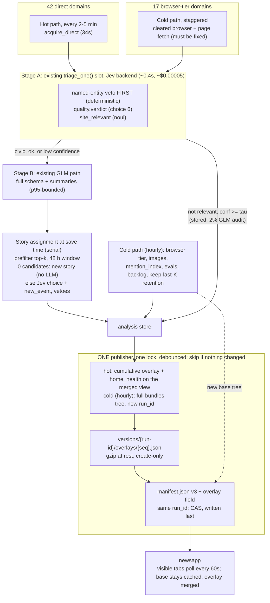

# Near Real-Time News Pipeline: Two-Tier Classification and Continuous Ingestion — v1

**Status**: revised eleven times on 2026-09-19; **Phases 0, 1 and 2 (steps 2.0–2.3)
implemented on 2026-09-19/20 — §0.12 records what the build found.** §0 records what the first draft got wrong.
Passes two to eight re-verified one another and are archived, verbatim and under their
original ids, in `docs/plans/news-jev-realtime-cloud-worker-v1-analysis.md` Appendix A
(§0.1 is the index). The ninth pass (§0.9) read what those never opened — the last run's own
stage report, the run history and the rest of `analyze_local.py` — and changed the ranking:
the scheduler was never installed, the analyze stage loses 31% of its queue, a triage gate
already exists, and the fast path needs no manifest v4. The tenth pass (§0.10) verified all
five and found the analyze stage's serial canary to be **unbounded** on parse failures. The
eleventh pass (§0.11) confirmed that hazard but **refuted it as the explanation** for the
last run's lost time: the saved records' own timestamps show a 25 s canary and a single
**772 s stall** behind a 300 s × 3 request timeout sized for a local model. The corrected
design is §1–§10.

⚠️ **The pipeline is not running.** The live `manifest.json` names run
`2026-09-02T145946Z-16095` (`generated_at` 2026-09-02T15:28:56Z) and the bucket holds 12
version trees, all dated 2026-09-01/02. As of 2026-09-19 `news.electionsbg.com` is
**17 days stale**, and no `crontab` entry for the news job exists on this machine — nor did one
ever: all 15 recorded runs were manual (§0.9 P1). The "~1 hour" latency this document sets
out to cut was never a production state — see Phase 0.

**Target**: cut latency from publication to live on `news.electionsbg.com` from ~1 hour to
a few minutes for the direct feed tier, without regressing the analysis quality, the
evidence gates, or the release guarantees the current pipeline already provides.

---

## 0. Revision note — what changed from the first draft

Every row below is a claim the first draft made, what is actually true, and the evidence.
Nothing was removed silently; where the original figure was wrong, it is kept here so the
reasoning that produced it stays reviewable.

| # | First draft said | Corrected | Evidence |
| --- | --- | --- | --- |
| 1 | Jev classification costs **$3.78/mo** at 45,000 articles × **2,000 tokens** | **~$15.00/mo** — a Jev `choice`'s option definitions are billed *input* tokens, and the 26+103 taxonomy implies **~11,900** tokens/article, not 2,000. *Superseded by §0.1 R10: the article is ~900 tokens, not 4.7k, so ≈8,100 tok / ~$10/mo* | `functions/jev_payload.js`; measured 236-option call = **11,582 input tokens / $0.00049** in `docs/plans/jev-typesafe-eval-v1.md` §2 |
| 2 | Jev latency **70–250 ms** | **310–492 ms**, and the chat had to raise its client budget 1,200 ms → **2,500 ms** because it expired on every live call | `ai/llm/jevClient.ts`, `docs/plans/jev-typesafe-eval-v1.md` §7 |
| 3 | Baseline batch setup costs **~$30.50/mo** | Measured **$22.99–25.55/mo** at the measured 900–1,000 articles/day | `news/evals/openrouter-live-batch-2026-08-31.md` |
| 4 | Volume **1,500 articles/day** | Measured **900–1,000/day** | same |
| 5 | Tier-2 summaries **$9.00/mo** | **~$2–3/mo**, derived from GLM's measured $0.000655 per full-schema response | `news/evals/openrouter-model-benchmark-2026-08-29.md` |
| 6 | GCS **$0.50/mo** | **~$2.81/mo** at 5-minute publishing and **~$9.36** at 90 s. Superseded by §0.1 R2: Class A on this regional-Standard bucket is **$0.05 per 10,000**, so the $28–94 range this row first carried was **10× high**. Operations are not the scaling cost — **reader egress is** (§0.1 R3) | `gsutil ls -L -b`; corrected table in §5.3 |
| 7 | Hetzner **`CAX11`/`CX22` at €3.79–3.99 (~$4.15)** | **Wrong vendor, plan and price — but the budget was right.** `CAX11` is **€5.99/mo ex-VAT** (€3.79 was a stale 2024 launch price); **`CX22` no longer exists — renamed `CX23`** at €5.49 (€3.99 was its pre-June price under the retired name); **IPv4 is a separate €0.50/mo line**, as cloud prices now exclude public IPs. All eight Cost-Optimized plans are **not orderable**; the cheapest orderable EU plan is `CPX22` at **€19.99 (~$23.19)**. The original ~$4.15 **is** achievable — **netcup VPS Lite 1 G12s €4.10 (~$4.76)** or **OVHcloud VPS-1 2027 €4.49 (~$5.21)** | Hetzner price-adjustment + IPv4 pricing docs; netcup/OVH primary catalogs; `vps-eu-pricing-2026.md`; table in §5.3 |
| 8 | Cloudflare Browser Rendering is **$0.05/min, $3.00/hr → ~$50–225/mo** | The $5/mo Workers Paid base is right; **Browser Run is $0.09 per browser HOUR** with **10 browser hours/month included** = **$0.0015/min**, so both unit prices were **~33× high**. The range is also mis-shaped: 10 h → $5, 50 h → $8.60, 100 h → $13.10, and **$50/mo needs ~510 browser-hours (~17 h/day)**, which is not "periodic sweeps". ⚠ Still the wrong tool here, for a different reason — it runs on Cloudflare's **own datacenter IPs** and cannot clear the challenges it would be bought for (§5.3) | [Cloudflare Browser Run pricing](https://developers.cloudflare.com/browser-run/pricing/) |
| 9 | Oracle OCI free tier **4 OCPU / 24 GB** | **2 OCPU / 12 GB** since 2026-06-15 (1,500 OCPU-h + 9,000 GB-h/mo), and the idle-reclaim rule — CPU 95th pct <20% **and** network <20% **and** memory <20% over 7 days — is a live risk for a quiet poller. EU A1 capacity is a lottery | Oracle Always Free docs |
| 9b | *(absent from the first draft)* | **GCP's always-free e2-micro cannot host this**: US-only regions, **1 GiB** RAM, a **fractional 0.25 vCPU**, and ~**$3.65/mo** for the external IPv4 alone. A real EU e2-standard-2 is ~$54–63/mo. Also **ARM64 Playwright is supported** (`chromium-linux-arm64.zip` is published and confirmed on the CDN), so architecture — not capability — is why `CAX11` is unusable today | GCP free-tier + Compute pricing docs; `playwright-core` registry |
| 10 | Hetzner IPs "are not flagged as datacenter scrapers by Cloudflare" | **Inverted.** Hetzner is **AS24940**, tagged `hosting` by the IP-intelligence databases Cloudflare consults *before* it reads headers. Hetzner beats AWS/GCP/Azure for scraping, but for fingerprint and rate reasons, not reputation | [ASN analysis](https://dev.to/james_clark/your-scraper-isnt-blocked-because-of-your-headers-its-blocked-because-of-your-asn-13gn) |
| 11 | `topics` is "hierarchical `choice`" | **`topics` is an array.** 878 of 2,457 non-empty analyses (**35.7%**) carry ≥2 topics, and Jev `Choice` is single-select. Not mentioned in the first draft at all | measured over `news/data/analysis/articles/**` |
| 12 | `entities` resolve deterministically in 2 ms via a **30k+** gazetteer | **14,066** entries (4,655 person / 3,824 institution / 5,404 place / 183 party) and **zero companies**. The mention index deliberately **excludes** places and companies, yet `entities.places` is non-empty in 79.8% and `companies` in 23.9% of analyses | `news/data/gazetteer.json`; `mention_index` stage report |
| 13 | `party_tones` is a Jev strength | Party tone is **hidden in production**: all four tested models failed the release gate on unsupported evidence, and Jev cannot emit the `evidence` string that gate validates | `news/evals/openrouter-model-benchmark-2026-08-29.md` |
| 14 | Gold evaluation set is **50 articles** | **240** records; 50 is the repeat-adjudication subset | `news/evals/gold-set-2026-08-28.md` |
| 15 | Phases 1–4 are four new scripts to be written from the API docs (`jev_client.py`, `eval_jev_benchmark.py`, `daemon_ingest.py`, `deploy_hetzner.sh`) | None of the four exists, and writing a Jev client from the docs is the wrong move — the repo already has a working payload builder, the option caps and the cost accountant to port. **And the gate itself already exists**: `analyze_local.py`'s `triage_one()` / `analyze_routed()` is a switched-off cascade with a named-entity veto (§0.9 P3) — Jev goes in that slot | `functions/jev_payload.js`, `ai/llm/jevClient.ts`, `news/scripts/analyze_local.py:295–430` |
| 16 | *(absent from the first draft)* | **The browser tier saved zero articles from `blitz.bg`, `dnevnik.bg` and `capital.bg` on the last run (2026-09-02 — see §0.1 R1; re-measure).** This is the largest reliability defect in the pipeline, it is a fetch-path bug, and no hosting change fixes it — §3.2 | `news/data/_state/*.json` |

**What survives unchanged**: Jev's price and shape, the fact that it cannot generate prose,
the two-tier cascade as the right decomposition, the 17-site browser tier count, and the
~40/60 civic split (measured 44.5% non-civic).

### 0.1 Revision passes 2–8 — moved to the analysis file

Passes two to eight (formerly §0.1–§0.8 here, ~255 lines) now live verbatim in
`news-jev-realtime-cloud-worker-v1-analysis.md`, **Appendix A**, under their original ids.
Every `§0.1 R…`, `§0.2 G…`, `§0.3 V…`, `§0.4 O…`, `§0.5 N…`, `§0.6 S…`, `§0.7 T…` and
`§0.8 U…` reference in §1–§10 below **resolves there, not in this file** — those ids keep
their `§0.2`/`§0.3`/… labels because that is where they were minted. ⚠️ **Numbering:**
because the archived passes keep their original section numbers, the live ninth and tenth
passes are numbered to match their pass — **§0.9** and **§0.10** — leaving §0.2–§0.8
deliberately unused here. A `§0.2 P…` reference would now be a mistake; the live ids are
`§0.9 P…`. The rows the design still leans on, in one line each:

| id | what it established |
| --- | --- |
| R1 | nothing has published since 2026-09-02; no scheduler on this machine (sharpened by §0.9 P1) |
| R2 / R3 | GCS Class A is $0.05 per **10,000**; reader egress, not operations, scales with cadence |
| R4 / R5 | a realistic content-addressed release is ~5–6 MB, not 100 KB; the bucket has no lifecycle rule |
| R6 | the uploader refuses a release without the full 14-stage report + `home_health_ready` |
| R7 | the analyse queue orders by publication day then outlet rank, not by arrival |
| R8 | two independent CAS publishers can roll the site back; one publisher only |
| R9 | the 8 / 300 / 24,000 caps are this repo's chat-proxy caps, not Jev's |
| R10 / R11 | the article is ~600–900 tokens; a two-call topic hierarchy needs no retriever |
| R12 | the browser route probe tests a different client than the one that fetches |
| R13 | GLM's 10 s is a median; the stage spent ~75 s of worker time per answer (diagnosed in §0.9 P2) |
| V1 / V2 | `-j json` is transport-only gzip; `-z json` stores gzip, and GCS transcodes for other clients |
| O1 / O2 | Jev on OpenRouter is an alpha `decisions` endpoint; a 24 h batch must be collected by repeated sweeps |
| N2 | `_perf` must join `ARCHIVE_EXCLUDE` or the perf log is archived on every publish |
| U1 / U2 | a 48 h story window anchored on the article's `published` costs the rule nothing; the serial join is off the critical path |
| G1 / G2 | **withdrawn / superseded** — G1 claimed `-j json` contradicted the live `identity` encoding (it does not; V1 is right), and G2's per-domain shard size is confirmed by V4 |
| V4 / V5 | the largest `articles/<domain>.json` is ~260 KB compressed (§6.5 item 5); the article is median 1,989 chars ≈ 600–900 tokens (§4.4) |

### 0.9 Ninth pass — what eight passes never opened

Passes two to eight verified each other's arithmetic and line references. None of them read
the last run's **own stage report**, the run **history**, or the rest of `analyze_local.py`.
Five findings, all first-party, folded into the sections named.

| # | The plan said | Verified | Evidence |
| --- | --- | --- | --- |
| P1 | "Restore the scheduler" — the pipeline *stopped* 17 days ago, and ~1 hour is the latency to beat | **There was never a scheduler on this machine.** `install_cron.sh` appends every run to `news/var/cron.log`; that file does not exist. The 15 runs in `news/data/_nightly/` start at 04:55, 04:59, 05:29 ×2, 06:25, 08:38, 09:08, 10:06, 12:55, 13:47, 14:07, 14:19, 14:42, 14:59, 23:40 — **none at `:00`**, all but one on 2026-09-01/02 (§0.11 E3). They were manual. The hourly transaction has **never run unattended**, and "~1 hour" was never a production latency. Phase 0 is a first install and Phase 5's "48 h hourly baseline" is the first soak test. Plain cron is also the wrong scheduler for a Mac: it does not wake a sleeping machine and drops missed runs — use a launchd job (`StartCalendarInterval`, which runs a missed interval on wake) | `ls news/var` (no `cron.log`); run ids in `news/data/_nightly/`; `news/install_cron.sh:43` |
| P2 | GLM costs **$0.000867** per accepted analysis at a 10 s median; "~75 s of worker time per answer" is a tail to budget around | **The last run lost 31% of its queue, and that is the cost and the latency.** queued 100 → answered 82 → **saved 69**: **26 responses were invalid JSON** (`Expecting ',' delimiter…`, `Extra data…`) and 6 were validator-rejected, although every request carries `response_format … strict: true` and `provider.require_parameters`. 99 of 109 responses were routed to one provider (**NextBit**), which is evidently not enforcing the schema. Cost: $0.09237 / 69 = **$0.00134 per saved analysis — 54% above the baseline every table here uses.** Transport latency: **median 17.99 s, p90 30.64 s**, not 10 s. And 109 responses × ~20 s ÷ 4 workers ≈ 550 s of a 1,520 s stage — **~1,000 s is unaccounted for** (⚠️ **located by §0.11 E1: a single 772 s stall on one hung request under `DEFAULT_TIMEOUT = 300` × `MAX_ATTEMPTS = 3`** — not the serial canary, which cost 25 s on this run; the canary is nonetheless unbounded on parse failures, §0.10 W1, and is fixed as a latent hazard). Parse failures get **no in-run retry** (`schema_retries` covers validator rejection only). This is a yield defect, not a tail | `news/data/_nightly/2026-09-02T145946Z-16095.json` → `stages[analyze].result` (`parse_failed` ×26, `billing.providers`, `billing.transport_latency_s`); `llm_client.py:159–171`; `analyze_local.py:746–790` |
| P3 | Stage A is a new Jev gate in a new `jev_client.py`; "none of the four scripts exists" (§0 row 15) | **A cascade gate already exists and is switched off.** `analyze_local.py` has `triage_one()` / `analyze_routed()` behind `--triage-model` / `NEWS_LLM_TRIAGE_MODEL` (`triage_model: null` on the last run): a free-model, proof-only weather/sports route with a **named-entity veto** — any article mentioning a gazetteer person, party, institution or company *always* goes to the paid model — an evidence check on the triage answer, a no-retry 12 s timeout, fail-closed to the paid path, and `triage_fallback` provenance on the record. That veto is a deterministic recall floor stronger than any τ fitted on 240 records. Jev belongs **in this slot, behind this veto** | `analyze_local.py:295–430`, `:676–680` |
| P4 | Background tabs make reader egress unbounded, so bound it with gzip + a `stories` split + v4 | **Hidden tabs poll because of one missing check.** `data.ts:903` is a bare `setInterval(() => load(false), PUBLICATION_POLL_MS)`; the `visibilitychange` handler beside it only *adds* a refresh on becoming visible. Skipping the tick while `document.hidden` removes the forgotten-tab term from §5.3 outright — a one-line change, no publish-model work | `newsapp/app/data.ts:903–907` |
| P5 | A faster cadence needs manifest v4 (content addressing, sharded `stories`, mark-and-sweep GC) — a coordinated deploy | **The v3 validator ignores unknown keys**, so a **base + overlay** release is available with no manifest version bump: the hourly run keeps publishing the full v3 tree; the fast path publishes one small overlay object and re-points the manifest at the *same* `run_id` with an added `overlay` field. `dataCache.clear()` fires only on a `run_id` change, so readers keep the base. Old clients ignore the field and stay on hourly data. §6.5 is rewritten around this; v4 becomes the fallback | `newsapp/app/data.ts:700–758` (`parsePublicationManifest` checks named fields only) |

**Net effect on the recommendation.** Two items move ahead of everything Jev: fix analyze
**yield** (P2 — more accepted articles per dollar and per minute than the gate can save), and
ship the two reader-egress one-liners (P4 + `-z json`). Jev moves from Phase 1 to Phase 3:
§1 item 1 already says the latency is not in the classifier, and its upside is ~$10/mo against
a failure mode that is silent by construction. The fast path is built on the overlay (P5),
which removes the coordinated v4 deploy, the GC, and most of the R8 rollback hazard.

---

### 0.10 Tenth pass — verification of the ninth

The ninth pass's five findings were re-derived from source; **all five hold**, and they are
the first in this document to come from the run's own stage report rather than from the plan.
Two defects found, plus two notes.

| §0.9 | Claim | Independent check |
| --- | --- | --- |
| P1 | There was never a scheduler; no `cron.log`; runs never at `:00` | ✓ `news/var/` holds only `adjudication/` and `reports/` — **no `cron.log`**; `_nightly` start times run 04:20→23:40 with **none at `:00`**. Note: it says "15 runs", there are **18** distinct start times (the list omits the 04:20/04:49/04:52/05:25 deploy cluster). Substance unaffected |
| P2 | 31% of the queue lost; 26 malformed; NextBit 99/109; $0.00134/saved; 18 s median | ✓ **exact on every figure** — `queued 100 → answered 82 → saved 69`; `parse_failed` **26**; providers `{NextBit: 99, Together: 4, Parasail: 3, Morph: 3}`; `cost_usd` $0.09237095 ÷ 69 = **$0.001339** (**54% above** $0.000867); `transport_latency_s` `{median: 17.99, p90: 30.64}`; 109 × ~20 s ÷ 4 ≈ 545 s of 1,530 s |
| P3 | A switched-off cascade gate already exists, behind a named-entity veto | ✓ `triage_one()` at `analyze_local.py:295` ("every non-proof returns `fallback`") vetoes on `person/party/institution/company` — "A free model never gets authority to suppress their article"; `analyze_routed():406`, `--triage-model` / `NEWS_LLM_TRIAGE_MODEL:672`, `triage_fallback:419` |
| P4 | Hidden tabs poll because of one missing check | ✓ `data.ts:903` is a bare `setInterval`; `refreshVisible` only *adds* on becoming visible |
| P5 | The v3 validator ignores unknown keys, so base+overlay needs no version bump | ✓ the validator is a chain of named-field checks ending `return row as unknown as NewsPublicationManifest` — no unknown-key rejection; `dataCache.clear()` only on `run_id` change |

Also verified, because a wrong answer would break readers: **§6.5's gzip one-liner is safe.**
The manifest's byte check is *internal only* (`sum(inventory[].bytes) === bundle.bytes`,
`data.ts:753–755`) — there is **no** transfer-length assertion, so stored gzip cannot fail a
client — and `materialize_snapshot` is a local→temp-copy check, unaffected by `-z json`. The
`bundle.bytes` / `sha256` requirement in §6.5 is correct and sufficient.

**W1 — the serial canary is UNBOUNDED on parse failures, which is a better explanation for
P2's missing ~1,000 s than P2 gives.** *(The hazard is confirmed; the attribution is
**refuted by §0.11 E1** — the canary cost 25 s on this run. Ids renamed U→W by §0.11 E2.)* `record_worker_failure()` returns **`False` for
`parse_failed`** (`analyze_local.py:432–435`), and the canary loop breaks only when it returns
`True`, which requires `error_kind in ("unreachable","remote_refused")`. Malformed JSON
therefore **never stops it**: the loop `continue`s serially, one 18–30 s call per malformed
answer, until the first parseable record — up to the whole queue on a provider that accepts
`strict` and ignores it, not "several calls". Folded in: Phase 1.3 gains **(d) bound the
canary** (open the pool, or abort as endpoint-unusable, after K consecutive parse failures);
Phase 1.4 now states the mechanism rather than naming the canary as "one candidate"; and
§0.9's P2 row points here. This also matters after the provider is fixed — it is a silent
serialization hazard for whichever provider misbehaves next, and it costs wall-clock, not
dollars, so no cost gate would catch it.

**W2 — the collapse to §0.1 split the id namespace.** Moving passes 2–8 worked (Appendix A is
real and complete — every id from G1–G6 through U1–U2 is present in the analysis file), but
the ninth pass was numbered **§0.2**, which is also the archived third pass's number, so
`§0.2` meant two things and the two in-text `§0.2 G1` / `§0.2 G2` references pointed at a
section containing no G-ids. Folded in: the ninth pass is renumbered **§0.9** and all 36
`§0.9 P…` references updated, the two bare `§0.2` references qualified, §0.1 now states the
numbering convention explicitly (archived passes keep their minted numbers; live passes are
numbered to match their pass, leaving §0.2–§0.8 deliberately unused), and the pointer table
gains the **G1/G2** and **V4/V5** rows it was missing.

**Notes.** (i) P1's launchd recommendation is already carried into Phase 0 step 0.2, which
correctly frames Phase 0 as a **first install** rather than a restore and specifies an
`install_launchd.sh` sibling (`install_cron.sh` itself writes a crontab block, so it stays as
the Linux path) — no further change needed. (ii) The ninth pass's re-ordering (yield, then
the two one-liners, then ingestion, then Jev, then publish) is the right order and the
reasoning is sound: P2's defect is worth more per dollar *and* per minute than the gate can
save, and it silently corrupts the baseline every later comparison rests on.

---

### 0.11 Eleventh pass — verification of the tenth

The tenth pass's five ✓ rows reproduce (line refs `analyze_local.py:295 / 406 / 419 / 672`,
`record_worker_failure` returning `False` for `parse_failed` at `:432–435`, the internal-only
byte check at `data.ts:751–755`, the "54% above" arithmetic: 0.001339 ÷ 0.000867 = 1.544).
No stale `§0.2 P…` reference remains, every step reference resolves, and Phase 1.3(d)/1.4
carry W1 as described. Three corrections — the first changes what Phase 1 must fix.

| # | §0.10 said | Verified | Evidence |
| --- | --- | --- | --- |
| E1 | **W1 (then "U1")**: the unbounded serial canary is "the most likely source of the missing ~1,000 s" | **Refuted for this run by the records' own timestamps; the mechanism is a request timeout.** The run began 14:59:46Z; acquisition + prep (34 + 72 + 22 s) puts the `analyze` start at ≈15:01:54Z, and the **first record was saved at 15:02:19Z — the canary cost ~25 s**, one call. 67 of the 69 records then landed steadily between 15:02:19 and **15:13:55** (largest gap 47 s) — ~700 s for 100 calls at 4 workers, exactly what an 18 s median predicts. Then **nothing for 772 s**, and the last two records at 15:26:47 / 15:26:58 — both **schema retries** (first attempts `gen-1788361475` ≈15:04:35, retries `gen-1788362797` ≈15:26:37), i.e. the post-pool retry queue, which cannot start until every worker returns. One worker was therefore stuck from ≈15:11:30 to ≈15:26:36 = **~906 s = 300 + 2 + 300 + 4 + 300**: `llm_client.py` `DEFAULT_TIMEOUT = 300`, `MAX_ATTEMPTS = 3`, `BACKOFF_SECONDS = 2.0`. The comment above the constant says why it is 300: *"A 12B on a Mac mini is SLOW … roughly 5x the observed worst case on a 16 GB box"* — a local-model timeout applied to a hosted API whose p90 is 31 s. It is also a priori implausible for the canary: at a 26% failure rate the expected serial cost is 0.35 extra calls (P(≥5 consecutive) ≈ 0.1%). **So: stage = ~25 s canary + ~700 s productive pool + ~772 s stall + ~20 s retries.** W1 stays as a latent hazard worth bounding; the fix that recovers half the stage is a hosted-endpoint timeout (~60 s, ≈2× p90), one transport retry, and a per-stage deadline after which the pool is abandoned and unfinished items return to the queue | `analyzed_at` over the 69 records of run `…145946Z-16095` in `news/data/analysis/articles/**`; `analysis_provenance.schema_attempts[].response_id` (epoch-prefixed); `llm_client.py:30–41` |
| E2 | the tenth pass minted ids **U1 / U2** | **Collides with the archived eighth pass**, whose U1–U4 live in Appendix A and whose `U1 / U2` row sits in §0.1's index — the same split-namespace defect W2 itself describes. Renamed **W1 / W2**; the one in-text reference (§0.9 P2) updated | §0.1 index row `U1 / U2`; analysis file Appendix A §0.8 |
| E3 | P1 "15 runs … all on 2026-09-01/02"; §0.10 "18 distinct start times" | **Both counts are right and the dates are slightly wrong.** `_nightly/` holds **15 timestamped pipeline runs** (one of them `2026-08-27T234016Z`, two on 09-01, twelve on 09-02), **4 hand-labelled `deploy-20260901T04xx00Z` reports** (04:20 / 04:49 / 04:52 / 05:25 — round-second labels, so typed, not scheduled) and a `2026-08-26` report: 15 runs, 18 distinct start times, four dates. None at `:00`; conclusion unchanged | `ls news/data/_nightly` |

**Consequences, folded in.** Phase 1 gains step **1.3(e)** (timeout/deadline) and 1.4 is
rewritten around the measured timeline; "~1,000 s unexplained" becomes "~772 s stalled on
one hung request" everywhere; §6.4 item 6 gets concrete numbers; §6.4 item 7's arithmetic
improves — without the stall the last run's `analyze` is **~750 s**, so the cold run is
~17 minutes before any yield work and the fast path's dark fraction is ~28%, not ~50%; §8
gains a stall gate. Note what this does *not* change: yield (31% lost) is still the cost
defect, and the two fixes are independent — the timeout recovers wall-clock, the provider /
repair work recovers dollars.

---

### 0.12 Phase 0 and Phase 1 implemented — what the build found (2026-09-19)

Reports: `news/evals/phase0-scheduler-2026-09-19.md`,
`news/evals/analyze-yield-2026-09-19.md`. Four findings change figures or
premises above; each is folded into the section it corrects only here, so the
record of what was believed stays readable.

| # | the plan said | measured | consequence |
| --- | --- | --- | --- |
| I1 | §0.3 V2: `-z json` is a one-flag change; GCS transcodes for non-gzip clients | `gsutil cp -z` **appends `no-transform`** to Cache-Control (`gslib/utils/copy_helper.py`), which disables transcoding | the uploader resets the immutable policy with a `setmeta` scope before the manifest (`0f44b41354`) |
| I2 | §2.3 / §5: GLM costs $0.000867 per accepted analysis | provisional, from a 12-article check: with NextBit excluded (it caused every syntax failure) Parasail cached 6.6% of prompt tokens against NextBit's 63.9%, so **per response +30% ($0.00110)**, per saved **~$0.0015 (+12% on 09-02's $0.00134)** — yield recovered most of it. ~$41–45/mo at 900–1,000/day. Latency unchanged (article-call p50 17.6 s) | every Jev-vs-GLM saving in §1/§5 is against the wrong baseline; re-derive it in Phase 3 from the perf log once 100-article runs confirm it |
| I3 | Phase 0: expect first-unattended-run defects | two, both invisible to a manual run: the model probe fetched OpenRouter's whole catalogue (>60 s) under a 10 s timeout, and its failure record named the wrong URL (`74fd3ace72`); an unmeasured provider's wrong-shaped answer killed the analyze stage (`bd8c1f9344`). The publish gate refused both runs — readers kept the old release rather than a partial one | the staleness alarm fired as designed; keep it |
| I5 | §3.2 / §6.3: the browser tier is "a fetch-path bug… a 1–2 day change with zero recurring cost recovers four of the most important outlets" | The fetch path WAS missing and is now added (`896e0081a7`, any tier, bounded). But blitz.bg and dnevnik.bg refuse their ARTICLE pages to a real browser — headless and headed, with the origin's challenge cleared and its cookies reused (measured 2026-09-20) — so no code change recovers them; residential egress or an outlet agreement is what is left. `settle()` also missed the Bulgarian interstitial („Един момент…"), storing challenge pages as articles | §3.2's estimate holds for the fetch path only; re-scope the four-outlet claim, and keep the caps/cooldown so a refusing outlet costs a bounded slice of each run. `news/evals/ingest-browser-tier-2026-09-20.md` |
| I4 | §3.2's failure table is the "before" for Phase 2 | accurate for blitz.bg, dnevnik.bg and 24chasa.bg; capital.bg is intermittent. On `consecutive_failures`: `save_articles.py` ALREADY treats "everything listed was already stored" as productive, so the Phase 0 report's finding is narrower than stated — bgdnes.bg still incremented, so that equality misfires for some domains | Phase 2 intake should find why the productive rule misfires, rather than adding one |

---

## 1. Executive summary

The goal is unchanged: decide each incoming article within seconds instead of within the
hourly batch, so a civic story is live a few minutes after the outlet publishes it.

What changed is where the time and the money actually go.

0. **First, the pipeline has to run at all — and it never has, unattended.** It has not
   published since 2026-09-02 (§0.1 R1), and every run before that was started by hand
   (§0.9 P1). A scheduler (launchd, not cron, on a Mac) plus a staleness alarm on
   `manifest.generated_at` is worth more than everything else in this document combined,
   and costs nothing — **Phase 0** (§7).
0b. **Then make the analyze stage keep what it pays for.** The last run saved 69 of 100
   queued articles: 26 responses were invalid JSON despite `strict` structured output, 99 of
   109 routed to one provider. That is $0.00134 per saved analysis (not $0.000867), an 18 s
   median (not 10 s), and **772 s of the 1,520 s stage spent waiting on one hung request**
   under a 300 s × 3 timeout sized for a local model (§0.11 E1). Fixing yield and that
   timeout is worth more money *and* more latency than the Jev gate — **Phase 1**.
1. **The latency is not in the classifier.** It is in the batch cadence, the publish model,
   and the client's 60-second manifest poll. A five-minute direct-tier hot path — the
   **design target** — collects most of the speedup **with the existing GLM model and no
   new host**, published as a small **overlay** on the hourly base release (§6.5), which
   needs no manifest version bump and leaves reader caches intact.
2. **The reliability problem is not IP reputation.** On the last run (2026-09-02) the browser
   tier harvested 20 links and then 403'd on all 20 article pages, because two of its three
   modes have no page-level browser fallback and the third decides its route with a probe
   run *inside the browser* and then hands the pages to a *different* client — plain-HTTP
   Python (§0.1 R12). The direct-tier `24chasa.bg` fails the same way. **Fix it in Phase 2
   step 2.2, before the 24 h batch — it is free and it recovers four of the most important
   outlets.**
3. **Jev is a gate first, a classifier second.** Flat over the full 26+103 taxonomy its
   option definitions cost ~40% of the current GLM call. A **two-call hierarchy** (26
   categories, then the winner's ~4 subcategories) cuts that to ~15% with no retriever to
   build — the first revision's shortlist is cheaper still but depends on an unbuilt,
   unmeasured retriever (§4.4, §0.1 R11). The gate itself must be tuned for civic
   **recall**, because a false "not relevant" silently removes a story — so it goes into the
   **existing `triage_one()` slot, behind its named-entity veto** (§0.9 P3, §6.6), not into
   a new code path. Jev is **Phase 3**, after the pipeline runs and keeps its output: it is
   not on the critical path to "minutes", and its upside is ~$10/mo.
4. **The publish model is the real architectural blocker — but the cost is in the readers,
   not in the uploads.** The release is an immutable 27 MB version tree pinned by the
   frontend, and a new release makes every open tab re-download every mounted bundle,
   including a 4.36 MB uncompressed `stories.json`. GCS *operations* are ~$3–9/mo at a fast
   cadence (§0.1 R2); reader egress scales with audience × cadence and is unbounded (R3).
   Three cheap changes bound it: **stop polling in hidden tabs** (one line, §0.9 P4),
   **gzip at rest** (one flag, `-z json`), and a **base + overlay release** — the hourly run
   publishes the full tree, the fast path publishes one small overlay under the *same*
   `run_id`, so no reader cache is cleared (§6.5, §0.9 P5). Content addressing, the
   `stories` split and a mark-and-sweep GC become the fallback, built only if the overlay
   proves insufficient. Old `versions/` trees still need retention (R5), but at the hourly
   rate that is a simple keep-last-K.
5. **`party_tones` and every evidence-bearing field stay out of Jev's scope** — structurally,
   not as a tuning choice.
6. **One publisher.** Hot and cold paths must not both CAS-publish independently, or the
   30-minute cold run periodically rolls the site back by up to half an hour (R8).
7. **Grouping articles into stories is a recall problem, and creating a story needs no
   LLM.** 93% of stories are single-article, because the deterministic join rule is precise
   but strict (§6.9.1). A new story is already built from the founding article's own
   headline and its GLM summaries, so no generative call is ever added for it (§6.9.4). ~400
   stories are active in a 48 h window — too many for one Jev `Choice` — so Jev judges only
   the existing prefilter's top 6–10 candidates plus a `new_event` option, at save time,
   behind the current rule's vetoes, tuned for ≥95% precision (§6.9.2–6.9.3). About
   $0.00006 per article; built only if Phase 3.6 and the Phase 3.8 replay support it (F6).

Cost at 900–1,000 articles/day, corrected (second revision; model lines assume the measured
per-call figures hold — Phase 3 measures them):

| configuration | monthly |
| --- | ---: |
| Today (GLM 5.3 Flash, whole schema, hourly) — August live batch | **$23–26** |
| Today, at the **last run's** yield ($0.00134/saved, §0.9 P2) | **~$36–40** |
| Full-taxonomy Jev + summaries + new VPS | **$20–35 — no saving** |
| Jev gate (Stage A) only, GLM unchanged for the civic ~55%, existing host | **~$14–16** |
| Jev gate + hierarchical Jev topics/labels + GLM summaries, existing host | **~$8–11** |
| GCS ops, 5-min overlay publish (2 writes/release; any of the above) | **+~$0.09** |
| GCS storage, hourly base trees + keep-last-K retention | **< $1** (§5.3) |
| Reader egress | **bounded by hidden-tab pause + gzip + overlay (§5.3); measured in Phase 4** |

**How it gets built (§7).** Install the scheduler and alarm (Phase 0) → fix analyze yield
and ship the two reader-egress one-liners (Phase 1) → a live 24 h ingestion batch with the
browser tier fixed (Phase 2) → Jev benchmarked, then run in shadow in the existing triage
slot (Phase 3) → publish baseline, then the overlay fast path (Phase 4) → several days
unattended with every timing logged (Phase 5) → a cloud-vs-Mac-mini decision from that log
(Phase 6). Every figure in this summary is an estimate until a phase measures it.

---

## 2. Measured baseline

Read from `news/data/_nightly/2026-09-02T145946Z-16095.json` and the sibling reports. This
is the system the design has to beat, and it is the only place its numbers may come from.

⚠️ **This is also the LAST run.** Every figure in §2 and §3.2 is from 2026-09-02; the
pipeline has not run since (§0.1 R1). Re-measure the stage timings and the `_state` failure
table on the first restored run before using them to size anything — a 17-day backlog will
make that first run unrepresentative, so take the second.

### 2.1 One hourly transaction (14 stages)

| stage | seconds | notes |
| --- | ---: | --- |
| `acquire_direct` | 34 | 63 registry rows, 55 producing records |
| `acquire_browser` | 72 | 17 domains, sequential, challenge waits |
| `probe_model` / `check_prompts` / `common_words` | 22 | |
| **`analyze`** | **1,530** | `z-ai/glm-5.3-flash`, queued 100 / answered 82 / saved 69 |
| `image_rights_queue` / `image_candidates` / `review_queue` | 23 | |
| `mention_index` | 67 | 7,647 articles scanned, 379 entities |
| `bundles` | 13 | **65 files, 27,118,153 bytes** |
| `eval_export` / `eval_task_build` / `home_health` | 11 | |
| **total** | **1,772** | ~30 min, run hourly |

**Inside `analyze` — the yield nobody had read (§0.9 P2).** From the same report's
`stages[analyze].result`:

| figure | value |
| --- | --- |
| queued → answered → **saved** | 100 → 82 → **69** |
| `parse_failed` (invalid JSON despite `strict` + `require_parameters`) | **26** |
| validator-rejected (e.g. `subcategory 'fuel' not under category 'energy'`) | 6 (8 schema retries, 2 succeeded) |
| provider routing | NextBit **99**, Together 4, Parasail 3, Morph 3 |
| billed | 109 responses, 696,883 prompt tok (**445,440 cached**), 87,828 completion, **$0.09237** |
| cost per **saved** analysis | **$0.00134** |
| transport latency | median **17.99 s**, p90 **30.64 s** |
| stage timeline (from the records' `analyzed_at`, §0.11 E1) | ~25 s canary → 67 records in ~700 s → **772 s with no output** → 2 schema retries. One request hung under `DEFAULT_TIMEOUT = 300` × `MAX_ATTEMPTS = 3` (≈906 s), holding the pool open |
| `triage_model` | `null` — the existing cascade is off (§0.9 P3) |

Prompt caching already works (64% of prompt tokens cached), so it is not a lever. The
levers are provider routing, a JSON-repair pass, and an in-run retry for parse failures —
Phase 1.

### 2.2 The corpus

| figure | value |
| --- | --- |
| articles stored / analysed | 7,736 / 2,583 (33.4%) |
| outlets | 59 registered; 17 browser tier, 42 direct |
| incoming rate | 900–1,000 articles/day |
| `site_relevant = false` | 1,150 / 2,583 (**44.5%**) |
| `quality.verdict = ok` | 2,430 / 2,583 (94.1%) |
| `topics` with ≥2 entries | 878 / 2,457 (**35.7%**) |
| `leaning.label = not_applicable` | 1,591 / 2,583 (61.6%) |

### 2.3 The model bill

`news/evals/openrouter-live-batch-2026-08-31.md`, 1,487-article live batch: **$1.266215**
for **1,461 accepted** analyses = **$0.000867 per accepted analysis**, closing exactly at
1,725 OpenRouter generations across the first pass, schema retries, probe and a 4,096-token
recovery pass. Operating budget: **$26.00/mo per 1,000 accepted articles/day**;
**$22.99–25.55/mo** at the measured incoming rate.

⚠ **That batch accepted 98.3% (1,461 / 1,487); the last production run saved 69%.** At
$0.00134 per saved analysis (§2.1) the same volume is **~$36–40/mo**. Whether 2026-09-02 was
a bad provider day or the new normal is unknown — one run is one sample — which is exactly
why Phase 1 measures yield per provider before any model comparison is made against "GLM".

Per-field quality against the 240-record gold set is the bar any replacement must clear:

| field | GLM 5.3 Flash | human repeat agreement |
| --- | ---: | ---: |
| quality (accuracy) | 0.905 | 0.980 |
| primary topic (top-1) | 0.750 | 1.000 |
| leaning (macro-F1) | **0.544** | 0.978 |
| russia stance (macro-F1) | **0.500** | 0.927 |
| AI-generated (macro-F1) | 0.815 | 0.917 |

⚠ **`leaning` and `russia_stance` are the weak fields, and their gold support is tiny** —
`leaning` has 38 non-`not_applicable` records and `russia_stance` 22. Any gate on those
fields alone is a gate on noise.

⚠ **Party/person sentiment is gated OFF in production.** Four models were tested; all failed
the tone/evidence gate (`Gemma 4 31B` best detection but 4 unsupported evidence excerpts;
`GLM 5.3 Flash` 5). This is a live safety boundary, not an unfinished feature.

---

## 3. Where the latency and the reliability actually are

### 3.1 Latency is set by the publish cadence and the client poll

Corrected timeline for a **direct-tier** article:

```
[00:00]  outlet publishes
[00:45]  hot-path poll picks it up (60 s interval, 34 s to sweep 55 direct feeds)
[00:47]  fetch + parse + gazetteer
[00:48]  gate + classification (Jev gate ~0.4 s; GLM ~10–18 s MEDIAN for the survivors —
         10 s in the August batch, 18 s on the last run, p90 31 s, and a 26% chance the
         answer is unparseable and the article waits for the next run, §0.9 P2)
[01:06]  debounce window closes; home_health + overlay + manifest uploaded (§6.5)
[02:06]  an ALREADY-OPEN, VISIBLE browser tab notices (PUBLICATION_POLL_MS = 60 s)
         a cold visitor sees it immediately
```

This is the **best case**, on a hot path whose poll happens to fire just after publication
and whose GLM call lands near the median. The target is therefore stated as **p90 ≤ 5
minutes `published → live`**, measured from the Phase 5 perf log (§7), not as this timeline.

Four consequences the first draft missed:

* **The client poll is a floor, not a detail.** `newsapp/app/data.ts` sets
  `PUBLICATION_POLL_MS = 60_000` and fetches `manifest.json` with `cache: "no-store"`.
  Publishing in 5 seconds still costs an open tab up to 60 seconds.
* **`analyze` is not the end-to-end bottleneck — the batch window is.** At 42 articles/hour
  a 5-minute hot path decides ~3.5 articles, so throughput is ample even at the measured
  ~75 s of worker time per answer — but that tail sets **latency**, so the hot path needs a
  per-call timeout (§6.4 item 6). This is most of the plan's "30×" and it needs no new
  model.
* **The analyse queue is not an arrival queue.** `queue_sort_key` orders by publication
  *day*, then outlet rank (§0.1 R7). The hot path must analyse the records **its own
  acquire step just saved** (pass their paths as explicit targets, the way `--redo` already
  names targets), and leave the backlog to the cold path. Otherwise the 5-minute claim holds
  only on a day with no backlog.
* **Sub-3-minute latency is physically impossible for the 17 browser-tier domains.** The
  repo measured `dnevnik.bg`'s challenge clear at **~5 min** and `capital.bg`'s at
  **~10 min** (`harvest_browser.mjs`). The first draft said "12 s to 5 minutes" and then
  claimed 1.5–3 minutes end-to-end for everything. Scope the claim: **sub-3-minute for the
  42 direct domains; a 20-minute-to-1-hour budget for the browser tier.**

### 3.2 The browser tier was broken at the last run, and it is a fetch-path bug

The browser tier is the entire justification the first draft gave for a new host. On the
**last run, 2026-09-02** (§0.1 R1 — nothing has run since, so re-measure), it was saving
**zero** articles from the largest outlets, from a **residential Mac mini**:

| domain | method | consecutive failures | last error | newest stored |
| --- | --- | ---: | --- | --- |
| `blitz.bg` | `browser_then_rss` | 11 | `listed 20, saved 0, 20 per-article failures` (403) | 2026-08-22 |
| `dnevnik.bg` | `browser_render_scrape` | 11 | `listed 20, saved 0, 20 per-article failures` (403) | 2026-08-22 |
| `capital.bg` | `browser_then_sitemap` | 4 | `listed 20, saved 0, 14 per-article failures` (403) | 2026-09-02 |
| `24chasa.bg` | direct | 8 | `listed 20, saved 0, 16 per-article failures` | 2026-09-02 |
| `bta.bg` | `browser_render_scrape` | 0 | 30 URLs queued, **429** | 2026-09-02 |

Also alerting: `bntnews.bg`, `burgas24.bg`, `focus-news.net`, `forbesbulgaria.com`,
`plovdiv24.bg`, `varna24.bg`.

**Mechanism.** The challenge is cleared and 20 links are harvested — then the article
*pages* are fetched by a bare HTTP client and 403'd. Two independent causes in
`news/scripts/harvest_browser.mjs`:

1. **Feed modes have no page-level browser fallback.** `browser_then_rss` (blitz.bg) and
   `browser_then_sitemap` (capital.bg, offnews.bg, marica.bg, kmeta.bg) end at
   `next: fetch_latest_articles.py --stdin=<kind>`; the article pages are then fetched by
   `save_articles.py` over plain HTTP. There is no browser path for them at all.
2. **The route probe tests the wrong client.** In `browser_render_scrape`, `--route` runs
   `fetch(links[0], {credentials: "omit"})` **inside the cleared browser page** and, on
   `status === 200 && len > 5000`, routes every URL to `save_articles.py` over plain HTTP.
   The probe therefore measured the browser's TLS/HTTP-2 fingerprint, IP session and
   challenge state, and the decision is applied to a Python client with none of them. It is
   also one link wide and shape-blind (a Cloudflare interstitial is a 200 with several KB of
   HTML). `dnevnik.bg` shows exactly the resulting signature: 20 links, 20 × 403.

A different VPS fixes neither. This is a 1–2 day change with **zero recurring cost**, and
it is the highest-value engineering item in this document — Phase 2 step 2.2.

⚠️ `24chasa.bg` is a **direct**-tier domain in the same state (8 failures, 16 per-article
failures) — so the direct tier has the same missing fallback, not only the browser modes.
It cannot be solved by the browser fix alone; either promote it to a browser mode or give
`save_articles.py` a per-domain escalation to the browser harvester.

### 3.3 The publish model cannot do sub-minute releases

* `bundles` writes **65 files / 27,118,153 bytes**.
* `upload_to_gcs.py` publishes them with
  `gsutil -m cp -r <tmp>/app-data/* gs://…/versions/<run-id>` — a complete tree per release.
* `newsapp/app/data.ts` **enforces** that layout: it throws unless
  `row.data_base === \`versions/${runId}\``, and builds every bundle URL as
  `${root}/${manifest.data_base}/${path}` with `cache: "force-cache"`. **The version
  directory must therefore be complete**; uploading only what changed leaves the rest 404.

So the first draft's *"incremental bundle build & atomic GCS sync (500 ms)"* is not
available in the current design. The consequences are quantified in §5.3 and the fix is
§6.5.

Four further properties of today's publish path, all verified, that constrain a faster
cadence:

* **A new release invalidates every reader's cache.** `resolveBase()` calls
  `dataCache.clear()` whenever `run_id` changes, and bundle URLs embed the run id, so the
  browser HTTP cache cannot help either. Every open tab re-fetches every mounted bundle
  once per release.
* **The bundles are stored and served uncompressed.** The uploader uses `cp -j json`, which
  is gzip *transport* encoding only — `gsutil help cp`: "leaving the data uncompressed in
  Cloud Storage" — and the live `stories.json` duly reports
  `x-goog-stored-content-encoding: identity`, `content-length: 4358382`. `-z json` (stored
  `Content-Encoding: gzip`) would cut it to ~0.96 MB (4.5×) and `latest.json` 484 KB → 119 KB.
* **The bundle granularity is wrong for a hot path.** `stories.json` (4.36 MB) and
  `latest.json` are whole-corpus aggregates that change on essentially every release, and
  four screens (Story, Article, Outlet, Saved) mount `stories.json`. Content-addressing
  unchanged objects does not help an object that always changes.
* **Nothing is ever deleted.** No bucket lifecycle rule exists; 12 releases already hold
  266 MiB.
* **Hidden tabs poll too.** `data.ts:903` is a bare `setInterval`; the `visibilitychange`
  handler only adds a refresh on becoming visible. Every forgotten tab therefore re-downloads
  its mounted bundles on every release, for ever (§0.9 P4).

One property works *for* a faster cadence: **`parsePublicationManifest` validates named
fields only and ignores unknown keys, and `dataCache.clear()` fires only when `run_id`
changes.** A manifest re-pointed at the same `run_id` with an extra field is valid to every
deployed client and clears nobody's cache — the basis of the overlay release in §6.5.

---

## 4. Jev: capability boundary and cost

### 4.1 What it is

`jev-1.13` (TypeSafe's first "System One" model) answers one or more typed **questions**
against a `state` and returns typed answers — never free text. `POST
https://api.typesafe.ai/v1/systemone`. Three primitives:

| primitive | answer space | returns |
| --- | --- | --- |
| **Choice** | an enumerated set you supply | winning option + probability over every option + `confidence` |
| **Score** | an ordered rubric you supply | probability-weighted scalar + `confidence` |
| **Noul** | yes/no | a 0–1 probability |

All questions in one request run in parallel against the same state. **Pricing verified**:
OpenRouter lists `typesafe/jev-1.13` at **$0.042/1M input, $0.00/1M output**, 32,000-token
context ([OpenRouter](https://openrouter.ai/typesafe/jev-1.13); also
[llm24.net](https://llm24.net/model/jev-1-13)), matching `functions/jev_payload.js`.
Jev 1.13 released 2026-09-18.

**How this pipeline calls it — through OpenRouter (owner's decision, 2026-09-19).** Not the
chat-completions endpoint the GLM path uses: Jev is a beta on OpenRouter's **alpha decisions
endpoint**, `POST https://openrouter.ai/api/alpha/decisions`, taking the System One body
`{model, state, questions}` unchanged and returning `{answers, usage: {input_tokens,
output_tokens, cost}}`, with model id `typesafe/jev-1.13` or pinned
`typesafe/jev-1.13-20260917`. It is **not** in the public `/api/v1/models` catalogue. The
request/response shape above comes from a third-party example repo and is confirmed by
Phase 3 step 3.1 before use. The chat keeps calling TypeSafe directly
(`api.typesafe.ai/v1/systemone`, `functions/jev_payload.js`); the news client makes the
endpoint configurable so either path works.

**Pin the version** — on OpenRouter as `typesafe/jev-1.13-20260917`, and log the model id
each response returns. `functions/jev_payload.js` pins `jev-1.13.0` deliberately: `jev-latest`
moves when TypeSafe ships, and confidence thresholds tuned against one release do not
necessarily hold on the next. This plan pins too.

### 4.2 The three hard limits

The first two are structural — no prompt fixes them. The third was mis-sourced by the first
revision (§0.1 R9): the numbers are this repo's **chat-proxy caps**, not TypeSafe's. The news
pipeline calls TypeSafe server-side with its own key and must look up the real API limits
in Phase 3; the proxy caps are a reasonable *self-imposed* bound to copy, not a constraint.

1. **Nothing generates a value.** Choice/Score/Noul only select from candidates you already
   enumerated. Every free-text schema field is out of scope by construction:
   `summary_bg`, `summary_en`, `quality.notes`, `leaning.evidence`,
   `russia_stance.evidence`, `ai_generated.signals[]`, `party_tones[].evidence`.
2. **Choice is single-select.** `docs/plans/jev-typesafe-eval-v1.md` §6 states this
   explicitly. `topics` is an **array** and 35.7% of analyses carry ≥2 topics, so a single
   `category`/`subcategory` question pair silently collapses a third of the corpus. Two
   recoveries, cheapest first — measure both in Phase 3:
   * **threshold the returned distribution** — a Choice returns a probability for *every*
     option, so "all categories with p ≥ τ" is a multi-label candidate at zero extra cost
     (a single-select softmax is not a calibrated multi-label score, so τ is fitted on the
     gold set, not assumed);
   * a `primary` question plus a `secondary` question over the same candidate set.
3. **Request-size caps** — `functions/jev_payload.js` `LIMITS` (8 questions, 300 options,
   24,000 chars of `state`, 100,000 total) are the chat proxy's own caps. Treat them as a
   sane self-imposed budget; ~0.6% of stored articles exceed 24,000 chars and must be
   truncated head-first (title + lead carry the classification signal) — 42 of 7,733 today.

### 4.3 Corrected schema mapping

`news/prompts/analyze_schema.json`, all ten required top-level fields.

| field | Jev | reality |
| --- | --- | --- |
| `quality.verdict` | `choice` | ✅ native — **build this** |
| `site_relevant` | `noul` | ✅ native — **build this** |
| `topics[].category` / `.subcategory` | `choice` ×2, **sequential** (category, then the winner's subcategories) | ⚠️ native but **single-select**; keep the 35.7% multi-topic rate by thresholding the returned distribution, or a `primary` + `secondary` question pair — measure both (§4.2, §0.1 R11) |
| `topics[].primary` | — | derivable from which question answered |
| `leaning.label` | `choice` | ⚠️ native, but `leaning.evidence` is not — see below |
| `russia_stance.label` | `choice` | ⚠️ same; and gold support is n=22 |
| `ai_generated.verdict` | `choice` | ⚠️ native, but `signals[]` is not |
| `party_tones[]` | `choice` per party | ❌ **out of scope** — needs `evidence`, which Jev cannot produce, and the release gate is closed |
| `entities.*` | — | ⚠️ **partly** deterministic: gazetteer covers person/institution/party (14,066 entries, 3,479 institutions *ambiguous*); **places and companies are excluded from the mention index**, yet `places` is non-empty in 79.8% of analyses and `companies` in 23.9%. A generative model or a new resolver is still required |
| `quality.notes`, `leaning.evidence`, `russia_stance.evidence`, `ai_generated.signals[]` | — | ❌ free text |
| `summary_bg`, `summary_en` | — | ❌ free text — Tier 2's job, as the first draft correctly said |
| `story` (join an existing story, or found a new one) | `choice` over the prefilter's top-k + `new_event` | ⚠️ **not a schema field the model fills** — `analyze_local.py` builds the `story` block itself. Jev can *judge* a join over a deterministic shortlist (§6.9.2); it cannot take all ~400 active stories as options, and founding a story needs no model at all (§6.9.4) |

### 4.4 Cost: the option definitions are input tokens

This is the correction that changes the conclusion. A `Choice`'s `criteria` map is part of
the request, and at $42/Btok a large option set dominates the bill. The repo has measured
both ends:

| configuration | input tokens | cost/call | latency |
| --- | ---: | ---: | ---: |
| `choice` over **236 options** | **11,582** | **$0.00049** | 492 ms |
| `choice` over **k=5 options** | **559** | **$0.000023** | 329 ms |
| GLM 5.3 Flash, whole schema (live) | ~5,114/request | $0.000867/accepted | 10.07 s median |

**Jev is not intrinsically cheaper than GLM here.** One 236-option question costs the same
order as the entire current GLM call. It becomes cheap only when the option set is small.

~~At the measured ~48 tokens/option and a ~4.7k-token article~~ — the first revision used
GLM's *whole-prompt* size as the article size (§0.1 R10). Over all 7,733 stored articles
the article is median 1,989 / mean 2,956 / p90 6,288 characters (§0.3 V5), i.e. roughly
**~600–900 tokens** at a conservative 3.5
chars/token for Cyrillic. Corrected, at ~48 tokens/option:

```
full taxonomy, flat  :  900 + ~150 options × 48 ≈ 8,100 tok → $0.00034/article → ~$10/mo
hierarchy, 2 calls   :  (900 + 26×48) + (900 + ~4×48) ≈ 3,300 tok → $0.00014 → ~$4/mo
retrieved k≈6        :  900 +   ~6 options × 48 ≈ 1,200 tok → $0.00005/article → ~$1.5/mo
gate (noul + choice6):  900 +   ~7 options × 48 ≈ 1,250 tok → $0.00005/article → ~$1.5/mo
```

Three things these numbers do not yet know, and Phase 3 must measure:

* **Whether `state` is billed once per request or once per question.** The 11,582-token
  calibration call had one question and a short chat state. If state is billed per
  question, a 6-question label request costs ~6× the article, and the per-question
  split below changes.
* **Jev's tokenizer on Bulgarian.** 3.5 chars/token is an assumption; read
  `usage.input_tokens` back rather than estimating.
* **Hierarchy accuracy.** A wrong first-level category makes the second call unable to
  recover. Its error compounds in a way flat classification's does not; score it against
  the gold set at both levels.

⚠ The k=5 row was measured with a **synthetic** retriever, so it is a ceiling given perfect
retrieval, not a prediction. **The two-call hierarchy removes the retriever entirely** at a
~$2.5/mo premium over the retrieved configuration — prefer it unless Phase 3 shows the
hierarchy's first level is the accuracy bottleneck.

---

## 5. Cost model

### 5.1 Corrected per-article costs

| item | cost/article | basis |
| --- | ---: | --- |
| GLM 5.3 Flash, whole schema | $0.000867 | measured, 1,487-article live batch (98.3% accepted) |
| GLM 5.3 Flash, whole schema, **last production run** | **$0.00134** | $0.09237 / 69 saved; 26 of 100 unparseable (§0.9 P2) |
| Jev, full taxonomy (flat) | ~$0.00034 | ~8,100 input tokens × $42/Btok (§4.4, corrected) |
| Jev, two-call hierarchy | ~$0.00014 | ~3,300 input tokens |
| Jev, retrieved shortlist | ~$0.00005 | ~1,200 input tokens; needs a retriever |
| Tier-2 summary only | ~$0.00010 | derived from GLM's measured per-response cost |
| Jev story join (top-k ≤ 6–10 + `new_event`) | ~$0.00006 | ~1,300 input tokens; only for civic articles with ≥1 candidate (§6.9.2) |
| Jev story join over all ~400 active stories *(rejected)* | ~$0.0005–0.0009 | 12–20k input tokens — more than the GLM call; over the 300-option cap (§6.9.2) |
| Creating a new story | $0 | founding article's headline + existing GLM summaries (§6.9.4) |
| Jev gate only (`site_relevant` + `quality`) | ~$0.00005 | ~1,250 tokens, 7 options |

All Jev rows are estimates until Phase 3 reads `usage.input_tokens` back (§4.4).

### 5.2 Corrected monthly table at 1,000 articles/day

| line | first draft | first revision | second revision |
| --- | ---: | ---: | ---: |
| Baseline (current GLM, whole schema) | $30.50 | $22.99–25.55 | **$22.99–25.55** (unchanged) |
| Jev classification, full taxonomy | $3.78 | ~$15.00 | **~$10** |
| Jev classification, hierarchy | — | — | **~$4** |
| Jev classification, retrieved shortlist | — | ~$6.42 | **~$1.5** + retriever |
| Tier-2 summaries | $9.00 | ~$2–3 | **~$2–3** |
| Jev story join (F6) | — | — | **< $1** (≤ 16.5k civic articles/mo × $0.00006) |
| GCS ops, 5-min full-tree publish | $0.50 | ~$28 | **~$2.81** |
| GCS ops, 90 s full-tree publish | — | ~$94 | **~$9.36** |
| GCS ops, 5-min content-addressed | — | — | **~$0.35** |
| GCS ops, 5-min **overlay** (overlay + manifest = 2 writes) | — | — | **~$0.09** (ninth pass, §6.5) |
| GCS storage growth, 5-min full trees, no GC | — | — | **+~$5/mo every month** |
| Reader egress | — | — | **~$4.5/open-tab/mo at 5 min today; ~$1 with gzip + hot/cold split**; with the **overlay** the hourly rows of §5.3 apply at any fast cadence (+ ~50 KB per release), and hidden tabs cost nothing once they stop polling (§0.9 P4) |
| VPS | $4.15 | $7–23 | **$4.76–23** (see the host table below); decided in Phase 6 from the Phase 5 log |

### 5.3 What dominates: readers, then storage, then operations

**GCS operations — smaller than the first revision said.** The bucket is regional
`EUROPE-WEST3` Standard, where Class A is **$0.05 per 10,000** ($0.005 per 1,000). The
first revision priced it at $0.05 per 1,000:

| publish cadence | ops/day | ops/month | at $0.005/1,000 |
| --- | ---: | ---: | ---: |
| hourly (today) | 1,560 | 46,800 | $0.23 |
| **15 minutes — the Phase 5 experiment cap** | **6,240** | **187,200** | **$0.94** |
| 5 minutes — the **design target** (§1) | 18,720 | 561,600 | $2.81 |
| 90 seconds | 62,400 | 1,872,000 | $9.36 |
| 15 minutes, content-addressed (~8 writes) | 768 | 23,040 | $0.12 |
| 5 minutes, content-addressed (~8 writes) | 2,304 | 69,120 | $0.35 |
| 90 seconds, content-addressed (~8 writes) | 7,680 | 230,400 | $1.15 |
| **5 minutes, overlay (2 writes) + hourly full tree** | **2,136** | **64,080** | **$0.32** |

⚠ **Two different cadences are in play and they are not the same number.** **5 minutes is the
design target** — the latency this document is trying to reach. **15 minutes is the cap on
the Phase 5 local experiment** (and the floor §9.5 imposes until reader egress is bounded),
chosen because at 5 minutes the full-tree path grows storage ~+$5/mo *every month* and
multiplies reader downloads. Phase 5 therefore measures the 15-minute operating point, and
the 5-minute rows above are projections, not measurements. Report both when Phase 5's log
lands, and do not read a Phase 5 result as evidence about the 5-minute target — or the
reverse.

Operations alone do **not** justify deferring the hot path, and they do not by themselves
justify content addressing. The two lines below do.

**Reader egress — the cost that scales with success.** Every release clears every open
tab's cache (§3.3), and `stories.json` is 4.36 MB uncompressed and mounted by four screens.
Per tab that stays open on one of them:

| cadence | today (4.36 MB raw) | gzip-at-rest (0.96 MB) | + hot/cold `stories` split (~0.1 MB hot head) |
| --- | ---: | ---: | ---: |
| hourly | 3.1 GB/mo ≈ $0.38 | $0.08 | ~$0.01 |
| **15 minutes — the Phase 5 cap** | **12.6 GB/mo ≈ $1.51** | **$0.33** | **~$0.03** |
| 5 minutes | 37.7 GB/mo ≈ $4.52 | $1.00 | ~$0.10 |
| 90 seconds | 126 GB/mo ≈ $15.07 | $3.33 | ~$0.35 |

**With the overlay release (§6.5) the cadence stops mattering to this table**: the base
tree — and so `stories.json` — changes only hourly, so a tab pays the *hourly* row plus one
small overlay (tens of KB gzipped) per fast release: at 5 minutes ≈ 0.4 GB/mo ≈ **$0.05**
on top of $0.08 with gzip. The cadence rows above describe the full-tree path only.

At $0.12/GB (first TB, EMEA). Background tabs keep polling today (throttled to ≥1/min, which
is exactly `PUBLICATION_POLL_MS`), so "open" includes forgotten tabs — until the poll skips
hidden tabs, a one-line change in `data.ts:903` that Phase 1 ships (§0.9 P4). There is no measured
concurrent-tab figure in this repo; before Phase 5 tries a faster cadence, read it from
`newsVitals`/analytics or bound it by design with the mitigations in §6.5 — which make the
cost roughly cadence-independent rather than guessing an audience.

**Storage — the cost that compounds.** Immutable releases are never deleted (§3.3).
Full trees add ~77 GB/month at 15 minutes (≈ +$1.6/mo *each* month) and ~233 GB/month at
5 minutes (≈ +$5/mo each month, so ~$60/mo after a year); content-addressed releases of
~5.5 MB add ~47 GB/month at 5 minutes; with the `stories` split, a few GB. Every
full-tree or content-addressed configuration needs a GC, and an age-based lifecycle rule is
unsafe once objects are shared across releases (§0.1 R5). **The overlay path keeps base trees
at the hourly rate** (~27 MB × 24 ≈ 19 GB/month, ≈ $0.40/mo per retained month) and overlays
are tens of KB, so there retention is a plain keep-last-K of whole `versions/<run-id>/`
trees and their overlays — no shared objects, no mark-and-sweep (§6.5).

**Host — verified prices.** The first draft was wrong on vendor, plan *and* price, though its
~$4.15 budget was achievable:

| option | spec | ex-VAT | USD/mo | note |
| --- | --- | ---: | ---: | --- |
| **netcup VPS Lite 1 G12s** | 2 vCPU / 4 GB / 80 GB | **€4.10** | **~$4.76** | cheapest spec-compliant EU box; 6-month min term |
| **OVHcloud VPS-1 2027** | 2 vCPU / 4 GB / 40 GB | **€4.49** | **~$5.21** | no commitment |
| Contabo Cloud VPS 4 | 4 vCPU / 8 GB / 100 GB | €5.50 | ~$6.38 | headline needs 24-month prepay |
| Hetzner `CAX11` (ARM) | 2 vCPU / 4 GB / 40 GB | €5.99 | ~$7.53 | **+€0.50 IPv4**; currently **not orderable** |
| Hetzner `CX23` (was `CX22`) | 2 vCPU / 4 GB / 40 GB | €5.49 | ~$6.95 | **not orderable** |
| Hetzner `CPX22` | 2 vCPU / 4 GB / 80 GB | €19.49 (+€0.50 IPv4 = €19.99) | ~$23.19 | cheapest *orderable* Hetzner EU plan; $ figure is the €19.99 total |
| Oracle Always Free A1 | 2 OCPU / 12 GB | $0 | **$0** | capacity lottery + idle-reclaim risk |
| Fly.io `shared-cpu-2x` | 2 vCPU / 4 GB | — | ~$25 | no ops, EU regions |

* **`€3.79` was CAX11's stale 2024 launch price; `€3.99` was CX23's pre-June price under the
  retired name `CX22`.** Hetzner repriced twice in 2026 (1 Apr, all customers; 15 Jun, new
  orders and rescales, which also renamed the lineup) and **IPv4 is now a separate €0.50/mo
  line item** — cloud prices exclude public IPs, IPv6 is free.
* **GCP's always-free e2-micro cannot host this**: US-only regions, **1 GiB** RAM, a
  **fractional 0.25 vCPU**, and ~**$3.65/mo** for the external IPv4 alone. A real EU
  e2-standard-2 is ~$54–63/mo.
* **Oracle was halved on 2026-06-15** to 2 OCPU / 12 GB, and its idle-reclaim rule (CPU 95th
  pct <20% **and** network <20% **and** memory <20% over 7 days) is a live risk for a quiet
  poller.
* **ARM64 Playwright is supported** — `playwright-core`'s registry maps
  `ubuntu22.04/debian12-arm64` to `chromium-linux-arm64.zip`, and the build is on the CDN
  (~192 MB). `CAX11` would run Playwright *if it could be ordered*, so ARM is not the
  blocker that availability is.
* **Serverless is not the answer either.** The repo budgets **an hour per sweep** (dominated
  by `dnevnik.bg`'s ~5 min and `capital.bg`'s ~10 min challenge waits), so a 20-minute
  stagger is ~2,160 browser-hours/month ≈ **$194/mo** on Cloudflare Browser Run. ⚠ Its unit
  price is **$0.09/browser-hour with 10 hours/month included** ($0.0015/min) — the first
  draft's "$0.05/min · $3.00/hr · $50–225/mo" was ~33× high on the rate and mis-described
  the shape, since $50/mo needs ~510 browser-hours (~17 h/day). It is still the wrong tool:
  Browser Run runs on **Cloudflare's own datacenter IPs**, so it cannot clear the challenges
  it would be bought for.

⚠ **The decisive point is first-party — this repository has already learned that the IP, not
the code, owns the challenge.** `.claude/skills/update-local-elections/SKILL.md:397`:

> The Cloudflare `cf_clearance` cookie is per-IP. If you're running from a residential IP and
> CI runs from a datacenter IP, they need separate warm-ups — the persisted
> `state/cik_clearance.json` will simply fail with 403 in the other environment, triggering a
> fresh Playwright warm-up.

Every provider in the table above is a datacenter ASN, and Cloudflare's bot score targets
headless browser signatures on top of that. **Changing VPS cannot fix the browser tier; only
the fetch path (§3.2/§6.3) or residential egress can.**

---

## 6. Architecture

### 6.1 Three clocks, not one

The first draft coupled three independent cadences into one "real-time pipeline". They are
bounded by different things and must be scheduled separately.

| clock | bound by | period |
| --- | --- | --- |
| **Scrape** | per-source politeness and Cloudflare | 60 s (direct) … 10 min (browser) |
| **Decide** | model latency **and yield** | ~0.4 s (Jev gate) … 10–18 s median / 31 s p90 (GLM), and **26% of answers unparseable** on the last run, so ~75 s of worker time per *saved* answer — fix the yield (Phase 1), then budget on the tail (§0.9 P2) |
| **Publish** | debounce + upload ops + the 60 s reader poll | 90–120 s |

### 6.2 Keep — do not rebuild

The standalone bundle and `run_hourly.sh` transaction; the direct/browser tier split;
`save_articles.py`'s extractor and validators; the immutable-version + manifest-CAS release
and pointer-only rollback; the private archive with versioning; the hourly cold path
(image rights, evals, `mention_index`, `home_health`); the eval operator boundary; the
deterministic story prefilter and its vetoes (`candidate_stories`, `same_event_evidence`,
§6.9) and the human-reviewed story-merge queue, which Jev augments rather than replaces. The first
draft proposed replacing a proven system with four unbuilt scripts; almost none of that is
necessary. "Proven" is the right word and not "running": the design and its gates are sound
and battle-tested, but per §0.1 R1 it has not executed since 2026-09-02 — which Phase 2
step 2.0 and Phase 5's alarm address, not a reason to rewrite it.

### 6.3 Change 1 — fix the browser tier (free, do first)

In `news/scripts/harvest_browser.mjs`:

* Give `browser_then_rss` and `browser_then_sitemap` the page-level fallback
  `browser_render_scrape --route` already has: when a plain-HTTP article fetch is not 2xx,
  re-fetch it **inside the cleared browser context** (carrying that context's cookies) and
  hand the HTML to `save_articles.py --prefetched=`.
* Replace the single-link probe with a sample of 3–5 links, **made by the client that will
  do the fetching** (the Python fetcher, or the same HTTP stack `save_articles.py` uses — not
  `fetch()` inside the cleared page), and require evidence of an *article* — an expected
  length band **and** a title/body marker — not `status === 200 && len > 5000`.
* Simpler and more robust than any probe: **make the routing per-article, not per-domain.**
  Try plain HTTP; on non-2xx or on an interstitial marker, re-fetch that one URL in the
  cleared browser context. The probe then becomes an optimisation (skip plain HTTP for a
  domain that failed it last run), and a wrong probe costs one retry, not a whole sweep.
* Persist the cleared context (`storageState`) per domain between sweeps so a
  `capital.bg`-style 10-minute clearance is paid once per cookie lifetime, not per sweep.
* Back off harder on `bta.bg`'s 429s; it is a rate problem, not a challenge problem.
* Cover the **direct** tier too: `24chasa.bg` fails the same way with no browser mode at
  all. A domain whose per-article failure ratio crosses a threshold escalates to the
  browser harvester on the next cold run.

Acceptance: `blitz.bg`, `dnevnik.bg`, `capital.bg` and `24chasa.bg` each store ≥10 articles
in a sweep, and `consecutive_failures` returns to 0 in `news/data/_state/*.json` — measured
on the installed scheduler, not against the 2026-09-02 snapshot.

### 6.4 Change 2 — split the schedule (the latency win)

A **hot path** every 2–5 minutes running only
`acquire_direct → analyze (just-fetched targets) → overlay → home_health → publish` (the
overlay release of §6.5 — the full `bundles` tree stays hourly), with the
browser tier, image pipeline, `mention_index`, evals, backlog analysis and GC staying on the
hourly **cold path**. The two paths run under **separate work locks** but share **one
publish lock and one publisher** (requirement 2 below) — the first revision's "its own lock,
distinct from `var/hourly.lock`" is right for the work and wrong for the publish (§0.1 R8).

Sizing from §2.1: `acquire_direct` 34 s + `bundles` 13 s leaves ample room in a 300 s
budget, and at 42 articles/hour the hot path decides ~3.5 articles per run. `run_nightly.sh`
already takes stage-level configuration (`NEWS_HOURLY_ANALYZE_LIMIT`,
`NEWS_ARTICLES_PER_SOURCE`, `NEWS_SKIP_BROWSER`, `NEWS_STAGE_TIMEOUT`), and
`STAGES_EXPECTED=14` is checked — the hot path needs its own expected-stage count and its
own report shape rather than a weakened assertion on the existing one.

Seven requirements the first revision left out, each found in the code:

1. **Analyse what was just fetched.** Pass the paths `acquire_direct` saved as explicit
   targets (the `--redo` mechanism already takes named targets and treats a missing one as a
   failure). Never pull from the shared newest-*day*-first queue (§0.1 R7).
2. **One publisher, one lock.** Hot and cold paths share **one publish lock and one
   release builder**. The cold path does its heavy work (browser tier, images, mentions,
   evals) under its own lock and then *hands its outputs to the next hot-path publish*
   instead of CAS-publishing a 30-minute-old snapshot itself (§0.1 R8). `bundles` reads
   the store at publish time, so a single publisher is monotonic by construction.
3. **Its own publish predicate.** The uploader today requires the full stage report plus
   successful `mention_index`, `bundles` and `home_health` (§0.1 R6). The hot path runs
   `bundles` and `home_health` (≈ 13 s + part of the 11 s eval group) and publishes against
   the **last successful** `mention_index` output, stamped in the manifest with its own
   age; the predicate refuses when that age exceeds a bound (e.g. 3 hours) rather than
   publishing stale mentions silently.
4. **App-data scopes only.** Publish via `public_app_data_scopes()`. The default scope
   list rsyncs the private archive and the mentions tree on every run — minutes of I/O
   and list operations per publish, belonging to the cold path.
5. **Amortise the per-run fixed costs.** `probe_model`, `check_prompts`, `common_words`
   (22 s together) and `analyze_local`'s `grammar_is_enforced` probe + canary are
   per-*run* costs sized for an hourly job. At 288 runs/day the grammar probe alone is
   ~288 paid calls/day for no information. Cache a successful probe for the cold-path
   interval and skip the prompt and gazetteer rebuilds on the hot path.
6. **Budget on the tail.** 10–18 s is GLM's median; the measured stage was ~75 s of worker
   time per answer (§0.1 R13) — half of it one request hung for ~906 s under
   `DEFAULT_TIMEOUT = 300` × `MAX_ATTEMPTS = 3`, constants sized for a local 12B model
   (§0.11 E1). For a hosted endpoint: **~60 s per request (≈2× the measured p90), one
   transport retry, and a stage deadline** after which the pool is abandoned. An
   article that times out stays on disk and is picked up by the cold path's backlog pass,
   so a slow provider degrades latency, never coverage.

7. **The cold run must get short, or the fast path is dark half the time.** While both
   paths are one script under one `var/hourly.lock` (Phase 5's interim shape), no fast run
   can start during the ~30-minute hourly transaction — so for half of every hour the
   latency is the old one. 1,530 of those 1,772 s are `analyze`, and **772 s of that was one
   hung request** (§0.11 E1): Phase 1's timeout fix alone takes the cold run to ~17 minutes
   (dark fraction ~28%), and is therefore also the fast path's availability fix. If the cold run still exceeds ~10 minutes afterwards, that is the
   trigger for separate work locks (§7.6 F3) — with a **store write lock** around
   `save_attempt()`, since both paths mutate `analysis/index.json`.

**Debounce.** Publish at most once per N minutes *and only when something publishable
changed* — at ~42 articles/hour × 55% civic, a 5-minute window averages ~1.9 civic
articles (Poisson: ~15% empty) and a 2-minute window ~0.77 (~46% empty), so a large
share of hot runs have nothing new to publish. A release with no
content change must not be written; it would clear every reader's cache for nothing.

### 6.5 Change 3 — base + overlay release (enables Change 2's cadence)

**Two one-liners first — they are independent of any release design and ship in Phase 1:**

* **Stop polling in hidden tabs.** In `data.ts:903`, skip the interval tick while
  `document.hidden` (the existing `visibilitychange` handler already refreshes on return).
  Removes the forgotten-tab term from §5.3 entirely (§0.9 P4). Test: a hidden document makes
  no manifest request across N ticks; becoming visible makes exactly one.
* **Gzip at rest.** `-j json` → `-z json` in `upload_to_gcs.py:278` (§0.3 V1/V2). ~4.5× on
  `stories.json`. `bundle.bytes` / `inventory[].bytes` / `sha256` keep describing the
  **uncompressed** file; `verify_bundle.py` hashes local files only and is unaffected.

**Then the fast path publishes an overlay, not a tree (§0.9 P5).** The design rests on two
properties of the deployed client, both verified: `parsePublicationManifest` ignores unknown
keys, and the cache is cleared only when `run_id` changes.

```
hourly (cold)   versions/<run-id>/…            full 65-file v3 tree, exactly as today
                manifest.json                  { version: 3, run_id, data_base, bundle, … }

fast (hot)      versions/<run-id>/overlays/<seq>.json     create-only, immutable, gzip
                manifest.json                  same run_id / data_base / bundle, plus
                                               "generated_at": <now>,
                                               "overlay": { seq, path, bytes, sha256,
                                                            base_generated_at }
```

* **The overlay is cumulative, not a chain**: everything publishable that the store holds
  and the base does not — new article cards, full story objects for every new or touched
  story, and a replacement `home.json` payload (51 KB raw today). A reader needs the base
  plus the *latest* overlay only, never a sequence. At ~25 civic articles/hour it tops out
  at tens of KB gzipped just before the next base, then resets to empty.
* **Client** (`data.ts`): when the manifest carries `overlay`, fetch it (immutable URL,
  `force-cache`) and merge it over the cached base per path — `latest.json` (prepend),
  `stories.json` (upsert by story id), `articles/<domain>.json` (prepend), `home.json`
  (replace). The base promises in `dataCache` are untouched, so a release costs a reader one
  small fetch. The merge functions are pure and unit-tested against a full rebuild: **merged
  base+overlay must equal what `bundles` would have produced from the same store**, for a
  fixture that includes a story gaining a member and a brand-new story.
* **Old clients** ignore `overlay` and stay on hourly data — graceful, so there is **no
  coordinated deploy and no dual-write transition**. A `data.publication.test.ts` case pins
  it: a v3 manifest with an `overlay` key parses on the current validator.
* **The release gate still holds.** `home_health` runs on the *merged* home payload, and
  the hot publish predicate (§6.4 item 3) refuses when it fails or when the base it overlays
  is no longer the live `run_id` (read the manifest generation first; CAS on it as today).
* **R8 mostly dissolves.** Only the cold run mints a `run_id`, and its `bundles` step reads
  the store — which already holds everything the hot path saved — so a new base contains the
  overlays before it. The residue is the ~1–2 minutes between cold `bundles` and cold
  publish: an article hot-published in that gap disappears until the next hot run recomputes
  the overlay against the new base (≤ one cadence). Accept and measure it, or have the cold
  publisher emit overlay 0 itself. Both paths still take **one publish lock**.
* **Retention is keep-last-K.** No object is shared between releases, so deleting
  `versions/<run-id>/` (tree + overlays) older than the rollback window is safe and an
  age-based rule is *not* unsafe here — the R5 hazard belongs to content addressing only.
* **Rollback** is still pointer-only: any previous manifest (with or without its overlay)
  names a complete, immutable set.

What the overlay does **not** fix: the hourly base is still a 27 MB upload and a 4.36 MB
(0.96 MB gzipped) `stories.json` per reader per hour. That is today's cost, which §5.3 shows
is small once gzip and the hidden-tab pause land. If Phase 4 measures otherwise — or the
overlay merge proves fragile — the fallback below is the heavier, complete answer.

#### 6.5b Fallback — content-addressed publication (§7.6 F2; not built unless the overlay falls short)

One release = 65 objects and a complete `versions/<runId>/` tree today. The fallback changes
the release to content-addressed objects plus a manifest that names them:

```
objects/<sha256>.json     create-only, immutable, max-age=31536000
manifest.json             the only mutable object; CAS-written last
manifest v4: { version: 4, objects: { "home.json": "sha256-…", "latest.json": "…", … } }
```

Each release then uploads only the changed objects plus the manifest — **~5–6 MB and ~8
operations** instead of 27 MB and 65 (not the "~100 KB" the first revision said, §0.1 R4:
`stories.json` alone is 4.36 MB and changes on most releases). Immutability, the
generation-guarded CAS pointer and pointer-only rollback are all preserved.

**Most of v4 already exists.** The v3 manifest carries `bundle.inventory[] = {path, bytes,
sha256}` for every file, and the client already validates it. v4 is: derive each object's
URL from its `sha256` instead of from `data_base`, and upload create-only
(`x-goog-if-generation-match:0`, as today) under `objects/`.

Four additions the first revision missed — all required, because without them a faster
cadence mostly moves cost from uploads to readers:

1. **Key the client cache by object hash, not by release** (§7.6 F1 —
   it works under v3 too, and it also trims the *hourly* base switch under the overlay
   design, where most of the 65 files are unchanged between bases). Replace
   `if (activeManifest?.run_id !== next.run_id) dataCache.clear()` with a per-path compare:
   a path whose `sha256` is unchanged keeps its cached promise. Otherwise v4 still makes
   every tab re-download everything on every release.
2. **Gzip at rest — a one-flag change, already shipped in Phase 1 under the overlay
   design.** Upload with stored `Content-Encoding: gzip`:
   change `-j json` to **`-z json`** in `upload_to_gcs.py:278` (§0.3 V1 — `-j` compresses in
   transit only, which is why the live object is `identity`). Worth ~4.5× on `stories.json`
   and ~4× on `latest.json`, independent of v4. GCS decompresses on the fly for any client
   that does not send `Accept-Encoding: gzip` (§0.3 V2), provided the object's
   `Cache-Control` never gains `no-transform`. Two things to check when making it:
   `bundle.bytes` / `inventory[].bytes` / `sha256` must keep describing the **uncompressed**
   file (the client validates the manifest, not the transfer). `verify_bundle.py` hashes
   local files only, so it is unaffected.
3. **Split the always-changing aggregates.** `stories.json` → a stable body sharded by
   story-start week plus a small **hot head** (stories touched in the last ~48 h), and
   `latest.json` → the hot head only. A new article then rewrites ~100 KB of hot head
   instead of 4.36 MB, and readers of an old story keep a cached body. This is the change
   that makes reader egress roughly cadence-independent (§5.3). It touches the four
   screens that mount `stories.json` — the Story / Article / Outlet / Saved loaders must
   read head + the shards they need, and `data.home.test.ts` / `data.publication.test.ts`
   must cover a story that moves from head to body between two releases.
4. **Mark-and-sweep GC in the cold path.** Keep the objects named by the last *K* manifests
   (the rollback window, e.g. 48 h) plus the current one; delete every other `objects/`
   entry older than a grace period (≥ the longest a reader can hold a manifest — one
   `DATA_REFRESH_MS` plus the failed-manifest retry — so a tab mid-fetch never 404s).
   **Never use an age-based bucket lifecycle rule on `objects/`**: an unchanged object
   stays current while its `timeCreated` ages out (§0.1 R5). Retain every published
   manifest in a private `manifests/<run-id>.json` history so both GC and rollback have a
   source of truth; the private archive already has versioning. Delete the legacy
   `versions/` trees the same way once the v3 path is retired.
5. **Shard the per-domain article files too — the hot object items 1–4 leave untouched.**
   R4 names `articles/<domain>.json` (0.3–1.2 MB) as changing on every new article, but none
   of the four items above addresses it, and it is the largest remaining object: the biggest
   is `articles/actualno.com.json` at **1,174,533 B**. F2's ≤500 KB budget (§8) currently
   closes **only because gzip is counted** — that one shard is ~261 KB compressed, about
   two-thirds of the cap, before `latest.json`, `stories.json`, `home.json` or `stats.json`
   are added. Either apply the same stable-body + hot-head treatment (shard by publication
   month, keep the current month hot) or state plainly that gzip is what closes the number
   and that a busy-domain release can approach the cap. Do not leave the cap resting on an
   unstated assumption.

This is still a **scoped change**, not a rewrite: `newsapp/app/data.ts` already validates
manifest `version: 1 | 2 | 3` explicitly and throws on anything else, so `version: 4`
follows the established pattern. Gate it with `newsapp/app/data.publication.test.ts` plus a
test that a reader pinned to an old manifest still resolves every object it names, and a
test that an unchanged `sha256` across two releases does **not** trigger a refetch.

Ship the **bundle before the payloads** discipline still applies: an old client cannot read
a v4 manifest, so the frontend change deploys first, and the v3 path stays readable during
the transition. Concretely: for one full `DATA_REFRESH_MS` + cache lifetime after the v4
frontend ships, keep writing a v3 `versions/<run-id>/` tree beside the v4 objects (the
cold path only, hourly) so tabs opened on the old bundle still update.

### 6.6 Change 4 — Jev as a gate, then a hierarchy (measure first)

* **Stage A — put it in the slot that already exists (§0.9 P3).** `analyze_local.py`
  already routes through `analyze_routed()` → `triage_one()` when `--triage-model` is set:
  a proof-only gate that fails closed to the paid model on *any* doubt, records
  `triage_fallback` provenance, and — the part to keep — applies a **named-entity veto**:
  an article whose deterministic mentions include a person, party, institution or company
  is never eligible for termination, whatever the model says. Jev replaces the free chat
  model *inside* that function (a `--triage-backend jev` switch), and inherits the veto,
  the 12 s no-retry timeout and the fallback contract. Do **not** build a parallel gate.

  The veto changes the arithmetic, so Phase 3 measures it first: the share of the 44.5%
  non-civic articles that carry **no** vetoing mention is the gate's real ceiling (sports
  and weather pass; a celebrity or company story does not). If that share is small the gate
  saves little — and that is the correct answer, not a reason to drop the veto.

  The call itself: `site_relevant` (`noul`) +
  `quality.verdict` (`choice`, 6 options), ~7 options and ~1.25k input tokens.
  **~44% of articles terminate here at ~$0.00005 each.** This is the first draft's cascade,
  correctly scoped. The evidence for it is from a *different task* — Jev is 96% on the
  chat's closed-vocabulary tool routing, its confidence is calibrated there, and 81.3% of
  its wrong answers fall below a 0.7 gate — so Phase 3 must re-measure it on the news gold
  set before any of it is relied on.

  The gate is **asymmetric** and must be built that way. A false "not relevant" is
  invisible — `validate_publishable_analysis` refuses any record with
  `site_relevant is not True`, so the story silently never appears — while a false
  "relevant" only costs one GLM call. Therefore:
  * terminate **only** when the named-entity veto does not fire **and** `site_relevant =
    false` with confidence ≥ τ (τ fitted on the gold set for civic recall ≥ 0.98, §8);
    everything else, including every low-confidence answer, goes to GLM;
  * a Jev-terminated article is stored as an analysis record **marked with its source** —
    both id namespaces, because they are different strings for the same model:
    `decided_by: "typesafe/jev-1.13-20260917"` (the OpenRouter gateway id, §9.6) and
    `decided_by_upstream: "jev-1.13.0"` (the TypeSafe id the chat pins) — plus the
    probabilities and the threshold, so the backlog pass and a later GLM re-run can override
    it and the audit sample below can find it;
  * the cold path re-analyses a **random ~2% sample** of Jev-terminated articles with GLM
    every day and reports the disagreement rate — the only way to see recall drift on
    live traffic, since a dropped story leaves no trace otherwise.
* **Stage B — keep the existing path.** Civic + `ok` articles continue into GLM unchanged.
  Ship nothing new here.
* **Stage C — conditional on §7.** Let Jev take over `topics`, `leaning`, `russia_stance`
  and `ai_generated`, with GLM producing only `summary_bg` / `summary_en` and the evidence
  strings. For `topics`, prefer the **two-call hierarchy** (26 categories → the winner's
  ~4 subcategories, multi-label by thresholding the returned distribution, §4.2) over a
  retrieval shortlist — it needs no retriever, which was this phase's largest unbuilt
  dependency. Fall back to a retriever only if Phase 3 shows the first level is the
  accuracy bottleneck. Do not start this until the benchmark supports it.

  ⚠ Splitting labels (Jev) from evidence (GLM) creates a **consistency** problem the
  current single call does not have: GLM must be told the label it is justifying, and its
  evidence must still pass the verbatim-substring predicate. If GLM cannot find evidence
  for Jev's label, the record needs a defined outcome (fall back to GLM's own label, or
  `not_applicable`) — never a label with no evidence under it.
* **Story join — a separate, later call (§6.9).** Not part of Stage A/B/C: it runs at save
  time, one article at a time, over the deterministic shortlist, after GLM has produced the
  summaries the story may be founded from. It never merges two existing stories — that stays
  in the human merge queue.
* **Never** assign Jev an evidence-bearing field, and keep `party_tones` hidden until the
  existing release gate passes.

### 6.7 Change 5 — host: move compute, not scraping

* **Acquisition stays on a residential-egress host.** The current residential IP is an
  asset: no provider on the first draft's list satisfies "not treated as a datacenter
  scraper", because they are all datacenter ASNs and Cloudflare's bot score targets
  headless signatures on top. This repo has already measured the consequence
  (`.claude/skills/update-local-elections/SKILL.md:397` — `cf_clearance` is per-IP, so a
  datacenter egress 403s against a cookie warmed from a residential one). Hetzner is
  nonetheless a *better* scraping host than AWS/GCP/Azure — the first draft's conclusion,
  reached by incorrect reasoning.
* **If the hot path must leave the Mac mini, move `analyze + bundles + publish`** — pure
  compute, no scraping, no special IP needed. That is where a small VPS genuinely fits.
* **If a VPS is bought, buy the right one** (§5.3): netcup VPS Lite 1 G12s **€4.10 ex-VAT
  (~$4.76)** or OVHcloud VPS-1 2027 **€4.49 (~$5.21)** hit the first draft's budget. Hetzner
  is no longer the cheap option — `CAX11` is €5.99 and `CX23` €5.49, **both currently
  unorderable**, and the cheapest orderable EU plan is `CPX22` at €19.99 (~$23.19) — so a
  Hetzner plan assumes availability that does not exist today. ARM64 is **not** the blocker:
  Playwright's arm64 Chromium build is published and confirmed on the CDN.
* **Re-price at order time.** No plan in §5.3 should be quoted from a secondary source.

### 6.8 Target shape



---

### 6.9 Story assignment — grouping articles on the same subject

**The question.** Each civic article must either join an existing story (the same real-world
event covered by another outlet or a follow-up) or found a new one. The owner's proposal:
give Jev the stories of the last 1–2 days as `Choice` options, and create a new story when
none fits. Can that work, and can creating a story avoid an LLM call?

#### 6.9.1 What the pipeline does today — already LLM-free in the decision

Verified in source:

1. **Candidate retrieval** — `candidate_stories()` (`analyze_articles.py`) scores every
   story in `index.json` against the article: shared title tokens, entity mentions over
   title+description+keywords+content (people/parties ×2, institutions/companies/places ×1,
   capped at 3), and date proximity (≤2). A story needs `MIN_CANDIDATE_SCORE = 3` and at most
   `MAX_CANDIDATES = 6` are returned.
2. **Deterministic decision** — `auto_merge_host()` runs `same_event_evidence()`
   (`home_event_dedupe.py`) against each candidate: ≤ `MAX_EVENT_GAP_HOURS = 48` apart, same
   primary topic, no disjoint place sets, no disjoint number sets, and one of three
   token/entity rules (e.g. ≥2 shared strong entities + ≥3 shared tokens + Jaccard ≥ 0.35).
   It attaches to the best-Jaccard passing candidate, otherwise returns `None`.
3. **New story** — `analyze_local.py` builds the `story` block itself (not the model):
   `canonical_title_bg` = **the article's own headline**, `canonical_title_en` / summaries =
   the GLM `summary_en` / `summary_bg` the article already has, id =
   `<YYYYMMDD>-md5(date|title|url)[:8]`. **Creating a story costs no LLM call today.**
4. **Story↔story merges** stay human: the same rule proposes pairs into
   `news/review/story_merge_queue.json` (96 items: 85 accepted, 11 pending, 0 rejected);
   `apply_story_merges.py` applies accepted ones. Merging deletes a story, so it is never
   automatic.
5. **Saves are serial.** Analysis runs in a 4-worker pool, but `save_attempt()` — where the
   story is assigned — runs in the main thread in completion order, against the live index.
   So a second article about a brand-new event, finishing later in the same batch, *can*
   see the story the first one founded.

**The measured problem is recall, not precision.** Of 1,253 stories in the 2026-09-02
index, **1,166 (93%) are singletons** and only 87 have ≥2 members, although ~40 national
outlets cover the same events. The rule's precision is excellent (85 of 85 decided merge
proposals accepted), and `auto_merge_host`'s own docstring records that 67% of articles had a
strong cross-outlet candidate in the prefilter. The gap is the **decision**, not retrieval:
the candidates are found and the three hard-coded rules reject most of them.

#### 6.9.2 Can Jev take all stories of the last 1–2 days as options? No — shortlist first

| window | active stories (2026-09-02 index, by `last_published`) |
| --- | ---: |
| 24 h | 394 |
| 48 h | 398 |
| 72 h | 500–520 (anchor-dependent, see below) |

(That day's pipeline ran in catch-up mode; re-measure in Phase 2 on a steady-state day.) The
72 h figure depends on what "now" is: **520** counting back from the newest story's
`last_published` (14:46:32Z), **500** from the run's `generated_at` (15:28:56Z) — 20 stories
published in that 42-minute band on 2026-08-30, the catch-up day that created 353 stories.
24 h and 48 h are identical under either anchor. **Operationally the anchor is the moment of
assignment** — for a join decision, the article's own `published` (§ window note below).
At ~400 options a single `Choice`:

* is far past the **self-imposed** 300-option budget this repo's chat proxy caps a question
  at (`LIMITS`) — ⚠️ self-imposed, not a Jev limit: §0.1 R9 established that `LIMITS` is a
  chat-proxy input cap that a server-side caller with its own key does not pass through, and
  TypeSafe's real ceiling is unverified (Phase 3.1's over-limit probe settles it). **The
  decisive reason is not the cap but the arithmetic**: at ~30–50 tokens per option (title +
  short summary) 400 options is **12–20k input tokens** — about $0.0005–0.0009 per article,
  more than the whole GLM call it is meant to trim, and within sight of the 32k context once
  the article is added. So do not read this bullet as "Jev cannot take 400 options"; read it
  as "400 options is not worth paying for", which holds whatever Jev's ceiling turns out to be;
* asks a single-select model to discriminate among hundreds of near-duplicate headlines
  (several stories per day are about the same institution), which is the regime where the
  236-option routing figure (§4.4) does not transfer — those options were distinct tools.

So the full window is the wrong unit. **Use the existing prefilter as the shortlist and Jev
as the judge over it:**

```
article ─► candidate_stories()  (deterministic; NEW ≤48 h window anchored on the
            │   article's `published` — see the window note below)
            │   top k ≤ 6 (widen to 8–10 for recall; measure)
            ├─ 0 candidates ───────────────► NEW STORY (no Jev call)
            └─ k candidates ─► Jev Choice over {story_1 … story_k, "new_event"}
                                state   = article title + lead (+ GLM summary when available)
                                options = "<canonical_title_bg> — <first summary sentence>"
                                instruction: "the SAME real-world event (same incident,
                                decision, statement or announcement), not merely the same
                                topic, institution or person"
                 ├─ story_i with p ≥ τ_join  AND the §6.9.3 vetoes pass ─► JOIN story_i
                 └─ otherwise ──────────────────────────────────────────► NEW STORY
```

Cost: ~900 article + ~7 × 60 option tokens ≈ **1,300 tokens ≈ $0.000055 per article that has
a candidate** — well under $1/month at 550 civic articles/day. Latency ~0.3–0.5 s, and it
must run **inside the serial save step** (§6.9.1 item 5), not in the worker pool, so the
candidate list includes stories founded earlier in the same batch.

**Serial, but off the critical path.** The join runs in the single-threaded save loop — but
that loop does not block the analysis. `analyze_local.py` submits **every** item to the
4-worker pool up front (`pending = {pool.submit(...) for item in remaining}`) and the main
thread saves results in completion order while the workers keep calling GLM. A ~0.3–0.5 s
join per article therefore only adds wall-clock if the save loop falls behind the
completion rate, and it cannot: the last measured stage completed an answer every
~18.7 s (82 in 1,530 s), against a save-loop capacity of ~2–3 joins per second. The expected
cost is **one join's latency at the tail of the batch**, not 100 × 0.4 s. Phase 3.4 measures
it as a serial loop anyway, to confirm the capacity figure and to catch OpenRouter-side
latency spikes that would change it. The escape hatch — prefilter in the worker, option list
+ decision in the save step — is only needed if Phase 3.4 shows the save loop lagging.

**Window: key on `last_published`, not on creation, and keep 48 h.** 48 h is the existing
rule's `MAX_EVENT_GAP_HOURS`, the 24 h and 48 h counts above are nearly equal (so 2 days costs
almost nothing extra in candidates), and keying on a story's *last* member keeps a running
story (a trial, a coalition negotiation, a flood) alive as long as it keeps being reported,
without letting a week-old one-off absorb new articles. Phase 2 measures the member-gap
distribution of accepted merges to confirm or move the 48 h.

**The window — anchored on the article's `published`, it does not change what the rule can
merge.** The prefilter has **no window today**: it iterates every story in `index.json` and
treats date only as a *score* (`analyze_articles.py:804–807`: `first ≤ pub ≤ last` → 2, else
within **7 days** → 1). But the decision that follows it, `same_event_evidence`, **vetoes any
pair more than `MAX_EVENT_GAP_HOURS = 48` apart** (the article's `published` vs the story's
`last_published`), and returns `None` for a story with no `last_published` (114 of 1,253). So
a candidate outside a 48 h window **anchored on the article's own `published`** is a candidate
the current rule already cannot merge — removing it costs the deterministic path nothing. It
can even *raise* its recall: `MAX_CANDIDATES = 6` is a top-k cut, and stale stories with high
token scores can occupy slots an in-window story needed. Therefore:

* anchor the window on **the article's `published`**, not on the run's wall clock — a run
  draining a backlog would otherwise drop in-window candidates for older articles;
* ship it as a **parameter** of `candidate_stories()`, and gate it with a test that no
  candidate which passes `same_event_evidence` is removed by the window (a fixture of
  articles whose nearest story is 1, 2 and 3–7 days old);
* measure, in Phase 3.6, how often an in-window story was pushed out of today's top 6 by an
  out-of-window one — that is the recall the window gives back to the current rule;
* the scan also drops from ~1,253 stories per article to ~400.

**Keep the candidate count low — and note it is a parameter, not a constant.**
`MAX_CANDIDATES = 6` today; the diagram's "widen to 8–10" is a change to that constant whose
effect on the deterministic path must be measured the same way, since a wider `k` changes
which candidate `auto_merge_host` picks as well as what Jev is offered.

#### 6.9.3 Keep the deterministic vetoes as a precision floor

Jev decides *which* candidate; the existing hard checks still decide *whether it may*. A Jev
"join" is overridden to NEW STORY when `same_event_evidence`'s **veto** conditions fire: gap
> 48 h, conflicting primary topics, disjoint place sets, disjoint number sets (e.g. different
casualty counts or amounts). Those are cheap, explainable and exactly the false-merge shapes a
fluent model is prone to ("two different fires in two different towns"). The token/entity
*acceptance* thresholds are what Jev replaces, because they are what caps recall.

A wrong join is worse than a missed one — a false join puts two events under one headline
on the home page, while a miss leaves two stories the human merge queue can still combine.
So τ_join is fitted for **precision ≥ 0.95** first, recall second, and every Jev-driven join
stores its evidence (candidate ids, probabilities, τ, the veto results) on the analysis
record exactly as `auto_merge_host` stores its evidence today, so it can be undone by
detaching one member.

#### 6.9.4 Creating a new story needs no LLM call — confirmed, with two refinements

A new story needs an id, a Bulgarian title, an English title, a summary, topics and
entities. Every one already exists without an extra call:

| field | source | LLM call? |
| --- | --- | --- |
| id | `make_story_id(published, title_bg, url)` | no |
| `canonical_title_bg` | the founding article's headline | no |
| `canonical_title_en`, `summary_bg/en` | the founding article's GLM output (civic articles always get GLM — Tier 2) | **no extra call** |
| topics, entities | the founding article's analysis; re-aggregated by `recompute_story()` as members join | no |

Articles Jev terminates as non-civic (§6.6 Stage A) never publish, so they never need a
story. So **no generative call is ever needed to create a subject**, and none should be added.

Two deterministic refinements, both optional and both measured before shipping:

* **Display title vs matching anchor.** The canonical title is the *first* article's headline
  and is never rewritten — deliberately, so matching cannot drift as members accumulate
  (`auto_merge_host` docstring). But the first headline may be the most sensational one.
  Keep the anchor for matching, and add a separate `display_title_bg` chosen
  deterministically once a story has ≥3 members: the member title with the highest mean token
  overlap with the other members (the medoid) — the most "central" wording, no LLM.
* **Better retrieval without an LLM.** The prefilter matches exact word forms, and Bulgarian
  inflects heavily („правителството" / „правителство", „министърът" / „министъра"), so
  shared tokens are undercounted. A light prefix stem (first 5–6 characters of tokens ≥ 6
  long) or the resolved gazetteer mentions (persons/institutions/parties are already resolved
  deterministically, §4.3) would lift candidate recall. If that is not enough, a **local
  sentence-embedding model** (a small multilingual model on the Mac mini's CPU, ~tens of ms
  per article) retrieves by meaning — an embedding is not a generative call and costs nothing
  per article. Only consider it if Phase 3 shows retrieval, rather than the decision, is what
  misses.

#### 6.9.5 What it takes to trust it — the labelled data does not exist yet

The merge queue has 85 accepted pairs and **zero rejected**, so it can measure recall on
known positives but not precision. Phase 3 step 3.6 builds the missing negatives: ~200
article→candidate pairs drawn from the prefilter's output (so they are the *hard* cases —
same topic, shared entities), labelled same-event / different-event by hand, plus the 85
accepted pairs. Jev's join decision is scored against that set beside the current
deterministic rule, and Phase 3.8 replays it in shadow over the live 24 h batch — logging what it
*would* have joined — before anything changes on the site.

## 7. Implementation roadmap

**Staged as an install (Phase 0), a repair (Phase 1) and five measurement-first phases
(owner's direction, 2026-09-19; re-ordered by the ninth pass, §0.9).** Each phase ends in a
written report under `news/evals/` and a go/no-go line. The heavier designs in §6 (content
addressing, separate hot-path locks, a new host) are built only when a measurement calls
for them — §7.6.

| phase | what | why here |
| --- | --- | --- |
| 0 | Install the scheduler (launchd) + staleness alarm | the site is 17 days stale and was never scheduled (§0.9 P1) |
| 1 | Fix analyze **yield** and the **300 s × 3 timeout**; hidden-tab pause; `-z json`; perf log | 31% of the queue is lost (P2) and 772 s/run stalled on one hung request (§0.11 E1); the two one-liners are free (P4) |
| 2 | Live 24 h ingestion batch; browser-tier fix | the real denominator for every figure here |
| 3 | Jev via OpenRouter: benchmark, then the existing triage slot, offline replay of the Phase 2 corpus | not on the critical path to "minutes"; ~$10/mo upside (P3) |
| 4 | Publish baseline, then the **overlay** fast path | the latency win (§6.4, §6.5, P5) |
| 5 | Several days unattended, everything logged | first real soak test (P1) |
| 6 | Cloud vs Mac mini | decided from the Phase 5 log |

Phases 1 and 3 touch disjoint code and may overlap once Phase 0 is publishing; Phase 3 must
not *precede* Phase 1, because a Jev-vs-GLM comparison against a GLM path that drops a
quarter of its answers measures the provider, not the model.

**Mapping from the numbering used in Appendix A of the analysis file** (passes 2–8 were
written against it; this document's own text has been renumbered):

| Appendix A says | now |
| --- | --- |
| Phase −1 / Phase 0 (restore scheduler, alarm) | **Phase 0** |
| *(absent)* | **Phase 1** (yield + one-liners) |
| Phase 1 (Jev benchmark), steps 1.1–1.7 | **Phase 3**, steps 3.1–3.7 (+ 3.8 replay) |
| Phase 1b (gzip at rest, hash-keyed cache) | Phase 1.5 (gzip) + §7.6 F1 (cache) |
| Phase 2 (ingestion), steps 2.0–2.4 | **Phase 2**, unchanged numbers; Jev shadow moved to 3.8 |
| Phase 3 (publish baseline), steps 3.1–3.5 | **Phase 4**, steps 4.1–4.5 (+ 4.6 overlay) |
| Phase 4 (multi-day local run) | **Phase 5** |
| Phase 5 (host decision) | **Phase 6** |

**Shared instrumentation — build once, in Phase 1 (step 1.1), used by every phase.** One append-only
JSONL perf log, `news/data/_perf/<YYYY-MM-DD>.jsonl`, one line per event, never rewritten:

| event | fields |
| --- | --- |
| `fetch` | run id, domain, tier, method, url count listed / saved / rejected / failed, HTTP status histogram, bytes, wall seconds, feed-window overlap (§7.2) |
| `jev` | article id, questions, `usage.input_tokens`, `usage.cost`, latency ms (client-measured), HTTP status, answers + probabilities, model id returned |
| `glm` | article id, input/output tokens, cost, latency, attempts, outcome (saved / rejected / parse-failed / timeout) |
| `story` | article id, candidate story ids + prefilter scores, current-rule decision, Jev decision + probabilities + τ_join (shadow or enforced), veto results, final action (join / new), story id |
| `stage` | run id, stage name, exit code, wall seconds (mirrors the existing `_nightly/*.stages.jsonl`) |
| `publish` | run id, objects, total bytes, per-file bytes, upload wall seconds, gsutil op count, manifest generation before/after |
| `latency` | article id, `published`, `fetched_at`, `analyzed_at`, `live_at` (the manifest `generated_at` that first contains it) |

`published → live_at` is the end-to-end number this whole document is about, and nothing
records it today. It must be derivable from the log alone, with no bucket access.

⚠ **Keep the perf log out of the publish path, or it corrupts the baseline it exists to
measure.** `news/data/` is the source of the private-archive rsync
(`upload_to_gcs.py:255`), and `ARCHIVE_EXCLUDE` (lines 30–33) lists only
`_browser|_html|_nightly|evals|gold` — **`_perf` is not in it**, so a log written under
`news/data/_perf/` would be uploaded on every release, growing monotonically through the
multi-day Phase 5 run. That adds bytes and objects to precisely the per-publish figures
Phase 4 measures and Phase 5 reports. **Add `_perf` to `ARCHIVE_EXCLUDE` as part of building
the instrumentation**, and record the exclusion in Phase 4.1 so the release-byte baseline is
comparable across the phases. If the log is wanted durable, archive it on the cold path only
(or rotate to `news/evals/`, which is outside this rsync) rather than per release.

### Phase 0 — Install the scheduler and the staleness alarm (hours, $0)

**Do this first.** §1 item 0 ranks it above everything else in this document: nothing has
published since 2026-09-02, the live `manifest.json` still names run
`2026-09-02T145946Z-16095`, the bucket holds 12 version trees all dated 2026-09-01/02, and
`crontab -l` reports no news job on this machine.

⚠ **This is a first install, not a restore (§0.9 P1).** `news/var/cron.log` does not exist
and none of the 15 recorded runs started at `:00` — every one was manual. The hourly
transaction has therefore never run unattended: expect first-unattended-run defects (PATH,
`gsutil` credentials and `OPENROUTER_API_KEY` in a non-login environment, Playwright's
browser cache path, a 17-day backlog making the first run unrepresentative), and treat the
first 24 hours as a shakedown rather than a baseline.

0.1 **Establish the host before installing anything.** Confirm where the job is *meant* to
    run — the Mac mini in §3.2, or this machine — and that **no scheduler is live there**.
    Installing a scheduler on a second host while a Mac mini still holds an old entry gives two
    writers of one release pointer, which is the regression in §0.1 R8 arriving by accident.
    Record the answer in the Phase 0 report; it is also the first input to Phase 6.
0.2 **Install the hourly transaction — under launchd, not cron.** `install_cron.sh` writes
    a `0 * * * *` crontab line; on a Mac, cron does not wake a sleeping machine and silently
    drops every run missed while asleep (`run_hourly.sh`'s `caffeinate -s` only holds the
    machine awake *during* a run). Add a LaunchAgent variant (`install_launchd.sh`:
    `StartCalendarInterval` minute 0, `StandardOutPath` → `var/cron.log`, the same
    `--print` / `--uninstall` contract) — launchd runs a missed interval on wake — and keep
    the cron installer for a future Linux host. Then confirm **one real *scheduled* run
    publishes** — `manifest.json`'s `generated_at` advances and the site serves the new
    release — before anything else is built on top of it. A manual run proves nothing new.
0.3 **Staleness alarm, from day one.** Alert when `manifest.generated_at` is older than twice
    the cadence, and on any non-zero `pipeline_exit` / `upload_exit` / `eval_task_sync_exit`.
    A silent 17-day outage is exactly what this catches, and it is the reason Phase 5's
    multi-day unattended run can distinguish "quiet" from "dead".
0.4 **Re-baseline the failure state.** Re-read `_state/*.json` and
    `analysis_backlog.pending_total`: §3.2's table is a 2026-09-02 snapshot and the counts are
    almost certainly different. This is the "before" column for Phase 2.

Acceptance: `manifest.generated_at` advances within the cadence; the alarm fires when the
scheduler is stopped deliberately; the host and its exclusivity are recorded; the refreshed
`_state` counts are written into the Phase 0 report.

### Phase 1 — Make analyze keep what it pays for; ship the two one-liners (1–2 days, ~$1)

The last run saved 69 of 100 queued articles, at $0.00134 each and an 18 s median, and
spent 772 s of the 1,520 s stage waiting on one hung request (§0.9 P2, §0.11 E1, §2.1). Everything downstream — the cost
tables, the fast path's availability (§6.4 item 7), any Jev-vs-GLM comparison — rests on
this stage, so it is repaired before it is measured against.

1.1 **Perf log first** (the shared instrumentation above), so the repair is measured by the
    same instrument every later phase uses. Add `_perf` to `ARCHIVE_EXCLUDE` (§0.5 N2).
1.2 **Diagnose the yield, per provider.** Re-run the 26 `parse_failed` articles from
    `2026-09-02T145946Z-16095` and record, per OpenRouter provider: parse-failure rate,
    latency, cost. Keep the raw text of each failure — classify it (unescaped „…" / `"`
    inside an evidence string, truncation at `finish_reason: length`, trailing data). The
    hypothesis to confirm or kill: NextBit (99 of 109 responses) accepts
    `response_format: json_schema, strict` and does not enforce it.
1.3 **Fix what 1.2 shows**, cheapest first: (a) `provider: {ignore: [...]}` or
    `{order: [...], allow_fallbacks: false}` in `llm_client.py` beside the existing
    `require_parameters`; (b) a conservative JSON-repair pass *before* `parse_answer` fails —
    the repaired record must still pass the full validator and the verbatim-evidence
    predicate, so repair can never invent content; (c) one bounded in-run retry for
    `parse_failed`, which today gets none (`schema_retries` covers validator rejection only);
    **(d) bound the canary** (see 1.4 — unbounded on parse failures today; a latent hazard,
    not this run's cost); **(e) size the transport for a hosted endpoint** — when the URL is
    not a `LOCAL_HOSTS` one, `DEFAULT_TIMEOUT` ~60 s and one retry instead of 300 s × 3, plus
    a stage deadline (`NEWS_ANALYZE_DEADLINE_S`) after which outstanding futures are
    abandoned and their items left queued. **This is the change that recovers the 772 s.** Extend `grammar_is_enforced` to be per-provider, since the existing probe
    passed on a run where a quarter of the answers were malformed.
1.4 **Instrument the stage timeline — the last run's is already reconstructed (§0.11 E1).**
    From the saved records' `analyzed_at`: ~25 s canary → 67 records in ~700 s → **772 s
    with no output** → 2 schema retries. The stall is one request hung under
    `DEFAULT_TIMEOUT = 300` × `MAX_ATTEMPTS = 3` (`llm_client.py:33–41`, sized for a local
    12B model), holding the `ThreadPoolExecutor` open so the post-pool retry queue could not
    start — fixed by 1.3(e). Timestamp the canary loop, the grammar probe, each worker call
    (start, end, attempts, timeout hits) and each `save_attempt` in the perf log, so the
    next stall is read from the log instead of reverse-engineered from record timestamps.
    ⚠️ Separately, **the canary is unbounded on parse failures** (§0.10 W1): it runs
    serially, `continue`s through failures, and stops only when `record_worker_failure()`
    returns `True` — which a `parse_failed` result never does (`analyze_local.py:432–435`).
    It cost one call on the last run, but on a provider that accepts `strict` and ignores
    it entirely it would serialize the whole queue. **Bound it** (1.3(d)): open the pool, or
    abort with the endpoint-unusable reason, after K consecutive parse failures; log the
    count.
1.5 **Hidden-tab pause** (`data.ts:903`, §6.5) with its test, and **`-z json`**
    (`upload_to_gcs.py:278`) verified on one release with `curl -sI` (stored
    `Content-Encoding: gzip`, a client without `Accept-Encoding` still gets JSON).
1.6 **Report** `news/evals/analyze-yield-<date>.md`: saved/queued, $ per saved analysis,
    latency p50/p90 and parse-failure rate per provider, before and after; the stage-time
    breakdown.

Acceptance: **saved/queued ≥ 0.90** on a 100-article run with validator rejections reported
separately (they are a prompt/taxonomy problem, not a transport one); $ per saved analysis
back within 15% of the August batch's $0.000867, or the new figure adopted in §5 with the
reason; the stage-time breakdown sums to the stage wall-clock within 10%; and **no
intra-stage gap longer than ~65 s** — a 100-article `analyze` finishes in ~12–13 minutes,
not 25 (§0.11 E1).

### Phase 2 — Ingest new articles; measure download and ingestion on live data (2–3 days)

> **[IMPLEMENTED 2026-09-20 — report `news/evals/ingest-browser-tier-2026-09-20.md`.]**
> Steps 2.0–2.4 done; 2.2's acceptance is **not met and is not reachable by code**, which
> is a correction to §3.2 rather than a deferral. Four findings change what later phases
> should assume:
>
> - **The four outlets §3.2 names are four different problems.** capital.bg was the fetch
>   path and is recoverable (1 article via the new escalation on its first live run).
>   blitz.bg and dnevnik.bg challenge their ARTICLE pages for this client in a real
>   browser, headless and headed — residential egress or an outlet agreement, not code.
>   24chasa.bg is not a fetch problem at all: 1 per-article failure in 20.
> - **A gate decision is not a fetch failure**, and the escalator was treating it as one —
>   spending a real browser on pages refused on their content, then cooling the domain
>   down for six hours in a way that reads as an outlet block. All 5 escalated dnes.bg
>   URLs were recipes and horoscopes; plovdiv24.bg's were its own section pages.
> - ⚠️ **Do not raise the sweep cadence on the raw missed-window rate (Phase 4.x, §2.3).**
>   Three different things produce `window_overlap = False`, and 8 of the first 12
>   readings were a domain we can never store (`already_present` is 0 for ever) or a cold
>   corpus — not a moved window. Take the rate over sweeps with `held > 0`: **~87% overlap
>   at one hour**, on a small sample.
> - **Most sweeps cost almost nothing** — median 0.7 s and no article bytes when the
>   window overlapped, against 5.7 s when something was fetched. Cadence is cheap; the
>   binding constraint is the blocked outlets, not the interval.


2.0 **Re-confirm what Phase 0 established — do not redo it.** Phase 0 chose the host, proved
    its exclusivity and re-baselined `_state/*.json` and `analysis_backlog.pending_total`.
    Before the batch, re-confirm the scheduler is still the only one running and that Phase 0
    actually published; a Phase 0 that silently failed would make every Phase 2 number
    meaningless.
2.1 **Test batch.** One manual acquisition sweep, `NEWS_SKIP_BROWSER=0`, both tiers, with the
    perf log on; analysis runs GLM on the Phase 1-repaired path. (Jev is not built yet —
    its shadow pass is an **offline replay of this corpus** in Phase 3.8, which needs no
    live coupling because every article is on disk.) Measure per domain: listed / saved /
    failed, bytes, seconds; per article: GLM latency, cost and outcome.
    Check the numbers against §2.1 before scaling up.
2.2 **Fix what the test batch shows is broken** — expected to be the browser tier (§3.2,
    §6.3: per-article browser fallback for `browser_then_rss` / `browser_then_sitemap`, a
    probe that tests the client that will fetch, `bta.bg` back-off, `24chasa.bg`
    escalation). Re-run 2.1 until `blitz.bg`, `dnevnik.bg`, `capital.bg` and `24chasa.bg`
    each store ≥10 articles, or record why not. A 24-hour batch collected through a broken
    browser tier would measure the defect, not the pipeline.
2.3 **Full 24-hour batch.** ⚠ **This cannot be one download.** A sweep takes at most
    `NEWS_ARTICLES_PER_SOURCE=20` items per outlet, and a feed typically holds only its
    newest 20–50, while high-volume outlets publish far more than that in a day. A 24 h batch
    is therefore **collected**: acquisition-only sweeps every 30 minutes for 24 hours (direct
    tier; browser tier on its own slower stagger), with analysis draining behind them. The
    coverage measurement that matters is **feed-window overlap** — for each sweep and domain,
    whether the oldest listed item was already stored. A sweep in which *every* listed item
    is new means the window did not overlap and articles were missed; the per-domain rate of
    that event sets the **longest safe sweep interval** per outlet (sweep at least that
    often, or lose articles), and is the input to Phase 5's cadence.
2.4 **Report** `news/evals/ingest-24h-<date>.md`: articles/day per outlet and tier (the real
    denominator for every cost figure here — §2.2's 900–1,000 is from August), fetch seconds
    and bytes per sweep, failure rates, missed-window rate per domain, time from `published`
    to `fetched_at` by tier, analyze yield over the whole day (Phase 1's acceptance, now on
    live traffic), and — for §6.9 — the current rule's story decisions: share of civic
    articles with ≥1 candidate, the story-size distribution (vs 93% singletons), and the
    active-story counts at 24/48/72 h on a steady-state day. **Also the named-entity-veto
    share** (§6.6): of the day's non-civic articles, how many carry no vetoing mention —
    the ceiling on what any Stage-A gate can terminate.

### Phase 3 — Integrate Jev through OpenRouter; measure accuracy and speed (2–3 days, ~$1)

**The interface, verified 2026-09-19** — and it is *not* the chat-completions API the rest
of the pipeline uses:

* Jev is on OpenRouter as a **beta** ([OpenRouter announcement](https://x.com/OpenRouter/status/2100744709589316009),
  [provider page](https://openrouter.ai/provider/typesafe)). It does **not** appear in the
  public `GET /api/v1/models` catalogue (447 models, none `typesafe/*`, checked 2026-09-19),
  so a model-list probe cannot be used as its health check.
* It is served from a **separate alpha endpoint**, `POST https://openrouter.ai/api/alpha/decisions`,
  with the System One body posted as-is — `{model, state, questions}` — and answers returned
  as `{answers: {<id>: {type, …}}, usage: {input_tokens, output_tokens, cost}}`. Model id
  `typesafe/jev-1.13`, pinnable as `typesafe/jev-1.13-20260917`. Source:
  [typesafe-jev-examples](https://github.com/rajivkuriakose/typesafe-jev-examples) — a
  **third-party** repo, so step 3.1 confirms every one of these against a live call before
  anything is built on it.
* Context window **32,000 tokens**, $0.042/M input, $0 output, advertised 70–500 ms
  ([OpenRouter Jev 1.13](https://openrouter.ai/typesafe/jev-1.13)). Questions batch into one
  request only when they share a state.
* The pipeline already holds an OpenRouter key (`news/scripts/llm_client.py` accepts
  `OPENROUTER_API_KEY` for `openrouter.ai`), so billing lands on the account that already
  pays for GLM and `usage.cost` can be read directly instead of recomputed.

Steps:

3.1 **Contract probe.** One scripted call per primitive (`choice`, `score`, `noul`) with a
    real article as state. Record: the exact response shape, the returned model id (does the
    alias resolve to the pinned date?), `usage.cost` vs `input_tokens × $0.042/M`, and the
    error shape for an over-limit request (options, questions, state size). Commit the
    captured responses as test fixtures.
3.2 **`news/scripts/jev_client.py`.** Port the payload validation and `LIMITS` budget from
    `functions/jev_payload.js` and the never-throw / circuit-breaker / timeout contract from
    `ai/llm/jevClient.ts`, re-pointed at the OpenRouter decisions endpoint. Because that
    endpoint is `alpha`, the client must treat any 404/410/schema change as "Jev
    unavailable" and fall through to GLM, never as a pipeline failure — and must keep the
    endpoint and model id in config, not code, so a TypeSafe-direct fallback
    (`api.typesafe.ai/v1/systemone`, the path the chat uses) is a config change.
3.3 **`news/scripts/eval_jev_benchmark.py`** over `news/data/gold/gold_set.json` (240
    records), four configurations: the Stage-A gate (`site_relevant` + `quality`); flat
    full taxonomy; the two-call hierarchy; multi-label by thresholded distribution vs a
    primary/secondary pair (§4.2, §6.6).
3.4 **Speed.** Per configuration: p50/p95/p99 client-measured latency over the 240 calls,
    run sequentially *and* at the concurrency Phase 2 will use (4–8), because an extra
    OpenRouter hop and beta rate limits may not show at concurrency 1. Record any 429s.
    **Include the serial case:** the §6.9 join runs single-threaded inside `save_attempt()`
    while the GLM workers keep running, so it only costs wall-clock if the save loop falls
    behind the completion rate (§6.9.2). Measure a serial loop over one batch's worth of
    articles, report joins/second and p99, and confirm the save loop's capacity exceeds the
    measured completion rate — expected added wall-clock is one join at the tail, not
    k × per-call latency.
3.5 **Cost.** `usage.input_tokens` and `usage.cost` per request, plus the 1-question vs
    6-question pair over one state that settles whether state is billed per question (§4.4).
3.6 **Story assignment (§6.9).** Build the labelled pair set of §6.9.5 (the 85 accepted
    merge pairs + ~200 hand-labelled prefilter pairs), then score three deciders on it: the
    current `same_event_evidence` rule; Jev `Choice` over the prefilter's top-k +
    `new_event`; and Jev with the §6.9.3 vetoes. Report precision/recall per decider, the
    τ_join that reaches precision ≥ 0.95, and — separately — how many true matches the
    prefilter never surfaced (retrieval misses vs decision misses, §6.9.4).
3.7 **Wire Stage A into the existing slot** (§6.6, §0.9 P3): a `--triage-backend jev`
    switch inside `triage_one()`, keeping the named-entity veto, the no-retry timeout, the
    fail-closed fallback and the `triage_fallback` provenance. Shadow flag
    (`NEWS_JEV_GATE=shadow`): the answer is logged, the paid call always runs.
3.8 **Offline replay of the Phase 2 corpus.** Run the Stage-A gate and the story-join judge
    over the 24 h batch already on disk, beside GLM's stored answers and the current rule's
    stored story decisions: agreement on `site_relevant` / `quality`, the share the gate
    would have terminated **after the veto**, would-be joins, the story-size distribution
    each decider produces, and a hand-checked sample of Jev-only joins. This is the first
    live-traffic test of the gold-set numbers, at ~$0.10.
3.9 **Report** `news/evals/jev-openrouter-benchmark-<date>.md`: per-field accuracy against
    human labels beside GLM's (§2.3), the Stage-A civic-recall curve against τ, the story
    join results, the replay, latency percentiles, measured $/article per configuration,
    and the go/no-go below.

> **[DECIDED 2026-09-20 — NO. Stop at shadow. Report
> `news/evals/jev-openrouter-benchmark-2026-09-20.md`.]** Measured over 600
> analysed articles: the named-entity veto removes **63.7%**, and of the 218 it
> leaves only **3** satisfy the title-term proof `triage_one` requires — so the
> gate terminates **0.0%** at its shipped 0.98 floor and **0.5% at any
> threshold**, against this rule's ~10%. Two independent walls, neither of them
> the model: Jev's highest `not_site_relevant` over 218 articles is 0.97, below
> the floor; and the title check is a test on the ARTICLE, which is exactly why
> §3.7 could not give Jev an enforcing backend. Civic recall is **1.0000 at
> every τ** — the gate is safe and nearly inert. The whole upside of
> enforcement is **$0.19/month** at its theoretical maximum. Shadow ships
> (§3.7) and costs $0.81/month. The promising surface is topic assignment
> (§7.6 F4), measured at 98.5% on a third of articles: that needs its own §8
> pass.

**Go / no-go.** Jev runs in **shadow** through Phase 5 regardless (the data is cheap and
needed). It may become an **enforcing** gate in Phase 5 only if the Stage-A
gate reaches civic recall ≥ 0.98 at some τ that still terminates a useful share (report the
share), per §8. Topic/label replacement (§7.6 F4) needs its own §8 pass. Jev story joins
(§7.6 F6) may be enforced only if step 3.6 shows precision ≥ 0.95 at a τ_join that raises
recall over the current rule, confirmed by the step 3.8 replay. **If the veto leaves the
gate less than ~10% of articles to terminate, record that and stop at shadow** — the
saving would be under $2/mo and not worth a silent-failure surface.

### Phase 4 — Publish: measure the current approach, then build the overlay (3–4 days)

Publish the Phase 2 corpus through the **unchanged** v3 path (`bundles` → `home_health` →
`upload_to_gcs.py`, full `versions/<run-id>/` tree + CAS'd `manifest.json`) and measure it.
This is the baseline every later publish design has to beat, and today it exists only as
one 2026-09-02 data point.

4.1 **Sizes.** Per release: file count, total bytes, per-file bytes (`stories.json`,
    `latest.json`, the largest `articles/<domain>.json`), and **which files changed** since
    the previous release (the v3 inventory carries each file's `sha256`, so this is a diff of
    two manifests). The changed-file set is what decides whether content addressing (§7.6 F2)
    is worth building.
4.2 **Timings.** `bundles`, `home_health`, and each upload scope separately — the immutable
    version tree, the mentions rsync, the private-archive rsync and the manifest CAS — since
    the archive rsync is a per-publish cost only the cold path needs (§6.4 item 4).
4.3 **Reader cost, measured not modelled.** `curl` the published objects with and without
    `Accept-Encoding: gzip` and record the bytes a cold reader and a warm reader (one release
    later) actually download for the home, story and article screens.
4.4 **Gzip-at-rest, as a number.** `-z json` shipped in Phase 1.5; record the measured
    before/after here so the saving is a figure rather than an estimate (§0.3 V1/V2).
4.5 **Report** `news/evals/publish-baseline-<date>.md`, including the GCS operation count
    per release and the storage added per release (no lifecycle rule exists, §0.1 R5).
4.6 **Build the overlay release (§6.5)** — go unless 4.1 shows something that breaks its
    premise (e.g. the base changing in ways an overlay cannot express). In order:
    (a) the pure merge functions + the equality test *merged base+overlay ≡ full rebuild*;
    (b) the client read path, with the pin that today's validator accepts a manifest
    carrying `overlay`; **deploy the frontend before any overlay is published** — not
    because old clients break (they ignore it) but so the first overlay has readers;
    (c) `build_overlay.py` (store − base, cumulative) and `home_health` on the merged
    payload; (d) the hot publish predicate in `upload_to_gcs.py` (overlay + manifest only,
    same `run_id`, generation-guarded, refuses if the live `run_id` moved);
    (e) keep-last-K retention for `versions/<run-id>/` on the cold path.
    Acceptance: a hot release uploads **2 objects and ≤ 100 KB**; a reader on a warm base
    fetches only the overlay; publication monotonicity (§8) holds across a cold-run
    boundary, with the §6.5 gap measured.

    ✅ **DONE 2026-09-20/21, and the acceptance is met: 2 objects, 55.7 KB**, measured
    against the live release rather than a fixture. Four things the step decided
    differently from the text above, each because a measurement disagreed with it:

    * **(c) rebuilds the whole tree and subtracts, rather than computing the delta
      incrementally.** `bundles` is **21–76 s** (§4.2) against the **96 s + 22.6 s** of
      upload the overlay removes, so the rebuild was never the cost — and an incremental
      differ would be a second implementation of every rule about what a release
      contains, verifiable only against the rebuild it exists to avoid.
    * **The first overlay ever built was 1.84 MB, not ≤ 100 KB**, and 1.57 MB of it was
      three files whose content had not changed at all. Two causes, both fixed:
      `feedback-targets.json` (1.5 MB) was NON-DETERMINISTIC — aliases sorted with a
      case-folded key over a `set`, so the order came from string hashing, 26 of 8,494
      targets flipping between builds — which also moved `targets_sha256`, the hash an
      article-feedback submission is validated against; and `outlets.json` /
      `taxonomy.json` differed by a run timestamp alone. A release now preserves a file's
      `generated_at` when nothing else about it changed, **per stamp GROUP, not per
      file** (`latest.json` ↔ `feedback-targets.json`, `home.json` ↔ `stats.json` — the
      prerender and the publish manifest each throw on a mismatch). Measured after:
      **2,477 of 2,479 files byte-identical** across consecutive builds, against 0 of 65
      in the §4.1 baseline.
    * **`stories/index-N.json` is NOT merged by the client.** A page is a slice of one
      whole-corpus ordering, so a page merged alone duplicates or drops stories at its
      own boundary and recomputes its own `total`. `useStoryList` merges the accumulated
      PREFIX instead, which is the only place the arithmetic is sound.
    * **The two implementations of the merge are pinned to each other** by
      `news/eval_contract/overlay_vectors.json`, generated from real builds by the Python
      test and replayed by `newsapp/app/overlayMerge.test.ts` — the `canonical.py` /
      `canonical.ts` pattern. It caught two defects in the TypeScript twin on its first
      run that no hand-written fixture would have.

    ⚠️ **Nothing publishes a hot release yet.** `run_hourly.sh` has no fast-path
    invocation; that is Phase 5's scheduler work.

    **DECIDED 2026-09-21 — the ~1,900 story-detail files stay inside the per-release
    immutable tree, and the 96 s stands.** The alternative was a stable rsynced path
    (like `mentions`), which would cut the upload to roughly 10 s by skipping the ~90%
    that are byte-identical. It was refused because those files would leave
    `versions/<run-id>/`: a rollback would stop restoring the story details the release
    shipped with, and a reader mid-fetch could see two vintages. The cost is bounded and
    no longer on the fast path — 96 s once an hour, on a run with ~50 minutes of
    headroom, while a hot release is 55.7 KB. ⚠️ Note the byte-stability above does NOT
    help here and cannot: each release is written to a FRESH `versions/<run-id>/`
    directory, so `gsutil cp` has nothing to compare against. The lever that would work
    is content addressing (§6.5b / F2), which the byte-stability has now made possible —
    it was unbuildable while every file carried the run's timestamp — but which needs
    mark-and-sweep GC and a manifest change, so it stays fallback work rather than a
    flag.

### Phase 5 — Run it locally for several days; log everything (3–5 days)

Run the whole pipeline unattended on the chosen local host (Mac mini or this machine) and
let the perf log accumulate.

* **Scheduler.** The Phase 0 LaunchAgent, one scheduler, one host. Start at the hourly
  transaction for at least 48 hours — **the first unattended baseline this pipeline has
  ever had** (§0.9 P1). Then a second period at a faster cadence for the **direct tier
  only**, still through the single publish lock (§0.1 R8), at least as often as the longest
  safe interval from Phase 2.3. With the Phase 4.6 overlay the fast runs publish overlays
  and **5 minutes is allowed**; if the overlay was not built, the fast runs publish full
  trees and the cap stays at **15 minutes** (§5.3: at 5 minutes the full-tree path grows
  storage ~+$5/mo per month and multiplies reader downloads).
  ⚠ **The existing transaction cannot run every 15 minutes as-is** — it took **1,772 s**
  (~30 min) on the last measured run (§2.1), and `run_hourly.sh` takes `var/hourly.lock` and
  exits 0 when the lock is held, so a 15-minute cron would silently skip every other run.
  The fast runs must be the **same script under the same lock** with a reduced scope —
  `NEWS_SKIP_BROWSER=1`, just-fetched analyze targets (§6.4 item 1) and the overlay
  publish — while the full hourly run keeps the browser tier and the backlog. Log the
  **dark fraction**: the share of each hour in which no fast run could start because the
  cold run held the lock (§6.4 item 7) — it is the number that triggers §7.6 F3. Sharing the lock is what keeps it one publisher;
  a skipped run must still write a `stage`/`publish` line to the perf log ("skipped:
  lock held") so the acceptance check below can count it.
* **Jev.** Shadow mode throughout. If Phase 3's go/no-go passed, switch the Stage-A gate to
  **enforcing** for the second half of the run, behind `NEWS_JEV_GATE=1`, with the daily 2%
  GLM audit of Jev-terminated articles (§6.6). Story joins stay in **shadow** (logged beside
  the current rule's decision) unless Phase 3.6 and the Phase 3.8 replay both cleared the
  §8 precision gate, in which case they may be enforced for the last days of the run — with
  the daily story-size distribution and a hand-checked sample of Jev-only joins in the
  rollup. A Jev or OpenRouter-alpha outage must change cost and latency in the log, never
  coverage — a failed story-join call falls back to the current deterministic rule.
* **Staleness alarm, from day one.** Alert when `manifest.generated_at` is older than twice
  the cadence, and on any non-zero `pipeline_exit` / `upload_exit`. The pipeline has already
  stopped silently for 17 days once; a multi-day unattended run without this alarm cannot
  distinguish "quiet" from "dead".
* **Daily rollup** `news/evals/local-run-<date>.md` generated from the perf log: runs
  started/completed, stage p50/p95, `published → live` p50/p90/p99 by tier, articles/day,
  $/day split Jev / GLM, GCS bytes and ops/day, host CPU/RAM/disk and uptime (sleep,
  reboots and network drops on a Mac mini are exactly what Phase 6 must weigh), and every
  failure with its domain and stage.

Acceptance: ≥72 hours of continuous log with no unexplained gap; every run accounted for
(completed, failed with a logged reason, or skipped by the lock).

### Phase 6 — Decide: cloud platform, or keep it on the Mac mini (½ day)

Decide from the Phase 5 log, not from this document's estimates. The questions, in order:

1. **Did the local host keep up?** Missed runs, sleep/reboot/network gaps, and whether the
   stage p95 fits inside the cadence. If it did, the default is **stay local** — it is $0
   and it is the residential egress the browser tier depends on (§5.3, §6.7).
2. **Is acquisition IP-bound?** From Phase 2/4: the share of articles that only the browser
   tier (i.e. residential egress) could fetch. A datacenter host cannot fetch those
   (`cf_clearance` is per-IP, §5.3), so moving *acquisition* off the residential line is
   excluded unless that share is ~0.
3. **Is compute the constraint?** If analysis or publish p95 threatens the cadence, the
   option in §6.7 is to move **`analyze + bundles + publish` only** to a VPS, fed by the
   local acquirer. Price it from §5.3's verified table at order time (netcup / OVH ~€4–5;
   Hetzner currently unorderable below `CPX22`).
4. **Is reliability the constraint?** If the Mac mini's uptime is the problem but compute is
   not, a VPS running the same split is the answer, not a serverless platform (§5.3: browser
   workloads do not fit Browser Run economically or on IP grounds).

Output: a short decision record appended to this document, with the Phase 5 figures it
rests on, and which §7.6 follow-ons it triggers.

### 7.6 Follow-on backlog — built only when a Phase 4/5 measurement calls for it

| id | item | trigger (measured in) |
| --- | --- | --- |
| F1 | Hash-keyed client cache — keep parsed data for any path whose `sha256` is unchanged (§6.5b item 1; works under v3, and trims the hourly base switch under the overlay) | Phase 4.1 shows most files unchanged between **hourly bases** and Phase 4.3's warm-reader bytes are still material |
| F2 | **Fallback to the overlay**: content-addressed v4 publication, `stories.json` / `articles/<domain>.json` hot-head split, mark-and-sweep GC (§6.5b items 2–5) | the Phase 4.6 overlay fails its acceptance (merge ≢ rebuild, or the cold-boundary gap is unacceptable), **or** Phase 4 per-release bytes × Phase 5 cadence still makes reader or storage cost material (§5.3) |
| F3 | Separate hot/cold **work** locks under the one-publisher rule, with a store write lock around `save_attempt()` (§6.4 item 7) | Phase 5's **dark fraction** stays above ~15% after Phase 1 shortens the cold run, or `published → live` p90 misses the target |
| F4 | Jev takes over `topics` / labels — hierarchy first, retriever only if needed (§6.6 Stage C) | Phase 3 fields clear §8 against human labels, confirmed by the Phase 3.8 replay and Phase 5 shadow agreement |
| F5 | ~~Retention policy for the legacy `versions/` trees~~ — **promoted**: keep-last-K ships with the overlay (Phase 4.6e), since no object is shared between releases | — |
| F6 | Jev as the story-join judge over the prefilter shortlist, with the deterministic vetoes (§6.9.2–6.9.3); optionally stemmed/embedding retrieval and a medoid display title (§6.9.4) | Phase 3.6 precision ≥ 0.95 with higher recall than the current rule, confirmed by the Phase 3.8 replay |

## 8. Verification gates

The first draft's gates are replaced, because two of them cannot fail for the right reason.

| first draft | problem | corrected gate |
| --- | --- | --- |
| "50-article gold set" | the set is **240** records | `news/data/gold/gold_set.json`, 240 records |
| "≥85% leaning agreement **vs the established baseline**" | GLM's leaning macro-F1 against human labels is **0.544**. A model can agree with GLM and be wrong. Human repeat agreement is 0.978 | score against **human labels**; quote the human repeat band as the ceiling |
| "≥90% topics" | GLM's top-1 is 0.750 and the metric ignores multi-label | same, **plus** a multi-label assertion: the ≥2-topic rate must stay near the measured **35.7%**, so collapsing to one topic fails loudly |
| — | `leaning` has n=38 and `russia_stance` n=22 non-`not_applicable` | publish n beside every field; **never** set a release gate on the n=22 field alone (a 90% score there carries a ±13 pt 95% CI) |
| — | nothing tested for fabricated evidence | assert every `*.evidence` / `signals` value is a **verbatim substring of the article after whitespace folding** — the predicate already exists at `news/scripts/analyze_local.py:344–356` |
| — | `party_tones` assumed shippable | stays **hidden** until the existing tone/evidence release gate passes |
| — | no regression guard on the cascade | assert the gate's `site_relevant` rate stays within band of the measured 44.5%, so a gate that starts dropping civic articles fails loudly |
| — | a rate band cannot see *which* articles were dropped | **civic recall ≥ 0.98** for the Stage-A gate at the chosen τ, against human `site_relevant` labels on the 240-record gold set — publish the recall curve, not one point. Live: the daily 2% GLM audit of Jev-terminated articles, with its disagreement rate trended per run |
| — | the gate's evidence came from chat tool-routing | every Jev accuracy figure quoted for a news field must be **measured on the news gold set**; figures from `jev-typesafe-eval-v1.md` are priors, not gates |
| — | analyze silently loses a quarter of its queue (§0.9 P2) | **analyze yield**: saved/queued ≥ 0.90 per run, parse-failure rate reported per provider in the perf log, alarm below 0.80 for two consecutive runs — a floor on the denominator every other gate divides by |
| — | one hung request held the analyze pool open for 772 s (§0.11 E1) | **no silent stall**: in the perf log, no gap between consecutive `glm` events inside one `analyze` stage exceeds the hosted per-request timeout + backoff (~65 s), and the stage never outlives its deadline; a unit test pins that a non-local URL does not get the 300 s × 3 local-model transport |
| — | the overlay is a second implementation of the bundle (§9.4) | **merge ≡ rebuild**: for fixtures including a story gaining a member and a new story, client-merged base+overlay deep-equals the `bundles` output from the same store; and today's `parsePublicationManifest` accepts a manifest carrying `overlay` |
| — | hidden tabs polled for ever (§0.9 P4) | a hidden document issues **zero** manifest requests across N poll ticks; becoming visible issues exactly one |
| — | a Jev gate could bypass the existing safety design | the Stage-A gate can terminate **no** article whose mentions include a person, party, institution or company — asserted on the `triage_one()` path with the Jev backend, not re-implemented beside it |
| — | hot path could regress the site | **publication monotonicity**: across a day of releases neither `generated_at` nor the analysed-record watermark ever decreases, and no release is written when no publishable content changed |
| — | cost of cadence assumed to be uploads | **reader bytes per release** recorded by the publisher (sum of changed objects' compressed sizes); fail F2's acceptance (§7.6) if a typical release exceeds 500 KB **including the largest per-domain article shard** (§6.5b item 5) |
| — | old objects never deleted | **GC safety**: a fixture of overlapping manifests where GC must delete exactly the unreferenced, past-grace objects and nothing a retained manifest names |
| — | story joins had no precision measurement (0 rejected pairs in the merge queue) | **story-join precision ≥ 0.95** on the §6.9.5 labelled pair set before any Jev join is enforced, with recall reported against the current rule; the deterministic vetoes (§6.9.3) must still hold on every enforced join |
| — | a shortlist window or a wider `k` would silently change the deterministic rule too (§0.7 T1) | **deterministic-path invariance**: with Jev off, `candidate_stories()` returns a byte-identical candidate set to today's for a fixture of articles whose nearest story is 2–7 days old — asserted for the window and for any change to `MAX_CANDIDATES` before either is adopted |

Floors are ratchets: raise one only after an improvement holds, and never lower one to turn
a red run green without recording why in this file.

---

## 9. Open risks

1. **Retrieval is the unproven half — and now optional.** The cheapest Jev configuration was
   measured with a *synthetic* retriever the repo has not built. The two-call hierarchy
   (§4.4) avoids it at ~$2.5/mo more; build a retriever only if the hierarchy fails §8.
2. **`leaning` and `russia_stance` are weak everywhere.** GLM scores 0.544 / 0.500. If Jev
   does not beat that against human labels, the correct outcome is to **not** replace those
   fields — a cheaper wrong answer is not an improvement.
3. **Browser-tier challenge waits are structural.** `capital.bg`'s ~10 minutes cannot be
   optimised away; it can only be scheduled around. Any "real-time" claim must exclude it.
4. **The overlay's correctness is a merge, and merges drift.** The client now reproduces
   part of what `build_app_data.py` does; if the two disagree, a reader sees a story list no
   full rebuild would produce, with nothing failing. The equality test (merged ≡ rebuilt,
   §6.5) is the only defence and must run in CI against real fixtures — and any new field
   added to `stories.json` / `latest.json` has to be added to the merge or explicitly
   declared base-only. If that discipline proves too costly, fall back to F2, which has the
   opposite risk: **manifest v4 is a coordinated deploy** (a client that cannot read v4
   stops updating, so the frontend must lead and v3 must stay readable throughout).
5. **Reader egress is the unbounded bill line, not GCS operations.** Operations are ~$3–9/mo
   even at a fast full-tree cadence (§0.1 R2); egress scales with open tabs × releases ×
   changed bytes, and this repo has no measured concurrent-tab figure. The hidden-tab pause
   and `-z json` (Phase 1.5) and the overlay (Phase 4.6) bound it by design; Phase 4.3
   measures it. Without the overlay, Phase 5 does not publish faster than every 15 minutes.
6. **Jev version churn.** 1.13 shipped 2026-09-18. Pin the version
   (`typesafe/jev-1.13-20260917` on OpenRouter), and re-run the regression suite before any
   bump.
7. **The pipeline has never run unattended, and nobody noticed it was not running.** All 15
   recorded runs were manual (§0.9 P1), so every figure in §2 comes from a supervised run,
   and the first scheduled days will surface environment defects no manual run could. Every
   latency improvement here
   is worthless without the **Phase 0** staleness alarm, and a faster, more complex schedule
   has more ways to stop silently than the hourly one did.
8. **One publisher is a single point of failure.** If the publisher wedges, both paths stop
   releasing. The staleness alarm covers it; the publisher lock must carry a timeout and a
   stale-lock breaker so one hung run cannot hold it indefinitely.
9. **A gate false-negative is silent by construction.** `validate_publishable_analysis`
   drops every non-`site_relevant` record, so an over-eager Jev gate removes civic stories
   without any error. The recall gate and the live audit sample are the only defences.
10. **Hierarchy errors compound.** A wrong first-level category makes the second call
    unrecoverable; measured per level in Phase 3.
11. **F2's ≤500 KB cap depends on gzip actually being applied.** The largest
    per-domain shard is ~260 KB *compressed* (§0.3 V4) and ~1.17 MB raw. Gzip at rest is a
    known one-flag change (§0.3 V1), so this is no longer an open premise — but the cap is
    only meaningful once Phase 4.4 has measured the `-z json` variant, and a busy-domain release can still
    approach it until §6.5b item 5 shards the per-domain files.
12. ~~**The live-bucket observations behind R1/R3/R5 were not independently re-verified.**~~
    Re-verified in the second reviser's session, which has bucket access: `gsutil cat` of
    `manifest.json` (run `2026-09-02T145946Z-16095`), `gsutil ls …/versions/` (12 trees,
    266.17 MiB), `gsutil lifecycle get` ("has no lifecycle configuration"),
    `gsutil ls -L -b` (regional `EUROPE-WEST3`, `STANDARD`), `curl -sI` on the live
    `stories.json` (`x-goog-stored-content-encoding: identity`, 4,358,382 B), and
    `crontab -l` → "no crontab for atanasster". The residual risk is only that the pipeline
    may be scheduled on **another host** (a Mac mini) that also stopped — which **Phase 0
    step 0.1** must establish before installing cron anywhere, or two schedulers will race.
13. **The OpenRouter Jev endpoint is beta/alpha.** `/api/alpha/decisions` is not the stable
    `/api/v1` surface, Jev is absent from the public model catalogue, and its request shape is
    documented here from a third-party example repo (Phase 3 step 3.1 confirms it). A breaking
    change there must degrade to GLM-only, which is why the client's endpoint and model id
    are config and a TypeSafe-direct path stays available.
14. **A "24-hour batch" can silently undercount.** Feeds expose only their newest items and a
    sweep takes ≤20 per outlet; if sweeps are too far apart, articles fall out of the window
    between them with no error. Phase 2.3's feed-window-overlap measurement is the only
    detector.
15. **A wrong story join is visible and a missed one is not — so bias toward missing.** A
    false join puts two events under one headline on the home page; a miss leaves two
    stories the human merge queue can still combine. Hence τ_join for precision first and the
    deterministic vetoes kept as a floor (§6.9.3). The merge queue has **0 rejected pairs**,
    so until Phase 3.6's hand-labelled negatives exist there is no precision measurement at
    all.
16. **The story-window counts come from a catch-up day.** 394 / 398 / 500–520 active stories at
    24 / 48 / 72 h were read from the 2026-09-02 index, when the pipeline was draining a
    backlog. Phase 2 re-measures them on a steady-state day before k and the window are fixed.
17. **Retrieval misses are invisible to the decider.** If the prefilter never surfaces the
    right story (Bulgarian inflection defeats exact-token matching), no judge can pick it.
    Phase 3.6 reports retrieval misses separately from decision misses so the fix lands on
    the right half (§6.9.4).
18. **GLM's structured output is not reliable through OpenRouter's default routing.** 26 of
    100 answers were unparseable on the last run with `strict` + `require_parameters` set,
    99 of 109 responses from one provider (§0.9 P2). One run is one sample: it may be a bad
    provider day. Either way the baseline cost is $0.00087–0.00134 per saved analysis, not a
    point, until Phase 1 measures it per provider — and a provider pin trades yield for a
    new single point of failure, so keep `allow_fallbacks` to a *named* second provider.
19. **The named-entity veto may leave the Jev gate little to do.** Most non-civic articles
    that are not sports or weather still name a person or a company. If Phase 2.4 measures
    the veto-free share at a few percent, Stage A saves cents; the right outcome is then to
    keep the veto and drop the gate, not the reverse (§6.6, Phase 3 go/no-go).
20. **Jev 1.13 is days old, on an alpha endpoint, with a third-party-sourced contract**
    (risks 6 and 13). Nothing on the critical path to the latency target depends on it after
    the ninth pass's re-ordering — keep it that way.

---

## 10. Evidence index

| what | where |
| --- | --- |
| Full claim-by-claim audit with sources; **revision passes 2–8 verbatim (Appendix A)** | `docs/plans/news-jev-realtime-cloud-worker-v1-analysis.md` |
| **Runs were manual, never scheduled** — no `cron.log`; no run id at `:00` (§0.9 P1) | `news/var/`; run ids in `news/data/_nightly/`; `news/install_cron.sh:43` |
| **Analyze yield**: 100 → 82 → 69, 26 `parse_failed`, NextBit 99/109, $0.09237, 17.99 s median (§0.9 P2) | `news/data/_nightly/2026-09-02T145946Z-16095.json` → `stages[analyze].result` |
| Structured-output request shape (`strict`, `require_parameters`) | `news/scripts/llm_client.py:159–171` |
| **Existing triage cascade + named-entity veto**, off by default (§0.9 P3) | `news/scripts/analyze_local.py` `triage_one` / `analyze_routed` (`:295–430`), `--triage-model` (`:676`) |
| Serial canary loop that `continue`s through failures; `parse_failed` never ends it (§0.10 W1) | `news/scripts/analyze_local.py:746–790`, `record_worker_failure` `:430–438` |
| **The 772 s analyze stall** — record timeline, schema-retry response ids, local-model timeout constants (§0.11 E1) | `analyzed_at` in `news/data/analysis/articles/**` for run `…145946Z-16095`; `news/scripts/llm_client.py:30–41` |
| **Hidden tabs poll** — bare `setInterval`, additive `visibilitychange` (§0.9 P4) | `newsapp/app/data.ts:903–907` |
| **v3 validator ignores unknown keys; cache clears only on `run_id` change** — the overlay's premise (§0.9 P5) | `newsapp/app/data.ts:700–758`, `:801` |
| Jev accuracy, latency, token counts, regression suite | `docs/plans/jev-typesafe-eval-v1.md` |
| Production Jev payload builder, limits, cost accountant | `functions/jev_payload.js`, `functions/llm_http.js` |
| Jev client contract (never throws, breaker, timeout coupling) | `ai/llm/jevClient.ts` |
| Measured model cost and volume | `news/evals/openrouter-live-batch-2026-08-31.md` |
| Per-field accuracy, party-tone gate | `news/evals/openrouter-model-benchmark-2026-08-29.md` |
| 240-record gold set, label distribution, repeat agreement | `news/evals/gold-set-2026-08-28.md` |
| Stage timings, bundle size | `news/data/_nightly/2026-09-02T145946Z-16095.json` |
| Browser-tier failure state | `news/data/_state/*.json` |
| Route probe, challenge timings, feed vs page modes | `news/scripts/harvest_browser.mjs`, `news/scripts/save_all_browser.sh` |
| Client poll interval, manifest pinning, cache policy, `dataCache.clear()` on release | `newsapp/app/data.ts` (`createDataClient`, `resolveBase`) |
| Bundles that mount `stories.json` | `newsapp/app/screens/{Story,Article,Outlet,Saved}Screen.tsx` |
| Publish gate on the full stage report; app-data-only scope list | `news/standalone/README.md` §GCS setup; `upload_to_gcs.py` `commands()`, `public_app_data_scopes()` |
| Analyse-queue ordering (newest *day*, then outlet rank) | `news/scripts/analyze_articles.py` `queue_sort_key` |
| Non-relevant records never publish | `news/scripts/build_app_data.py` `validate_publishable_analysis` |
| Live publication state (last release 2026-09-02, no lifecycle, regional EUROPE-WEST3) | `gsutil cat …/news/app-data/manifest.json`; `gsutil ls -L -b gs://data-electionsbg-com`; `gsutil lifecycle get` |
| GCS Class A / egress pricing | [cloud.google.com/storage/pricing](https://cloud.google.com/storage/pricing); [nOps summary](https://www.nops.io/blog/google-cloud-storage-pricing/) |
| Publication boundary, release transaction, GCS ops | `news/standalone/README.md`, `news/standalone/upload_to_gcs.py` |
| Gazetteer coverage | `news/data/gazetteer.json` |
| Taxonomy size (26 categories / 103 subcategories) | `news/prompts/taxonomy_compact.json` |
| Jev pricing at OpenRouter | [openrouter.ai/typesafe/jev-1.13](https://openrouter.ai/typesafe/jev-1.13), [llm24.net](https://llm24.net/model/jev-1-13) |
| Jev via OpenRouter: alpha `decisions` endpoint, request/response shape, pinned id (third-party, confirmed in Phase 3.1) | [typesafe-jev-examples](https://github.com/rajivkuriakose/typesafe-jev-examples); [OpenRouter beta announcement](https://x.com/OpenRouter/status/2100744709589316009) |
| Per-sweep cap of 20 articles per outlet | `news/standalone/config.env.example` `NEWS_ARTICLES_PER_SOURCE`; `run_hourly.sh:141` |
| Existing OpenRouter key handling | `news/scripts/llm_client.py` (`OPENROUTER_API_KEY` for `openrouter.ai`) |
| Story prefilter (`MAX_CANDIDATES = 6`, `MIN_CANDIDATE_SCORE = 3`, entity weights) and `auto_merge_host` | `news/scripts/analyze_articles.py` (`candidate_stories`, `auto_merge_host`, `make_story_id`) |
| Same-event rule and vetoes (`MAX_EVENT_GAP_HOURS = 48`) | `news/scripts/home_event_dedupe.py` `same_event_evidence` |
| Story block built by the pipeline, not the model (headline as canonical title) | `news/scripts/analyze_local.py` (`story` block in the saved record) |
| Serial story assignment (saves on the main thread) | `news/scripts/analyze_local.py` main loop (`save_attempt` after `as_completed`) |
| Story merge review queue: 96 items, 85 accepted, 11 pending, 0 rejected | `news/review/story_merge_queue.json`; `news/scripts/apply_story_merges.py` |
| 1,253 stories, 93% singletons; 394 / 398 / 500–520 active at 24 / 48 / 72 h (2026-09-02; 72 h depends on the anchor) | `news/data/analysis/index.json` |
| Analysis pool submits all items up front; saves run on the main thread concurrently | `news/scripts/analyze_local.py` (`pending = {pool.submit(...)}` + `as_completed`) |
| Cloudflare Browser Run pricing | [developers.cloudflare.com](https://developers.cloudflare.com/browser-run/pricing/) |
| Cloudflare weights the ASN before headers | [ASN analysis](https://dev.to/james_clark/your-scraper-isnt-blocked-because-of-your-headers-its-blocked-because-of-your-asn-13gn) |
| Hetzner 2026 price adjustments | [agentdeals.dev](https://agentdeals.dev/hetzner-pricing-2026), [cloudpricecheck.com](https://cloudpricecheck.com/hetzner/cloud-servers-pricing) |
| Verified EU VPS prices (netcup / OVH / Contabo / Scaleway), primary sources | `vps-eu-pricing-2026.md` |
| **First-party: `cf_clearance` is per-IP, so a datacenter egress 403s** | `.claude/skills/update-local-elections/SKILL.md:397` |
| GCP always-free limits and the external-IPv4 charge | GCP free-tier and Compute Engine pricing docs |
| Oracle Always Free halved to 2 OCPU / 12 GB on 2026-06-15 | Oracle Always Free Resources doc |
| **Enforced stage count is 14, not the README's "twelve"** | `upload_to_gcs.py` `EXPECTED_STAGES`; `run_nightly.sh` `STAGES_EXPECTED` |
| **The uploader passes `-j json` — transport gzip only; data stored uncompressed** (§0.3 V1, withdrawing §0.2 G1) | `upload_to_gcs.py:278`; `gsutil help cp` |
| GCS decompressive transcoding for gzip-at-rest objects (§0.3 V2) | [docs.cloud.google.com/storage/docs/transcoding](https://docs.cloud.google.com/storage/docs/transcoding) |
| Per-domain article shard sizes (largest 1,174,533 B) — the basis of §0.2 G2 | `news/app-data/articles/*.json` |
